# 智能软件工程

  系统分析 · 设计 · 开发 · 测试 · 发布


  共 17 周 · 5 大部分

[下载智能软件工程实践幻灯片](https://bettermorn.github.io/IntelligentSWEPractice/courseware/ISWEP.pdf)

---
layout: default
---
# 课程总览
---
layout: section
---
# 课程大纲一览

| 部分 | 周次 | 主题 |
|---|---|---|
| 第一部分 系统分析 | 1-2 | 工程问题定义、软件功能定义 |
| 第二部分 系统设计 | 3-6 | 原型设计、AI影响、项目管理、领域驱动设计 |
| 第三部分 系统开发 | 7-10 | 开发方法、代码质量 |
| 第四部分 系统测试 | 11-13 | 测试方法、交叉测试 |
| 第五部分 发布 | 14-17 | 部署、迭代、答辩 |
---
layout: cover
class: text-center
background: '#1e3a5f'
---
# 课程进度总览

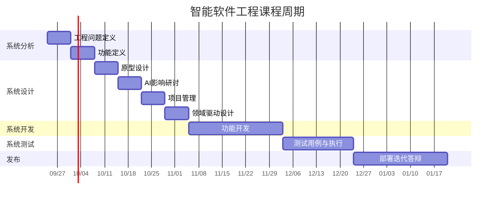
---

# 第一部分
## 系统分析

第 1-2 周

---
layout: two-cols
---

# 第1周：基于模型的系统工程与工业软件定义

- NASA 系统工程引擎 (NASA Systems Engineering Engine)
- 基于模型的系统工程 (MBSE) 核心思想
- 工业软件的本质、分类与技术壁垒
- 如何科学地定义工程问题与技术创新
- **实践指南**：协同仓库构建与问题定义

::right::

---
layout: two-cols
---

# NASA 系统工程引擎
### NASA Systems Engineering Engine

NASA SP-2016-6105 标准定义了一个高度结构化的系统工程流程：

1. **系统设计流程 (System Design)**:
   - 利益相关者需求定义 (Stakeholder Expectations)
   - 技术需求定义 (Technical Requirements)
   - 逻辑分解 (Logical Decomposition)
   - 设计解决方案定义 (Design Solution)
2. **产品实现流程 (Product Realization)**:
   - 转换、集成、验证、确认与运行 (Transition, Integration, Verification, Validation, Operations)
3. **技术管理流程 (Technical Management)**:
   - 决策分析、技术规划、需求管理、风险管理等

::right::

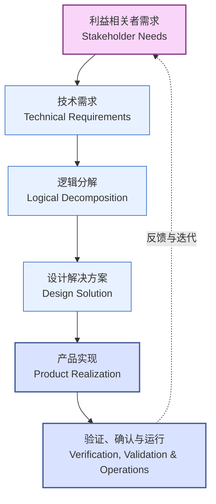


核心思想：
系统工程不是单一线性过程，而是递归 (Recursive) 和 迭代 (Iterative) 的过程。每一次物理分解都伴随着需求的下发与验证。

---

# 基于模型的系统工程 (MBSE)
### Model-Based Systems Engineering (MBSE)

传统的系统工程基于**文档 (Document-Centric)**，而现代系统工程转向**基于模型 (Model-Centric)**。

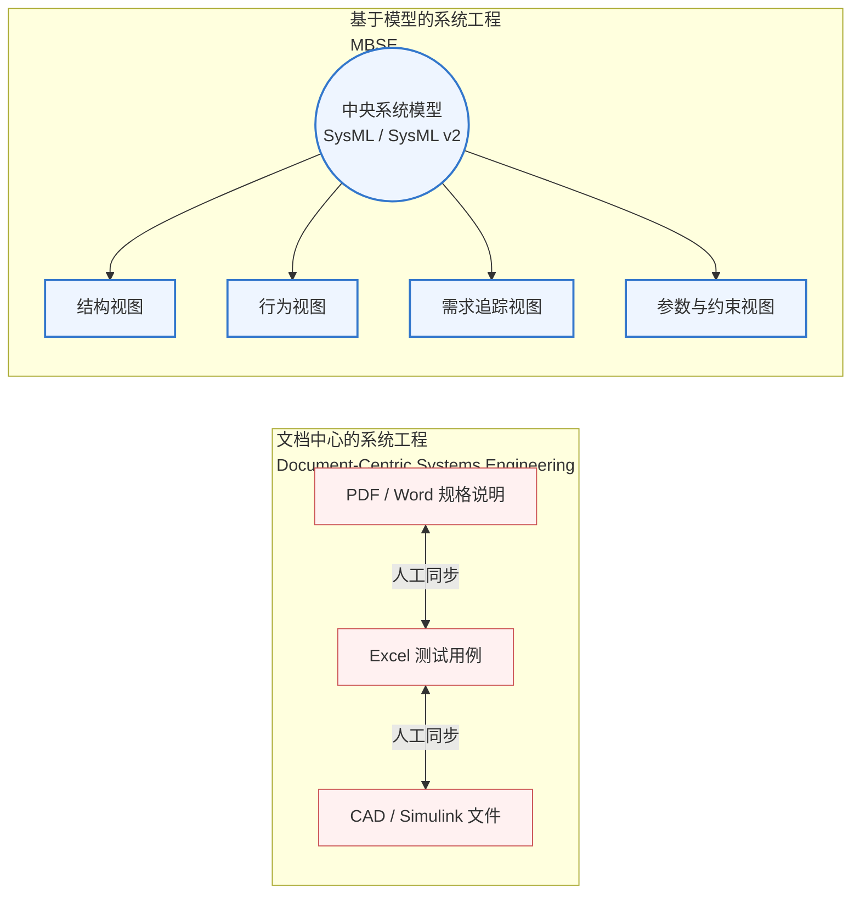

* **SysML (System Modeling Language)**：MBSE 的事实标准，涵盖四根支柱：**结构 (Structure)**、**行为 (Behavior)**、**需求 (Requirements)** 和 **参数 (Parametrics)**。
* **优势**：消除歧义、保持设计一致性、支持早期仿真与验证。

---
layout: two-cols
---

# 什么是工业软件？
工业软件是工业知识的**数字化、模型化与软件化**载体。

* **分类**：
  * **CAD** (计算机辅助设计)：几何建模内核、拓扑关系。
  * **CAE** (计算机辅助工程)：偏微分方程求解、网格剖分。
  * **CAM** (计算机辅助制造)：数控轨迹规划。
  * **MES/PLM**：流程与生命周期管理。

* **技术壁垒**：
  * 数值计算的精度与稳定性（如：Double precision 溢出控制）。
  * 实时性与高并发事务处理。
  * 领域知识（物理、材料、力学）的深度融合。

::right::


```cpp
#include 

struct HalfEdge {
    int origin = -1;
    int next = -1;
    int twin = -1;
    int face = -1;
};

// 判断网格是否为封闭流形结构
bool isManifold(const std::vector& edges) {
    // 工业 CAD 内核通常还需要进行更复杂的几何与拓扑校验。
    // 这里仅检查每条半边是否存在对应的孪生半边。
    for (const auto& edge : edges) {
        if (edge.twin < 0) {
            return false; // 存在开边界
        }
    }

    return true;
}
```
---

# 科学地定义工程问题：5W1H 与 痛点映射
### How to Define an Engineering Problem

研究生阶段的创新应避免“造轮子”，而应致力于“解决真实问题”。

| 维度 (5W1H) | 核心追问 | 本质分析 |
|---|---|---|
| **What (什么问题)** | 这个工程瓶颈的核心现象是什么？ | 识别物理现象、数据瓶颈或算力边界。 |
| **Why (为什么解决)** | 现有的开源软件或商业软件为什么做不好？ | 找到现有方案的技术限制（如高复杂度、高延迟）。 |
| **Who (谁受影响)** | 谁是这个软件系统的最终用户？ | 定义用户画像 (User Persona) 和操作环境。 |
| **Where (在哪里发生)** | 该问题发生在生命周期的哪个阶段？ | 确定是运行期、设计期还是部署期。 |
| **When (何时发生)** | 在什么边界条件/极值场景下会触发？ | 定义极限输入、高并发或边缘设备限制。 |
| **How (如何度量)** | 如何定量评估“问题被成功解决”？ | **关键指标 (KPI)**：吞吐量提高30%，内存降低50%等。 |

---

# 技术的创新路径：颠覆性 vs 渐进式
### Research and Engineering Innovation Paths

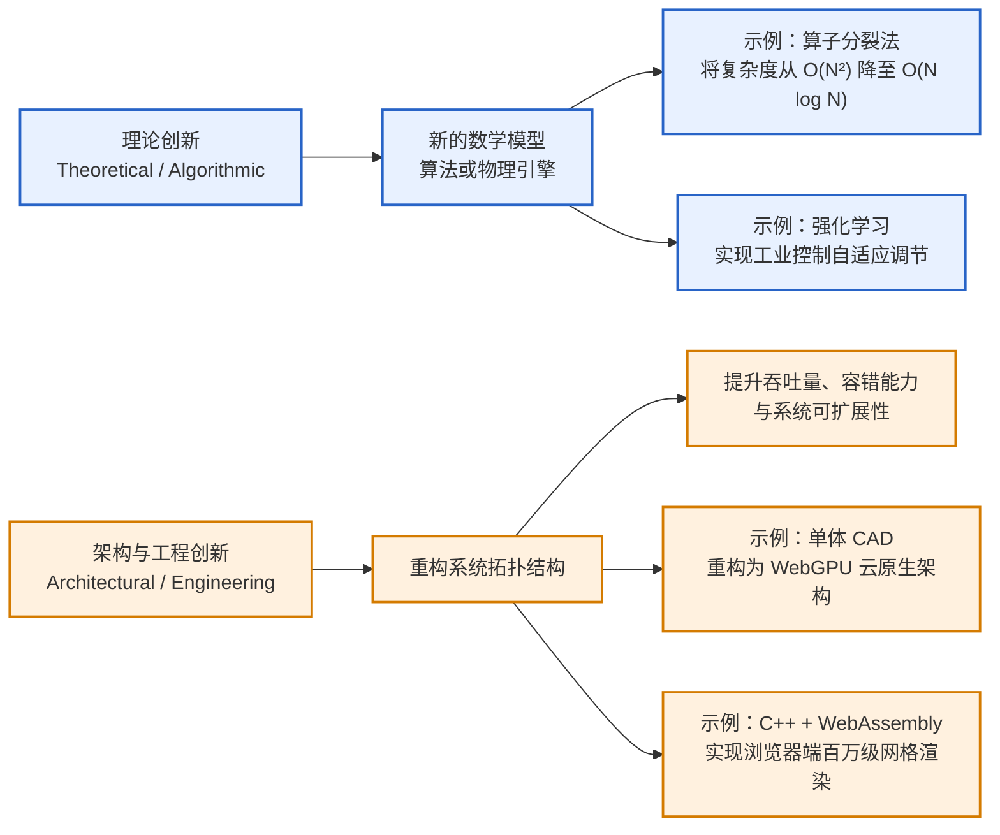


1. 理论创新 (Theoretical / Algorithmic)

引入新的数学模型、算法或物理引擎。

例如：在流体仿真中引入算子分裂法，将时间复杂度从 O(N^2) 降至 O(N log N)。

  
在工业控制中引入强化学习实现自适应调节。


2. 架构/工程创新 (Architectural / Engineering)


重构系统拓扑结构，提升吞吐、容错或可扩展性。

  
例如：将单体桌面版 CAD 重构为基于 WebGPU 的云原生协同 CAD 架构。
  
利用 C++ 与 WebAssembly 混合编译，实现浏览器端百万级网格渲染。

💡 给研究生的建议： 硕士阶段更推荐“场景驱动的工程架构创新”或“先进算法在垂直工业领域的应用创新”，既有学术发表度，又有工程落地性。

---
# 第1周：实践

- 分组
- 定义要解决的工程问题
- 在协作平台上建立小组项目仓库


📋 检查：确认学生定义的工程问题

---

# 第 1 周实践：定义你的工程项目与仓库构建
### Practice: Repository Setup & Problem Definition

各小组需要在协作平台（GitHub / GitLab）上建立项目，并提交规范的 `README.md`。

```bash
# 1. 初始化项目仓库结构
mkdir smart-industrial-app && cd smart-industrial-app
git init

# 2. 规范的分支管理策略
git checkout -b main      # 生产分支
git checkout -b develop   # 开发主分支

# 3. 规范的项目目录结构
mkdir -p docs/{architecture,requirements} \
         src/{backend,frontend,core_engine} \
         tests/{unit,integration} \
         .github/workflows
```

* **任务要求**：在 `docs/requirements/problem_definition.md` 中编写 5W1H 报告。
* **检查点**：第一周结束前，各组向助教提交仓库链接，通过 GitHub Issues 获得第一轮反馈。

---
layout: two-cols
---

# 第2周：理论

- 软件功能的科学定义：功能性与非功能性需求
- 面向对象分析与设计 (OOAD) 核心：从领域模型到高内聚低耦合
- 敏捷方法论在学术/工业研发中的应用 (Scrum, Kanban)
- **实践指南**：编写高质量的需求规范书与 UML 设计

::right::

# 第2周：实践

- 定义要解决工程问题的软件作品功能


📋 检查：确认软件作品的功能

---
layout: default
---
# 软件功能定义：从愿景到系统需求
### Software Functional Definition

需求分析是软件工程中最容易导致失败的环节。我们必须将含糊的用户期望转化为精确的系统需求。

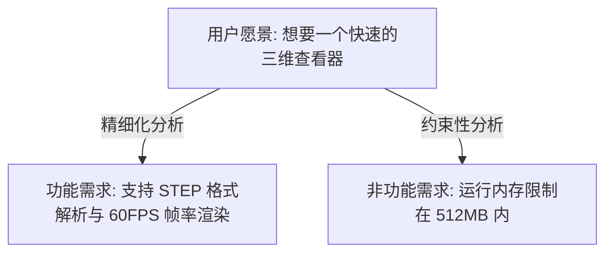

* **功能需求 (FRs)**：系统**必须做什么**（输入、处理、输出）。
* **非功能需求 (NFRs)**：系统必须**如何表现**（URPS：可用性 Usability, 可靠性 Reliability, 性能 Performance, 支持性 Supportability）。


坏的需求样例： "系统界面要好看，速度要快。"

好的需求样例 (可测量的)： "系统在加载 100MB 以上的 CAD 模型时，首屏渲染时间（LCP）需小于 3.0s，且 CPU 利用率不高于 60%。"


---
layout: two-cols
---

# 面向对象分析与设计 (OOAD)
### Object-Oriented Analysis & Design

OOAD 的核心在于**控制复杂度**。

1. **OOA (分析)**：在问题域中寻找对象，构建**领域模型 (Domain Model)**。
2. **OOD (设计)**：将分析模型转化为设计类，应用**设计原则 (SOLID)** 和**设计模式**。

**关键原则：SOLID**
* **S**ingle Responsibility (单一职责)
* **O**pen/Closed (开闭原则)
* **L**iskov Substitution (里氏替换)
* **I**nterface Segregation (接口隔离)
* **D**ependency Inversion (依赖倒置)

::right::


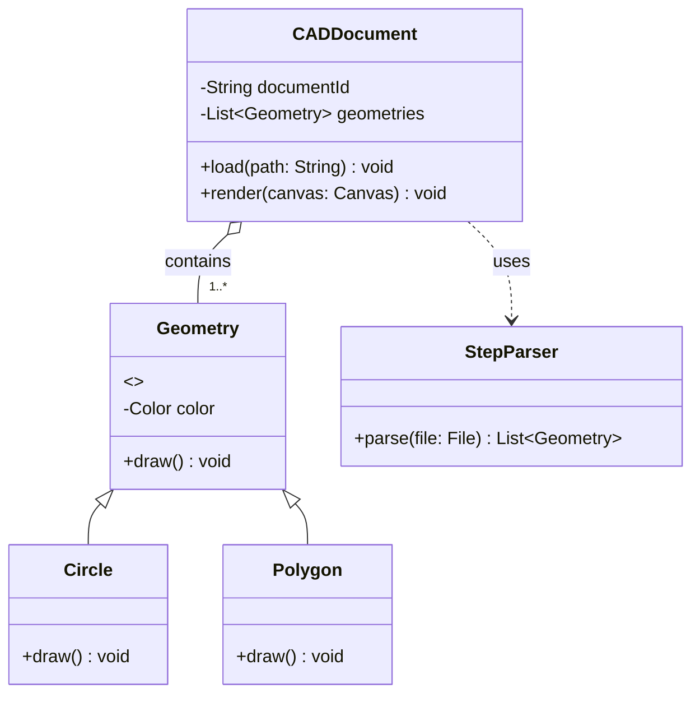


设计说明：`CADDocument` 与 `Geometry` 之间是聚合关系。渲染引擎只依赖抽象的 `Geometry` 类型，新增几何类型时不需要修改 `CADDocument`，符合开闭原则（OCP）。


---

# 敏捷开发方法 (Agile Methodology)
### 针对科学研究与不确定性项目的轻量级管理

研究生的项目往往面临“高学术不确定性”，传统的瀑布模型无法适应，推荐使用 **Scrum / Kanban**。

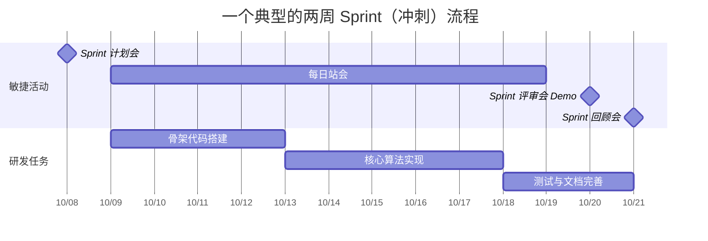

* **Product Backlog**：所有想做的功能池。
* **Sprint Backlog**：本周期（通常2周）承诺完成的任务。
* **定义完成 (Definition of Done, DoD)**：例如“代码通过单元测试，分支合并入 `develop` 且文档已更新”才算完成。

--
# 第 2 周实践：软件功能规范书撰写
### Practice: Functional Specification & UML Domain Modeling
本周各组必须在协作仓库中提交 `docs/requirements/functional_spec.md`。

```markdown
# 软件系统功能规格说明书 (示例模板)

## 1. 系统角色 (Actor)
* **工业分析师**：执行数据导入、算法配置与结果可视化。
* **系统管理员**：执行用户授权与配置审计。

## 2. 功能树 (Feature Tree)
* 模型导入模块
  * FR-1.1: 支持 STEP 物理数据包解析
  * FR-1.2: 异常文件鲁棒性容错与日志上报
* 求解器模块
  * FR-2.1: 并行化有限元方程组求解 (支持 OpenMP)

## 3. 领域模型 (Domain Model UML)
[在此处插入 Mermaid 类图]
```

* **汇报要求**：第二周课上，每组用 3 分钟展示其领域类图与功能分解，教师确认后方能进入系统原型设计。

---
layout: cover
class: text-center
background: '#3a1e5f'
---

# 第二部分
## 系统设计

第 3-6 周
---
layout: two-cols
---

# 第3周：理论

- 智能软件工程的研究与实践
- 什么是智能软件工程 (Smart Software Engineering / AI4SE)？
- 大语言模型 (LLM) 在需求、代码生成与重构中的应用
- 如何编写符合 INVEST 原则的用户故事 (User Stories)
- **实践指南**：利用 AI 辅助设计（v0.dev / Figma / React）构建高保真原型

::right::

# 第3周：实践

- 编写用户故事
- 使用 AI 工具及原型设计工具设计软件作品原型
- 调研技术方案

📋 检查：确认软件作品原型设计

---

# 智能软件工程 (Smart Software Engineering)
### 当软件工程遇到大语言模型 (AI4SE)
学术界与工业界正经历从传统的“人写代码”向“人机协同 (Human-in-the-loop AI Coding)”的范式转变。

* **研究热点**：基于 Agent 的软件工程自治、静态代码分析大模型、代码大模型对齐（RLHF for coding）。
* **核心生产力**：不仅是 Copilot 自动补全，更是在架构生成、单元测试生成方面的突破。

---
layout: two-cols
---
# 编写高质量的用户故事
### Writing INVEST User Stories
用户故事是敏捷开发中描述功能需求的核心工具。
**标准模板：**
> 作为一名 `[角色]`，
> 我想要 `[某种功能]`，
> 以便能够 `[实现某种价值]`。

#### INVEST 原则：
* **I**ndependent（独立的）
* **N**egotiable（可协商的）
* **V**aluable（有价值的）
* **E**stimable（可估算的）
* **S**mall（小巧的）
* **T**estable（可测试的）
::right::

#### 用户故事与验收标准实例：

```yaml
用户故事:
  角色: 作为一名结构工程师
  功能: 我想要一键导入 STEP 格式的文件
  价值: 从而避免手动转换格式造成的精度损失。

验收标准 (Acceptance Criteria - Gherkin 语法):
  场景: 导入一个有效的 STEP 模型
    Given 用户在主界面并点击了"导入"按钮
    When 用户选择了一个标准的 50MB "engine.step" 文件
    Then 系统应在 5.0 秒内完成解析并无损渲染
    And 系统状态栏应显示 "导入成功，包含 1420 个面"
```

---

# AI 辅助原型设计：从自然语言到交互式代码
### AI-Assisted Prototyping

在进行大规模开发前，利用 AI 生成工具快速完成**高保真交互原型 (Interactive Prototype)**，能够极大降低需求偏离的风险。

* **工具推荐**：
  * **v0.dev / Bolt.new** (前端 UI 的自然语言生成)
  * **Figma AI** (组件化交互设计)
  * **Uizard** (手绘草图转换为高保真 UI)


给 AI 的 Prompt 示例：

"Generate a responsive Tailwind React dashboard for a Scientific Simulation Control System. It should contain an interactive 3D canvas placeholder (using Three.js icons), a left sidebar showing the simulation parameters (density, gravity, step size), a bottom panel showing a live-updated charting log for error rates, and a clear run/pause control cluster."

---

# 示例代码：一个简易的三维渲染原型组件 (React)
### Example Code: Prototype Component for Three.js Viewport

```tsx
// src/components/SimulationViewport.tsx
import React, { useState } from 'react';

type SimulationParams = {
  density: number;
  viscosity: number;
};

export const SimulationViewport: React.FC = () => {
  const [isPlaying, setIsPlaying] = useState(false);
  const [params, setParams] = useState({
    density: 1.2,
    viscosity: 0.01,
  });

  const updateParam = (
    key: keyof SimulationParams,
    value: number,
  ) => {
    setParams((current) => ({
      ...current,
      [key]: value,
    }));
  };

  return (
    

      

        

          

            3D Simulation Space
          


                      className={
              isPlaying
                ? 'text-emerald-400'
                : 'text-slate-400'
            }
          >
            {isPlaying
              ? 'Status: Solving Navier–Stokes...'
              : 'Status: Idle'}
          
        


        

          
            Three.js / WebGPU Viewport
          
        

      


      

        

          Control Panel
        


        
          Density: {params.density.toFixed(2)}
        

                  type="range"
          min="0.1"
          max="5"
          step="0.1"
          value={params.density}
          onChange={(event) =>
            updateParam(
              'density',
              Number.parseFloat(event.target.value),
            )
          }
          className="mb-4 w-full"
        />

        
          Viscosity: {params.viscosity.toFixed(3)}
        

                  type="range"
          min="0"
          max="1"
          step="0.001"
          value={params.viscosity}
          onChange={(event) =>
            updateParam(
              'viscosity',
              Number.parseFloat(event.target.value),
            )
          }
          className="mb-6 w-full"
        />

                  type="button"
          onClick={() => setIsPlaying((current) => !current)}
          className={`w-full rounded py-2 font-semibold text-white ${
            isPlaying
              ? 'bg-rose-600 hover:bg-rose-500'
              : 'bg-emerald-600 hover:bg-emerald-500'
          }`}
        >
          {isPlaying
            ? 'Pause Simulation'
            : 'Run Simulation'}
        
      

    

  );
};
```
---

# 第 3 周实践：用户故事地图与技术方案调研
### Practice: User Story Mapping & Tech Stack Investigation
本周各组要将前期的软件定义转化为具体的研发路线，并完成原型设计。

# 第 3 周汇报要求：

1. **用户故事清单 (docs/requirements/user_stories.md)**：
   * 至少编写 5 个符合 INVEST 规范的用户故事。
   * 每个故事需配有详细的 验收条件 (Acceptance Criteria)。

2. **原型展示**：
   * 提交利用 AI (如 v0.dev / Figma) 生成的交互式原型页面，上台 Demo 交互流程。

3. **技术方案调研报告 (docs/architecture/tech_stack.md)**：
   * 论证核心技术选型。例如：为什么选用 WebAssembly 还是 C++ 原生运行？
   * 列出团队在未来 2 周内需要学习的新技术（制定自学计划与 Milestone）。


* **检查点**：助教和导师将严格评估**原型的可行性**以及**技术选型的科学性**，确认后方可进入系统开发（第四阶段）。

---
layout: center
class: text-center
---

# 课后思考与阅读建议
### Academic Papers for Next Week (Week 4 PREVIEW)

为第4周学术文献阅读汇报做准备，各组需在以下领域选择多篇 IEEE/ACM 顶级会议/期刊论文进行研读：

1. **大语言模型赋能代码生成**：*“Is Your Code Generated by ChatGPT Reliable?”*
2. **基于大模型的自动软件缺陷定位**：*“Automated Program Repair in the Era of LLMs”*
3. **软件协同系统**：研究现代协作设计工具（如 Figma / WebAssembly CAD）的协同冲突消解算法（OT 或 CRDT）。

期待在下周的文献汇报中，听到各位从研究生科研视角带来的深刻洞见！

---

# 第4周

## 理论
### AI 与软件工程的相互影响

🎤 汇报：智能软件工程文献阅读

---
layout: cover
class: text-center
background: '#3a1e5f'
---

# 本周学习目标

- 理解 AI 对软件工程全生命周期的渗透：哪些环节被"加速"，哪些被"重塑"
- 区分 **AI 辅助开发** 与 **AI 原生软件** 两个不同命题
- 掌握目前主流的 AI 编码工具及其能力边界
- 认知 AI 带来的新问题：代码安全、版权、幻觉、对工程师能力的影响
- 能够评估：你们的项目中，AI 可以应用到哪些环节

---
layout: two-cols
---

# 一个核心区分

### AI 辅助开发（AI for SE）
把 AI 当工具，**提升软件工程的效率**

- AI 写代码、生成测试、修 Bug
- AI 读文档、做评审
- 工程师仍是主体

::right::

### AI 原生软件（SE for AI）
把 AI **嵌入软件本身**，成为产品能力

- 智能推荐、对话式交互
- 代码里跑着大模型
- 工程问题转为"如何可靠地使用AI"


💡 对你们的项目：你们既在用 AI 辅助开发（第3周已用AI工具做原型），又在考虑把 AI 算法模型作为作品功能（第6周技术方案）——这正是两者的结合


---

# AI 在软件全生命周期中的应用

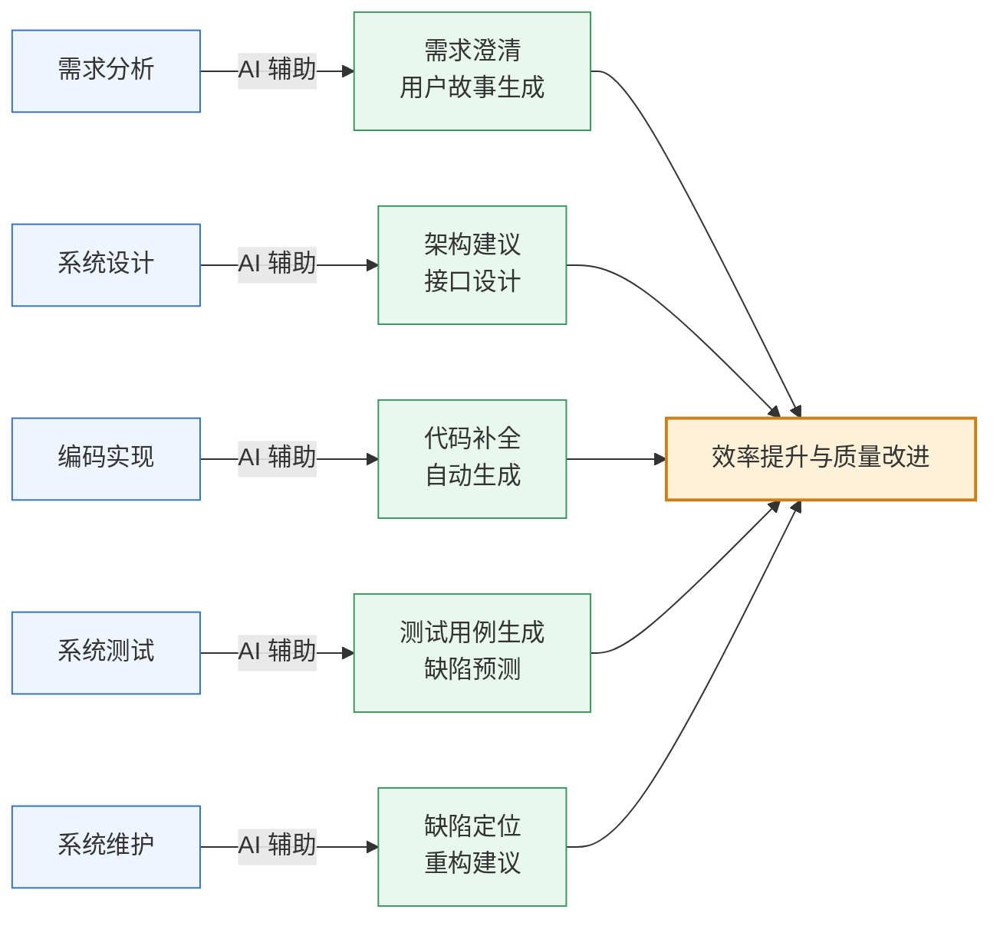

---

# 主流 AI 编码工具一览

| 工具 | 定位 | 典型能力 |
|---|---|---|
| **GitHub Copilot** | 行内补全 | 内联代码补全、聊天交互、Copilot Workspace |
| **Cursor** | AI 优先编辑器 | 全库理解、AI 编辑、代码库问答 |
| **Claude Code** | 编程代理 | 多文件修改、任务拆解、自主执行 |
| **Codeium / Windsurf** | 替代方案 | 免费补全、多语言 |
| **JetBrains AI** | IDE 集成 | 在 IntelliJ/PyCharm 内使用 |
| **ChatGPT / Claude** | 通用对话 | 代码解释、面试题、文档生成 |
| **GitHub Copilot / CodeRabbit** | 代码评审 | 自动 PR 审查、找 Bug |

---

# 能力边界：AI 能做什么，不能做什么


### ✅ AI 擅长

- 生成**样板代码**（CRUD、配置、DTO）
- 补全重复性高、有明确模式的内容
- 单测生成、注释生成、文档翻译
- 给出**常见问题**的已知解法
- 快速搭出一个可运行的原型


### ❌ AI 的局限

- **不理解业务语义**——它不知道"为什么这样设计"
- 生成看似正确实则**隐藏 Bug** 的代码
- **幻觉**：编造不存在的 API、库、函数
- 不会主动质疑不合理的需求
- 处理**大型复杂系统**的全局一致性能力有限
- 无法替你拍板架构决策


---

# 幻觉（Hallucination）案例：AI 编造不存在的 API


```java
// AI 生成的代码（示例）
// 假设用了一个不存在的库方法
import com.example.redis.StringRedisTemplate;

public class CacheService {
    public String get(String key) {
        return redisTemplate
            .getOrElse(key, () -> "default"); // ❌ 该方法不存在
    }
}
```

AI 很自信地编造了一个 `getOrElse` 方法，看起来像通用的 Redis 缓存 API，但实际不存在。

```java
// ✅ 真实存在的 Redis API
public String get(String key) {
    String v = redisTemplate.opsForValue().get(key);
    if (v == null) {
        return "default";
    }
    return v;
}
```

⚠️ 结论：AI 生成代码必须经过**编译/运行验证**，以及**人工代码审查**，不能盲信。呼应第9周"代码质量工具"。


---

# AI 时代的安全新问题
- **Prompt Injection（提示注入）**：恶意用户通过输入让 AI 模型执行非预期指令
- **数据泄露**：把公司敏感代码喂给外部 AI，可能被用于训练
- **供应链风险**：AI 推荐的不熟悉依赖包可能存在恶意代码
- **不可审计性**：AI 生成的复杂代码，人类难以审查其正确性
- **版权模糊**：AI 生成代码是否存在版权问题，法律尚未统一

🔒 **应对**：企业会部署私有化模型 / 使用"带安全审查的AI" / 设置代码上传白名单 / 对AI生成的代码必须强制走评审流程

---
layout: two-cols
---

# AI 对软件工程师角色的冲击
- **初级编码工作被替代**：样板代码、重复工作交给 AI
- **工程师能力重心上移**：从"会写代码"转向"会提问、会审查、会架构"
- **Prompt Engineering** 成为软技能
- **更强调**：系统设计、领域理解、质量意识、责任心

::right::

### 给你们的启示

你们的项目里：

- 哪些工作 AI 能做（让 AI 做）
- 哪些工作只能人来判断（业务决策、架构取舍）
- 如何在作品中体现"人机协作"而非"AI 替代人"

---
layout: center
---

# 本周汇报题目
## 智能软件工程文献阅读

请选择多篇关于 AI 与软件工程的文献（建议从以下方向选择）：

- AI 辅助代码生成的最新研究（如 GitHub Copilot 的实证研究）
- 大模型用于软件测试 / 缺陷定位
- 基于 LLM 的需求分析 / 架构设计
- AI 时代软件工程师的职业发展研究

🎤 **汇报要求**：2-3 分钟概述文献核心内容；结合你们自己的项目，说明从中获得的启发；指出该研究的局限性
---
layout: two-cols
---
# 第5周：理论
- 项目管理的沟通管理和风险管理

::right::

# 第5周：实践

- 制定项目管理的沟通计划和风险管理计划

🎤 汇报：智能软件工程文献阅读
---
layout: cover
class: text-center
background: '#3a1e5f'
---

# 第6周：理论
## 领域驱动设计方法
### Domain-Driven Design (DDD)

---

# 本周学习目标

- 理解为什么需要 DDD —— 解决"业务与代码脱节"问题
- 掌握**战略设计**：限界上下文、通用语言、上下文映射
- 掌握**战术设计**：实体、值对象、聚合、领域服务、仓储
- 能够为自己的项目画出限界上下文图
- 能够将一个业务场景转化为领域模型代码

---
layout: two-cols
---

# 为什么需要 DDD？

传统开发的问题：

- 业务专家说的话，程序员翻译成代码后**语义走样**
- 一个 `User` 类被塞进了下单、支付、物流所有逻辑 → **贫血模型 / 上帝类**
- 团队越大，模块边界越模糊，"改一处，坏三处"


::right::

```java
// ❌ 贫血模型（Anemic Model）反例
public class Order {
    private String id;
    private BigDecimal amount;
    private String status;
    // 只有 getter/setter，没有行为
}

public class OrderService {
    public void pay(Order order) {
        // 所有业务逻辑都堆在 Service 里
        if (order.getStatus().equals("PAID")) {
            throw new RuntimeException("已支付");
        }
        order.setStatus("PAID");
        // ... 100 行判断逻辑
    }
}
```


⚠️ 领域知识散落在 Service 各处，无法复用、难以测试

---

# DDD 核心概念地图

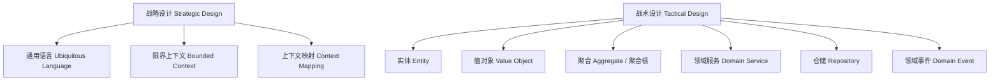

---

# 1. 通用语言（Ubiquitous Language）

**做法**：业务专家 + 开发人员用**同一套词汇**，写进代码、文档、注释里，杜绝"翻译损耗"

**案例场景**：图书馆借阅系统

| 业务语言 | 代码命名 |
|---|---|
| 读者 | `Reader` |
| 借阅 | `Loan`（不是 `Borrow`）|
| 逾期 | `Overdue` |
| 续借 | `Renew` |


```java
// ✅ 代码直接使用业务语言，无需注释解释
public class Loan {
    private Reader reader;
    private Book book;
    private LocalDate dueDate;

    public boolean isOverdue() {
        return LocalDate.now().isAfter(dueDate);
    }

    public void renew() {
        if (isOverdue()) {
            throw new CannotRenewException("逾期不可续借");
        }
        this.dueDate = dueDate.plusDays(14);
    }
}
```


💡 课堂练习：为你们的项目列出 10 个核心业务术语，中英文对照，作为团队"词汇表"


---

# 2. 限界上下文（Bounded Context）

一个大系统按业务边界拆分成多个"上下文"，**同一个词在不同上下文里可以有不同含义**

销售上下文

Product = 带价格、促销信息的商品


仓储上下文

Product = 带库存数量、货架位置的物品


物流上下文

Product = 带重量、体积、包装方式的货物


⚠️ **常见错误**：新手总想设计一个"万能 Product 类"给所有模块共用 —— 这正是 DDD 要避免的


---
layout: two-cols
---

# 3. 上下文映射（Context Mapping）

上下文之间如何协作？常见模式：


- **共享内核**（Shared Kernel）：两个团队共用一部分模型
- **防腐层**（Anti-Corruption Layer, ACL）：隔离外部/遗留系统的模型污染
- **发布者-订阅者**：通过领域事件解耦


::right::

```java
// 防腐层示例：隔离第三方支付接口的模型
public class PaymentAntiCorruptionLayer {

    private final ThirdPartyPaySDK sdk;

    public PaymentResult pay(Order order) {
        // 把第三方 SDK 的丑陋结构
        // 翻译成我们自己的领域模型
        ThirdPartyPayRequest req =
            new ThirdPartyPayRequest(
                order.getId().toString(),
                order.getAmount().toPlainString()
            );
        ThirdPartyPayResponse resp = sdk.charge(req);

        return resp.getCode() == 0
            ? PaymentResult.success()
            : PaymentResult.failed(resp.getMsg());
    }
}
```

---

# 4. 实体 vs 值对象


### 实体 Entity
- 有唯一标识（ID）
- 有生命周期，属性可变
- 两个实体即使属性相同，ID 不同也不相等

```java
public class Reader {
    private final ReaderId id; // 标识
    private String name;
    private String phone;

    // equals 基于 id 判断
    @Override
    public boolean equals(Object o) {
        return o instanceof Reader r
            && id.equals(r.id);
    }
}
```


### 值对象 Value Object
- 没有标识，只有属性
- **不可变**（Immutable）
- 属性相同即相等

```java
public final class Money {
    private final BigDecimal amount;
    private final String currency;

    public Money(BigDecimal amount, String currency) {
        this.amount = amount;
        this.currency = currency;
    }

    public Money add(Money other) {
        // 不可变：返回新对象，不修改自身
        return new Money(
            this.amount.add(other.amount), currency);
    }

    @Override
    public boolean equals(Object o) {
        return o instanceof Money m
            && amount.equals(m.amount)
            && currency.equals(m.currency);
    }
}
```


---

# 5. 聚合与聚合根（Aggregate Root）

**聚合** = 一组相关对象的集合，对外只暴露**聚合根**，保证一致性边界


```java
// Order 是聚合根，OrderItem 是内部实体
public class Order {
    private OrderId id;
    private List items = new ArrayList<>();
    private OrderStatus status;

    // 外部不能直接操作 items 列表
    // 必须通过聚合根的方法
    public void addItem(Product product, int qty) {
        if (status != OrderStatus.DRAFT) {
            throw new IllegalStateException(
                "订单已提交，不能修改");
        }
        items.add(new OrderItem(product, qty));
    }

    public Money totalAmount() {
        return items.stream()
            .map(OrderItem::subtotal)
            .reduce(Money.ZERO, Money::add);
    }

    public void submit() {
        if (items.isEmpty()) {
            throw new IllegalStateException("订单为空");
        }
        this.status = OrderStatus.SUBMITTED;
    }
}
```


**设计原则**：

- 一个事务只修改**一个聚合**
- 聚合内部保证不变量（invariant）：
  比如"总金额 = 各明细之和"
- 聚合之间通过 ID 引用，不直接持有对象引用
- 聚合尽量设计得小，避免锁竞争


🎯 课堂练习：在你们的系统中找出 2-3 个聚合根，画出聚合边界图


---

# 6. 领域服务 & 仓储


### 领域服务（Domain Service）
当一个操作**不自然属于**某个实体或值对象时使用

```java
// 转账涉及两个账户，不属于单个 Account
public class TransferService {
    public void transfer(
            Account from, Account to, Money amount) {
        from.withdraw(amount);
        to.deposit(amount);
    }
}
```


### 仓储（Repository）
封装持久化细节，让领域层不关心数据库

```java
public interface OrderRepository {
    Optional findById(OrderId id);
    void save(Order order);
}

// 基础设施层实现，领域层不感知具体技术
public class JpaOrderRepository
        implements OrderRepository {
    private final OrderJpaDao dao;

    public Optional findById(OrderId id) {
        return dao.findById(id.value())
            .map(OrderMapper::toDomain);
    }
}
```


---
layout: two-cols
---

# 分层架构与 DDD

```
├── domain/              # 领域层：核心业务逻辑
│   ├── model/           #   实体、值对象、聚合
│   ├── service/         #   领域服务
│   ├── event/           #   领域事件
│   └── repository/      #   仓储接口（不含实现）
├── application/         # 应用层：用例编排
│   └── OrderAppService.java
├── infrastructure/      # 基础设施层：技术实现
│   ├── persistence/     #   仓储实现、ORM
│   └── external/        #   第三方接口、防腐层
└── interfaces/          # 接口层：Controller、DTO
```

::right::

```java
// 应用层：编排用例，不含业务规则
@Service
public class OrderAppService {
    private final OrderRepository orderRepo;
    private final InventoryDomainService inventory;

    @Transactional
    public void submitOrder(SubmitOrderCommand cmd) {
        Order order = orderRepo.findById(cmd.orderId())
            .orElseThrow();

        inventory.reserve(order);  // 调用领域服务
        order.submit();            // 调用聚合根方法

        orderRepo.save(order);
    }
}
```


✅ 依赖方向：interfaces → application → domain ← infrastructure
（依赖倒置，领域层不依赖任何技术框架）


---
layout: center
---

# 本周实践任务


1. 与组员一起提炼项目的**通用语言表**（至少10个术语）
2. 画出项目的**限界上下文图**（可用 draw.io / Miro / Mermaid）
3. 识别至少 2 个**聚合根**，标注聚合边界
4. 用代码写出至少 1 个实体、1 个值对象、1 个聚合根示例
5. 确认技术方案（含 AI 算法模型如何融入领域模型）


🎤 本周汇报：系统设计技术方案（含限界上下文图 + 核心聚合设计）

# 第6周：实践

- 确认技术方案（包括人工智能算法模型等）
- 制定新技术学习方法


🎤 汇报：系统设计技术方案


---
layout: cover
class: text-center
background: '#1e5f3a'
---

# 第三部分
## 系统开发

第 7-10 周


---
layout: two-cols
---

# 第7周：理论

- 软件开发方法

::right::

# 第7周：实践

- 用各种技术和工具开发系统功能


🛠️ 检查：为学生提供开发指导


---

# 第8周


  
— 无新理论内容 —


## 实践
用各种技术和工具开发系统功能


🛠️ 检查：为学生提供开发指导


---
layout: two-cols
---


# 第9周：理论

- 如何编写卓越的代码：软件代码质量

::right::


---
layout: cover
class: text-center
background: '#1e5f3a'
---

# 第9周
## 如何编写卓越的代码
### 软件代码质量

---

# 本周学习目标

- 理解代码质量的**可度量维度**：可读性、可维护性、复杂度、重复度、安全性
- 掌握 **SOLID 原则**及常见反例
- 学会使用静态分析工具：**SonarQube / ESLint / Checkstyle / PMD**
- 学会看懂**圈复杂度（Cyclomatic Complexity）**和**代码坏味道（Code Smell）**
- 完成一次真实的"代码质量检查 → 重构"闭环


---
layout: two-cols
---
# 什么是"卓越的代码"？

### ❌ 能跑就行的代码

```python
def calc(x, y, t):
    if t == 1:
        r = x + y
    elif t == 2:
        r = x - y
    elif t == 3:
        r = x * y
    elif t == 4:
        if y != 0:
            r = x / y
        else:
            r = 0
    return r
```


::right::


### ✅ 卓越的代码

```python
from enum import Enum

class Operation(Enum):
    ADD = "+"
    SUBTRACT = "-"
    MULTIPLY = "*"
    DIVIDE = "/"

def calculate(x: float, y: float,
              op: Operation) -> float:
    match op:
        case Operation.ADD: return x + y
        case Operation.SUBTRACT: return x - y
        case Operation.MULTIPLY: return x * y
        case Operation.DIVIDE:
            if y == 0:
                raise ZeroDivisionError("除数不能为0")
            return x / y
```


💡 区别不在"能否运行"，而在于：命名语义化、意图清晰、异常显式处理、易扩展、易测试


---

# 代码质量的五个可度量维度

| 维度 | 说明 | 常用指标/工具 |
|---|---|---|
| **可读性** | 命名、注释、格式是否清晰 | Checkstyle / ESLint |
| **复杂度** | 逻辑分支是否过多 | 圈复杂度 (Cyclomatic Complexity) |
| **重复度** | 是否存在复制粘贴代码 | SonarQube Duplication |
| **可测试性** | 是否易于编写单元测试 | 单元测试覆盖率 |
| **安全性** | 是否存在已知漏洞模式 | SonarQube / Semgrep / Snyk |

---
layout: two-cols
---

# 圈复杂度（Cyclomatic Complexity）

**定义**：程序中线性无关路径的数量，每多一个 `if/for/while/case/&&/||` 就 +1


```java
// 圈复杂度 = 6（较高，难测试）
public String grade(int score) {
    if (score >= 90) {
        return "A";
    } else if (score >= 80) {
        return "B";
    } else if (score >= 70) {
        return "C";
    } else if (score >= 60) {
        return "D";
    } else {
        return "F";
    }
}
```


::right::


```java
// 圈复杂度 = 1（用数据结构替代分支）
private static final NavigableMap
    GRADE_TABLE = new TreeMap<>(Map.of(
        60, "D", 70, "C", 80, "B", 90, "A"));

public String grade(int score) {
    var entry = GRADE_TABLE.floorEntry(score);
    return entry != null ? entry.getValue() : "F";
}
```


📏 经验值：函数圈复杂度 > 10 建议重构；> 20 属于高风险代码


---
layout: two-cols
---
# 常见代码坏味道（Code Smell）


- **过长函数**（Long Method）：超过 50 行
- **过大类**（God Class）：职责过多
- **重复代码**（Duplicated Code）
- **过长参数列表**（>4个参数）
- **霰弹式修改**（Shotgun Surgery）：改一个需求要动十几个文件
- **依恋情结**（Feature Envy）：方法过度调用另一个类的数据

::right::

```java
// 依恋情结示例
class OrderPrinter {
    void print(Order order) {
        // 过度访问 Customer 的内部数据
        System.out.println(
            order.getCustomer().getName() + " - " +
            order.getCustomer().getAddress().getCity() +
            order.getCustomer().getAddress().getStreet()
        );
    }
}

// ✅ 重构：把格式化逻辑移到 Customer 自己身上
class Customer {
    String formattedAddress() {
        return address.getCity() + address.getStreet();
    }
}
```


---

# SOLID 原则速览（附反例/正例）


| 原则 | 一句话 |
|---|---|
| **S** 单一职责 | 一个类只做一件事，只有一个改变的理由 |
| **O** 开闭原则 | 对扩展开放，对修改关闭 |
| **L** 里氏替换 | 子类必须能替换父类而不破坏程序 |
| **I** 接口隔离 | 不强迫客户端依赖不需要的接口 |
| **D** 依赖倒置 | 依赖抽象，不依赖具体实现 |


---
layout: two-cols
---
# 开闭原则实战：支付方式扩展


```java
// ❌ 违反开闭原则：新增支付方式要改这个方法
public class PaymentService {
    public void pay(String type, BigDecimal amount) {
        if (type.equals("alipay")) {
            // 支付宝逻辑
        } else if (type.equals("wechat")) {
            // 微信逻辑
        }
        // 每加一种支付方式都要改这里！
    }
}
```
::right::
```java
// ✅ 符合开闭原则：新增支付方式只需新增实现类
public interface PaymentMethod {
    void pay(BigDecimal amount);
}

public class AlipayPayment implements PaymentMethod {
    public void pay(BigDecimal amount) { /* ... */ }
}

public class WechatPayment implements PaymentMethod {
    public void pay(BigDecimal amount) { /* ... */ }
}

public class PaymentService {
    public void pay(PaymentMethod method, BigDecimal amount) {
        method.pay(amount); // 无需修改本类
    }
}
```


---
layout: two-cols
---

# 静态代码分析工具选型

**多语言通用**
- SonarQube / SonarLint（IDE 插件）
- Semgrep（自定义安全规则）

**Java**
- Checkstyle（代码风格）
- PMD（潜在缺陷、复杂度）
- SpotBugs（Bug 模式检测）

::right::

**JavaScript/TypeScript**
- ESLint + Prettier
- SonarJS

**Python**
- Pylint / Ruff（速度快）
- mypy（类型检查）

**AI 辅助**
- GitHub Copilot Code Review
- Claude Code / Cursor 代码审查

---

# 实战：用 SonarQube 检查代码

```bash
# 1. 本地启动 SonarQube（Docker 方式，用于教学演示）
docker run -d --name sonarqube -p 9000:9000 sonarqube:community

# 2. 安装 sonar-scanner
brew install sonar-scanner   # macOS
# 或下载对应平台的 zip 包

# 3. 项目根目录创建 sonar-project.properties
```

```properties
sonar.projectKey=my-course-project
sonar.sources=src
sonar.tests=test
sonar.java.binaries=target/classes
sonar.host.url=http://localhost:9000
sonar.token=${SONAR_TOKEN}
```

```bash
# 4. 执行扫描
sonar-scanner

# 5. 浏览器打开 http://localhost:9000 查看报告：
#    - Bugs / Vulnerabilities / Code Smells
#    - 圈复杂度、重复率、测试覆盖率
#    - Quality Gate 是否通过（红/绿）
```

---

# 实战：用 ESLint 检查前端代码

```bash
npm install eslint --save-dev
npx eslint --init
```

```json
// .eslintrc.json
{
  "extends": ["eslint:recommended", "plugin:@typescript-eslint/recommended"],
  "rules": {
    "complexity": ["warn", 10],
    "max-lines-per-function": ["warn", 50],
    "no-unused-vars": "error",
    "eqeqeq": "error"
  }
}
```

```bash
# 检查
npx eslint src/ --ext .ts,.tsx

# 自动修复能修复的问题
npx eslint src/ --ext .ts,.tsx --fix
```


💡 建议把 lint 检查接入 pre-commit hook（用 husky + lint-staged），提交前自动拦截


---
layout: two-cols
---

# 单元测试覆盖率也是质量指标

```java
// 待测代码
public class DiscountCalculator {
    public BigDecimal calculate(BigDecimal price, int memberLevel) {
        if (memberLevel >= 3) {
            return price.multiply(new BigDecimal("0.8"));
        } else if (memberLevel >= 1) {
            return price.multiply(new BigDecimal("0.9"));
        }
        return price;
    }
}
```
::right::
```java
// JUnit5 测试：覆盖所有分支
class DiscountCalculatorTest {
    private final DiscountCalculator calc = new DiscountCalculator();

    @Test
    void 高级会员打八折() {
        assertEquals(new BigDecimal("80.0"),
            calc.calculate(new BigDecimal("100"), 3));
    }

    @Test
    void 普通会员打九折() {
        assertEquals(new BigDecimal("90.0"),
            calc.calculate(new BigDecimal("100"), 1));
    }

    @Test
    void 非会员不打折() {
        assertEquals(new BigDecimal("100"),
            calc.calculate(new BigDecimal("100"), 0));
    }
}
```

```bash
mvn test jacoco:report   # 生成覆盖率报告 target/site/jacoco/index.html
```

---

# 重构闭环：从检测到修复

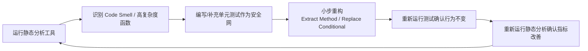


🔑 核心纪律：先写测试，再重构；每次重构后立刻跑测试 —— 保证"重构不改变外部行为"


---

# 课堂练习：现场重构


```java
// 请找出至少3个坏味道并重构
public class OrderProcessor {
    public String process(int type, double amount, String user, int status, boolean flag) {
        String result = "";
        if (type == 1) {
            if (amount > 1000) {
                if (status == 0) {
                    result = user + " VIP order pending: " + amount * 0.9;
                } else {
                    result = user + " VIP order done: " + amount * 0.9;
                }
            } else {
                result = user + " normal order: " + amount;
            }
        } else if (type == 2) {
            result = user + " refund: " + (-amount);
        }
        if (flag) {
            System.out.println(result);
        }
        return result;
    }
}
```


- 提示1：魔法数字（`1`, `2`, `1000`, `0`）应替换为枚举/常量
- 提示2：嵌套 if 圈复杂度过高，考虑提取方法或使用策略模式
- 提示3：布尔参数 `flag` 是"标志参数"坏味道，应拆成两个方法


---
layout: center
---

# 本周实践任务


1. 为项目配置至少一个静态分析工具（SonarQube/ESLint/Pylint 任选）
2. 运行扫描，记录当前 Bug 数、Code Smell 数、圈复杂度、重复率
3. 选出 Top 5 最严重问题，逐一重构（先补测试，再重构）
4. 重新扫描，对比重构前后指标变化，形成质量报告


✅ 本周检查：检查代码质量（提交扫描报告截图 + 重构前后对比）


# 第9周：实践

- 使用软件代码质量工具检查代码质量
- 并修改代码


✅ 检查：检查代码质量


---

# 第10周


  
— 无新理论内容 —


## 实践
用各种工具开发系统功能


🎤 汇报：系统代码质量情况


---
layout: cover
class: text-center
background: '#5f1e3a'
---

# 第四部分
## 系统测试

第 11-13 周


---
layout: two-cols
---

# 第11周：理论

- 软件测试的方法

::right::


---
layout: cover
class: text-center
background: '#5f1e3a'
---

# 第11周
## 软件测试的方法

---

# 本周学习目标


- 理解测试的目的：**证明正确性** ≠ **降低缺陷风险**
- 掌握测试金字塔：单元/集成/系统/验收测试
- 区分**黑盒测试**（功能）与**白盒测试**（结构）
- 掌握**等价类划分、边界值分析**等经典设计方法
- 会写规范的测试用例文档
- 了解自动化测试工具：JUnit / pytest / Jest / Selenium


---

# 测试的目的：一个关键认知


### ❌ 常见误解

"测试是为了证明程序没错"

实际上：**测试永远无法证明没有 Bug**（Dijkstra 名言："程序测试只能证明 Bug 存在，不能证明 Bug 不存在"）


### ✅ 正确理解

测试是为了：

- **降低**缺陷流入生产环境的**风险**
- 给重构/修改提供**安全网**
- 驱动**设计和重构**（测试先行）
- 用**成本换质量**：越晚发现缺陷，修复成本越高


📈 缺陷发现越晚修复成本越高（需求阶段 1x → 发布后 100x）


---
layout: two-cols
---

# 测试金字塔


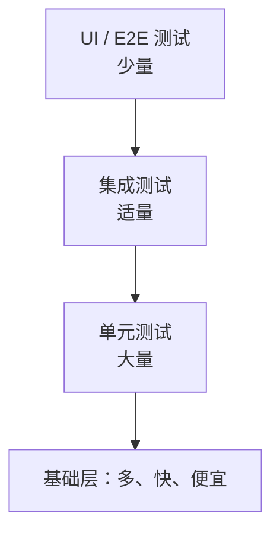

- **单元测试**：最多，最快，隔离小函数
- **集成测试**：验证模块配合
- **端到端（E2E）**：验证完整流程，慢，贵


::right::

### 比例建议

| 层级 | 数量比例 | 运行速度 |
|---|---|---|
| 单元 | ~70% | 毫秒级 |
| 集成 | ~20% | 秒级 |
| E2E | ~10% | 分钟级 |


⚠️ 常见误区："测试金字塔倒置"——全是 E2E，又慢又脆，改一处全崩


---

# 黑盒测试 与 白盒测试


### 黑盒（功能测试）
只看输入输出，不关心内部实现

```python
# 只测接口行为
def test_login_success(client):
    resp = client.post('/api/login',
        json={"username": "admin", "password": "123456"})
    assert resp.status_code == 200
    assert "token" in resp.json()
```


### 白盒（结构测试）
关注代码内部路径、分支、条件

```python
# 依据代码逻辑设计用例，覆盖每个分支
def test_calculate_positive(calc):
    assert calc.calculate(Operation.ADD, 10, 5) == 15

def test_calculate_divide_by_zero(calc):
    with pytest.raises(ZeroDivisionError):
        calc.calculate(Operation.DIVIDE, 10, 0)
```


💡 实际工作中两种结合：黑盒设计测试目标，白盒补充覆盖盲区（识别未测试的分支）


---
layout: two-cols
---

# 测试用例设计方法 1：等价类划分

将输入域划分成若干个**等价类**，每个类取一个代表值即可

**案例**：登录功能的"年龄"字段，合法范围 18-60

| 等价类类型 | 数据 | 预期结果 |
|---|---|---|
| 有效等价类 | 18、35、60 | 通过 |
| 无效等价类-下限 | 17 | 提示"年龄过小" |
| 无效等价类-上限 | 61 | 提示"年龄过大" |
| 无效等价类-非数字 | "abc" | 提示"格式错误" |
| 无效等价类-空值 | "" | 提示"必填" |

::right::

```python
import pytest

def validate_age(age: str) -> str:
    if not age:
        return "必填"
    if not age.isdigit():
        return "格式错误"
    a = int(age)
    if a < 18:
        return "年龄过小"
    if a > 60:
        return "年龄过大"
    return "通过"

@pytest.mark.parametrize("age,expected", [
    ("", "必填"), ("abc", "格式错误"),
    ("17", "年龄过小"), ("61", "年龄过大"),
    ("35", "通过"), ("18", "通过"), ("60", "通过"),
])
def test_validate_age(age, expected):
    assert validate_age(age) == expected
```

---

# 测试用例设计方法 2：边界值分析

**原理**：程序错误最容易发生在**边界附近**，所以对边界值及边界两侧的值都要测

**案例**：输入范围 [18, 60]

| 测试点 | 值 | 说明 |
|---|---|---|
| 下边界 | 18 | 恰好合法 |
| 下边界-1 | 17 | 非法 |
| 下边界+1 | 19 | 合法 |
| 上边界 | 60 | 恰好合法 |
| 上边界+1 | 61 | 非法 |
| 上边界-1 | 59 | 合法 |


🎯 经验：开发 80% 的 Bug 出在边界，边界值分析性价比最高


---

# 测试用例设计方法 3：判定表

适合**多条件组合**的场景，列出所有条件组合及对应动作

**案例**：图书借阅系统中，"是否能续借"判定

| 规则 | 是否逾期 | 是否欠费 | 续借次数<3 | 是否允许续借 |
|---|---|---|---|---|
| 1 | N | N | Y | ✅ 允许 |
| 2 | N | N | N | ❌ 不允许(超次数) |
| 3 | N | Y | Y | ❌ 不允许(有欠费) |
| 4 | N | Y | N | ❌ 不允许 |
| 5 | Y | N | Y | ❌ 不允许(逾期) |
| 6 | Y | Y | Y | ❌ 不允许 |
| 7 | Y | N | N | ❌ 不允许 |
| 8 | Y | Y | N | ❌ 不允许 |

```java
// 对应代码逻辑
public boolean canRenew(Loan loan) {
    if (loan.isOverdue()) return false;
    if (loan.hasUnpaidFine()) return false;
    if (loan.renewalCount() >= 3) return false;
    return true;
}
```


💡 用法：先画判定表找出所有分支，再据此写测试，能显著提高覆盖率


---

# 测试用例设计方法 4：因果图 & 场景法（简述）


### 因果图法
- 找"原因"（输入条件）与"结果"（输出动作）的依赖关系
- 用逻辑符（与/或/非）组合
- 适合输入条件相互影响的情况


### 场景法（面试常考）
- 按**业务流程**组织用例，走完整流程
- 基本流：正常完成任务
- 备选流：异常分支、边界处理
- 适合电商下单、登录、支付等业务


用"购物→下单→支付→发货"串多条场景，
比孤立测每个按钮更能发现流程缺陷


---
layout: two-cols
---

# JS 测试示例：Jest

```javascript
// product.js
export function calculateTotal(items) {
  return items.reduce((sum, item) =>
    sum + item.price * item.quantity, 0);
}
```

```javascript
// product.test.js
import { calculateTotal } from './product.js';

describe('calculateTotal', () => {
  test('多个商品正确求和', () => {
    const items = [
      { price: 10, quantity: 2 },  // 20
      { price: 5, quantity: 3 },   // 15
    ];
    expect(calculateTotal(items)).toBe(35);
  });

  test('空购物车返回0', () => {
    expect(calculateTotal([])).toBe(0);
  });
});
```

::right::

# 接口测试示例：Postman / REST

```http
### 登录接口 - 正常
POST /api/login
Content-Type: application/json

{ "username": "admin", "password": "123456" }

> 

### 登录接口 - 密码错误
POST /api/login
Content-Type: application/json

{ "username": "admin", "password": "wrong" }
```


💡 还可用 Postman / curl / Katalon 做 API 测试，或 Selenium / Playwright 做 E2E UI 测试


---

# 自动化测试工具速查表

| 语言/场景 | 单元测试 | 覆盖率 | E2E |
|---|---|---|---|
| Java | JUnit 5 | JaCoCo | Selenium |
| Python | pytest | coverage.py | Selenium / Playwright |
| JS/TS | Jest / Vitest | NYC | Playwright / Cypress |
| Go | testing | go test -cover | Selenium |
| 接口 | Postman / REST | — | — |

---

# 编写测试用例文档（规范模板）


| 用例编号 | 用例名称 | 前置条件 | 测试步骤 | 输入数据 | 预期结果 | 优先级 |
|---|---|---|---|---|---|---|
| TC-001 | 正常登录 | 用户已注册 | 1.打开登录页
2.输入账号密码
3.点击登录 | 正确账号+密码 | 登录成功跳转首页 | 高 |
| TC-002 | 密码错误 | 用户已注册 | 同上 | 错误密码 | 提示"密码错误" | 高 |
| TC-003 | 账号不存在 | 已入注册页 | 同上 | 不存在的账号 | 提示"用户不存在" | 中 |
| TC-004 | 密码为空 | 已入注册页 | 1.输入账号
2.密码留空
3.点击登录 | 空密码 | 提示"请输入密码" | 高 |


📋 本周作业：为你们的软件作品编写至少 10 个测试用例（覆盖等价类、边界值、场景法），包含预期结果


---
layout: center
---

# 本周实践任务


1. 为作品功能的**核心逻辑**编写单元测试（JUnit / pytest / Jest）
2. 用**等价类 + 边界值**为至少一个输入字段设计测试用例
3. 用**场景法**为一条关键业务流程编写端到端测试
4. 统计覆盖率，确保核心逻辑 ≥ 60%（第12周还会继续测）


📋 本周检查：确认学生的测试用例（提交测试用例文档 + 测试代码）


---

# 第12周


  
— 无新理论内容 —


## 实践
- 用测试用例测试作品
- 修改作品缺陷


📋 检查：确认学生的测试用例


---
layout: two-cols
---

# 第13周：理论

- 软件产品原型测试方法

::right::

# 第13周：实践

- 小组交叉测试软件作品原型

---
layout: cover
class: text-center
background: '#5f3a1e'
---

# 第五部分
## 发布

第 14-17 周


---
layout: two-cols
---

# 第14周：理论

- 部署和发布软件的方法及检查单

::right::

# 第14周：实践

- 部署作品

---

# 第15周

## 实践
完善作品：优化和迭代作品

---

# 第16周

## 实践
准备答辩材料

---
layout: center
class: text-center
---

# 第17周

# 🎓 作品答辩


最终成果展示与评审


---
layout: end
---

# 谢谢！

课程结束 · 祝项目顺利完成
