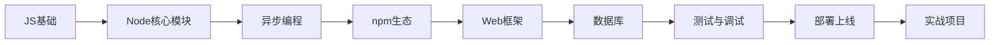

# Node.js 学习指南

从零基础到独立开发后端服务的完整路径

<div class="pt-12">
  <span class="px-2 py-1 rounded cursor-pointer" hover="bg-white bg-opacity-10">
    按空格键开始 →
  </span>
</div>

---
transition: fade-out
---

# 为什么学 Node.js？

<v-clicks>

- 📦 **统一语言**：前后端都用 JavaScript / TypeScript，降低上下文切换成本
- ⚡ **高并发 I/O**：事件驱动 + 非阻塞 I/O，适合 API 服务、实时应用
- 🌍 **生态庞大**：npm 是全球最大的包仓库
- 🛠️ **用途广泛**：Web 服务、CLI 工具、桌面应用（Electron）、构建工具链
- 💼 **就业需求高**：大量公司的后端 / 全栈岗位要求 Node 经验

</v-clicks>

---
layout: center
class: text-center
---

# 学习路径总览



---
layout: two-cols
---

# 第一步：打牢 JS 基础

Node.js 本质是 JS 运行时，语言功底不扎实，后面都是空中楼阁。

**必须掌握：**
- 变量作用域、闭包
- `this` 指向
- ES6+：箭头函数、解构、模板字符串
- Promise / async-await
- 模块化（CommonJS vs ESM）

::right::

<v-click>

```js
// 闭包示例
function counter() {
  let count = 0
  return () => ++count
}

const c = counter()
console.log(c()) // 1
console.log(c()) // 2
```

</v-click>

<v-click>

> 📌 建议：先用 MDN 文档系统过一遍 ES6+ 语法，再动手写 Node

</v-click>

---

# 第二步：Node 核心模块

不依赖任何框架，先吃透内置能力

<div grid="~ cols-2 gap-4">
<div>

**文件 / 系统**
```js
import fs from 'node:fs/promises'
import path from 'node:path'

const data = await fs.readFile(
  path.join(process.cwd(), 'a.txt'),
  'utf-8'
)
```

</div>
<div>

**网络服务**
```js
import http from 'node:http'

http.createServer((req, res) => {
  res.end('Hello Node')
}).listen(3000)
```

</div>
</div>

<v-click>

重点模块：`fs`、`path`、`http`、`events`、`stream`、`process`、`os`、`child_process`

</v-click>

---

# 第三步：理解异步编程与事件循环

这是 Node 区别于其他后端语言的核心，也是最容易卡住的地方

<v-clicks>

- 回调函数（Callback）→ 理解"回调地狱"的痛点
- Promise → 解决回调嵌套
- `async/await` → 语法糖，让异步代码像同步代码一样读
- **事件循环（Event Loop）**：宏任务、微任务、`process.nextTick`
- `EventEmitter`：Node 很多核心 API 的设计基础

</v-clicks>

<v-click>

```js
console.log('1')
setTimeout(() => console.log('2'), 0)
Promise.resolve().then(() => console.log('3'))
console.log('4')
// 输出顺序：1 4 3 2 —— 能解释原因才算真正理解
```

</v-click>

---

# 第四步：npm 生态与工程化

<div grid="~ cols-2 gap-6">
<div>

**包管理**
- `package.json` / `package-lock.json`
- 语义化版本（semver）
- `npm` / `pnpm` / `yarn` 的区别
- 全局包 vs 本地包

**常用脚手架命令**
```bash
npm init -y
npm install express
npm install -D nodemon
npm run dev
```

</div>
<div>

**工程规范**
- ESLint / Prettier
- `.env` 环境变量（`dotenv`）
- TypeScript 配置（`tsconfig.json`）
- Git 提交规范

</div>
</div>

---

# 第五步：选一个 Web 框架实战

<div grid="~ cols-3 gap-4">

<div class="border rounded p-3">

### Express
最经典，生态最大，上手快，适合入门

```js
import express from 'express'
const app = express()

app.get('/api/users', (req, res) => {
  res.json([{ id: 1 }])
})

app.listen(3000)
```

</div>

<div class="border rounded p-3">

### Koa
更轻量，中间件模型更现代（洋葱模型）

适合理解中间件机制

</div>

<div class="border rounded p-3">

### Fastify / NestJS
- Fastify：性能导向
- NestJS：企业级，类 Angular 架构，适合大型项目

</div>

</div>

<v-click>

> 建议：先用 Express 做一个 CRUD API，吃透路由、中间件、错误处理后再迁移到其他框架

</v-click>

---

# 第六步：数据库集成

<div grid="~ cols-2 gap-6">
<div>

**关系型**
- MySQL / PostgreSQL
- ORM：Prisma（推荐）、TypeORM、Sequelize

```js
const user = await prisma.user.create({
  data: { name: 'Alice' }
})
```

</div>
<div>

**非关系型**
- MongoDB（配合 Mongoose）
- Redis（缓存、会话、队列）

```js
const schema = new mongoose.Schema({
  name: String
})
```

</div>
</div>

---
layout: center
---

# 第七步：测试、调试、安全

<v-clicks>

- **测试**：`Jest` / `Vitest`（单元测试）、`Supertest`（接口测试）
- **调试**：VS Code 断点调试、`node --inspect`、日志（`pino` / `winston`）
- **安全基础**：输入校验（`zod` / `joi`）、防止 SQL 注入 / XSS、`helmet` 中间件、鉴权（JWT / Session）
- **性能**：了解内存泄漏排查、`clinic.js`、压测工具（`autocannon`）

</v-clicks>

---

# 第八步：部署上线

<div grid="~ cols-2 gap-6">
<div>

**基础方式**
- PM2 进程守护
- Nginx 反向代理
- 环境变量管理

```bash
pm2 start app.js --name api
pm2 logs
```

</div>
<div>

**容器化 / 云原生**
- Docker 打包
- CI/CD（GitHub Actions）
- 云平台：Vercel / Railway / 阿里云 / AWS

</div>
</div>

---

# 实战项目建议（由浅入深）

<v-clicks>

1. 📝 **CLI 工具**：写一个命令行待办事项工具，练习 `fs`、`process.argv`
2. 🔌 **REST API**：用户管理系统（CRUD + JWT 登录鉴权）
3. 💬 **实时应用**：用 `Socket.io` 做一个聊天室，理解 WebSocket
4. 🛒 **全栈项目**：Node + React/Vue 做一个电商后台或博客系统
5. 🚀 **微服务 / 队列**：引入 Redis 队列、消息中间件，模拟真实生产场景

</v-clicks>

<v-click>

> 原则：**每学一个概念，立刻用一个小项目验证**，不要只看不写

</v-click>

---

# 推荐资源

<div grid="~ cols-2 gap-6">
<div>

**官方 & 权威**
- [Node.js 官方文档](https://nodejs.org/docs)
- [Node.js 中文网](https://nodejs.cn)
- MDN（JS 基础）

**书籍**
- 《深入浅出 Node.js》
- 《Node.js 设计模式》

</div>
<div>

**练习平台**
- freeCodeCamp（Back End 模块）
- The Odin Project
- LeetCode（巩固算法）

**社区**
- GitHub 上的开源项目源码阅读（如 Express、Koa）
- Node.js 官方 GitHub Discussions

</div>
</div>

---

# 常见误区提醒

<v-clicks>

- ❌ 跳过 JS 基础直接学框架 → 遇到异步问题根本不知道怎么排查
- ❌ 只看教程不写代码 → "眼会了，手不会"
- ❌ 一开始就上手 NestJS 这类重框架 → 概念太多，容易劝退
- ❌ 忽视错误处理 → 生产环境一个未捕获异常可能让整个进程崩溃
- ❌ 不写测试 → 项目越大越不敢改代码

</v-clicks>

---
layout: center
class: text-center
---

# 一句话总结

<div class="text-2xl pt-4">
JS 基础 → 核心模块 → 异步与事件循环 → 框架实战 → 数据库 → 测试部署
</div>

<div class="pt-8 opacity-70">
每个阶段都配一个小项目，边学边做，比单纯刷教程有效十倍
</div>

---
layout: end
---

# 谢谢 🙌

开始写你的第一个 Node.js 项目吧