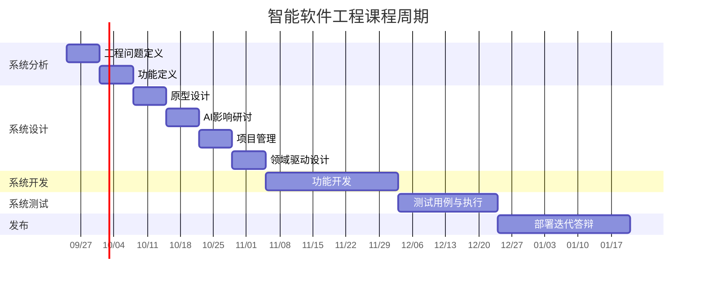

# 课程大纲一览

| 部分 | 周次 | 主题 |
|---|---|---|
| 第一部分 系统分析 | 1-2 | 工程问题定义、软件功能定义 |
| 第二部分 系统设计 | 3-6 | 原型设计、AI影响、项目管理、领域驱动设计 |
| 第三部分 系统开发 | 7-10 | 开发方法、代码质量 |
| 第四部分 系统测试 | 11-13 | 测试方法、交叉测试 |
| 第五部分 发布 | 14-17 | 部署、迭代、答辩 |
---

# 课程进度总览

---
# 学习说明

### 学习目标
- 产品设计（包括设计思维）
- NASA系统工程方法论
- 敏捷开发方法
- 人工智能应用和研究（如AI Agent）
### 基础设施
- 云服务器使用：阿里云，学生认证领取代金券，可抵扣云服务器费用。
- AI token使用：阿里云（百炼），学生代金券可抵扣AI Token费用。[国家超算互联网平台](https://www.scnet.cn/home/internet/index.html)也面向新用户提供免费Token与算力资源，并推出了普惠型算力定价。
- DeepSeek开发者平台 https://platform.deepseek.com/
### 作品完成要求
- 作品需要满足软件行业标准。某些作品会根据等保三级要求完成，参考国标[信息安全技术 网络安全等级保护基本要求](https://openstd.samr.gov.cn/bzgk/std/newGbInfo?hcno=BAFB47E8874764186BDB7865E8344DAF)

