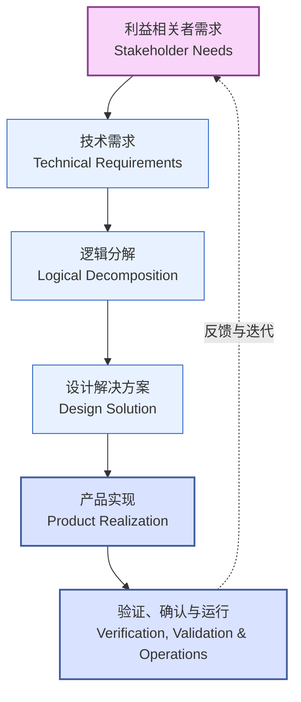
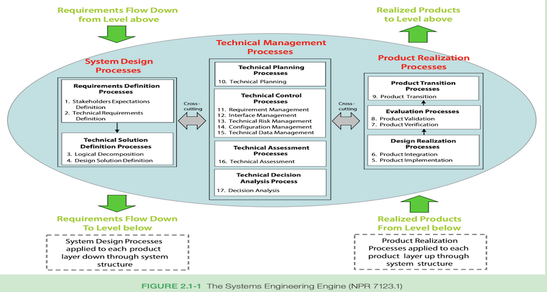
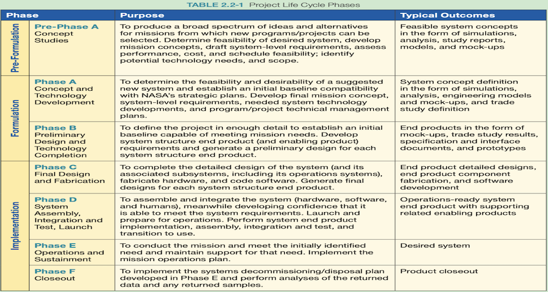
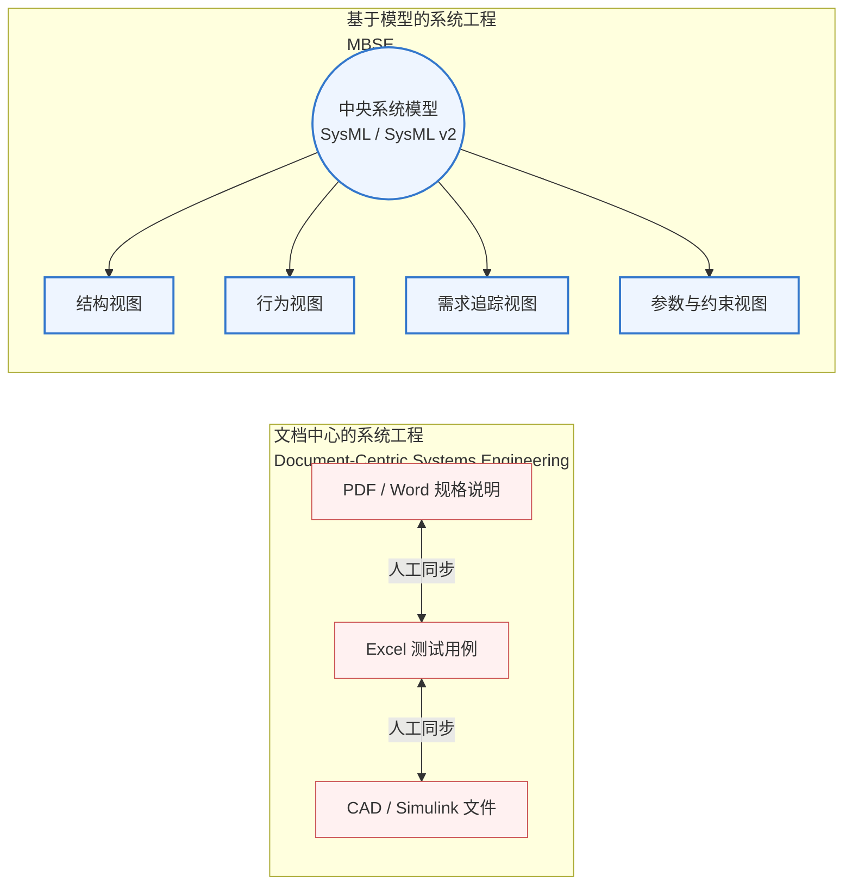
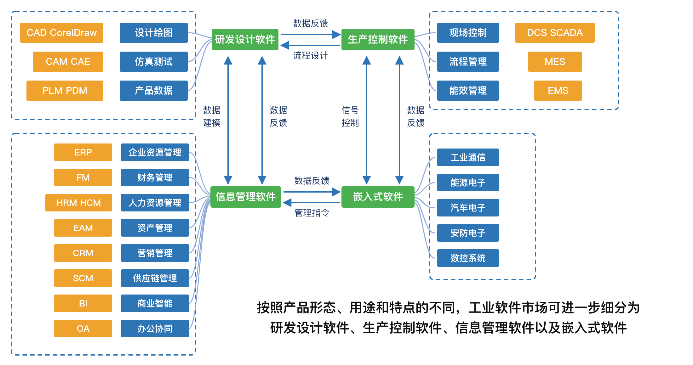
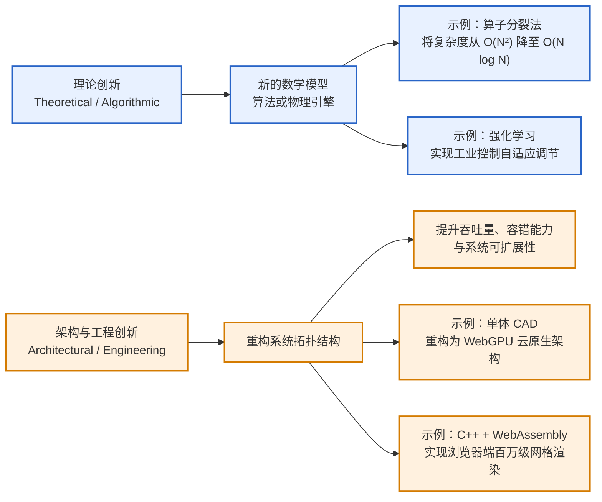
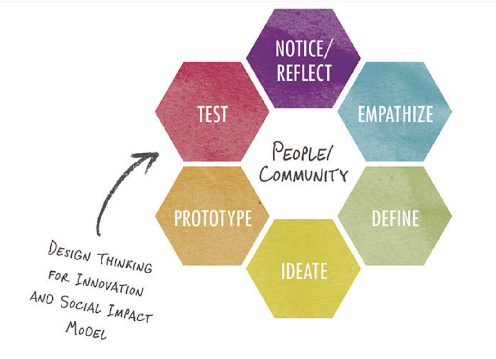
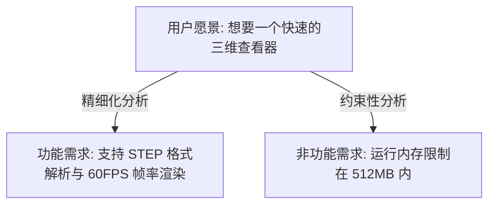
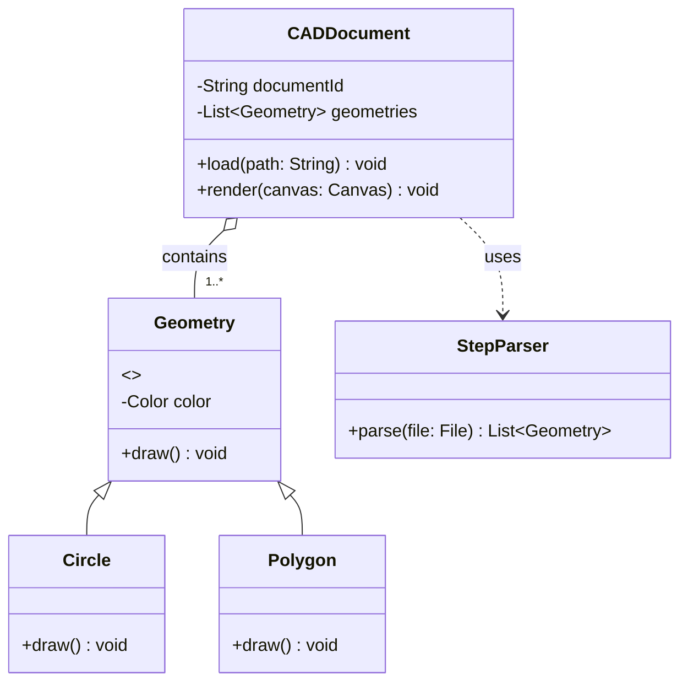
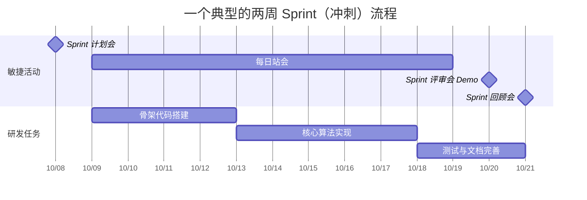

# 第一部分
## 系统分析

第 1-2 周

---
layout: two-cols
---
# 第1周：理论

- NASA 系统工程引擎 (NASA Systems Engineering Engine)
- 基于模型的系统工程 (MBSE) 核心思想
- 工业软件的本质、分类与技术壁垒
- 如何科学地定义工程问题与技术创新
- **实践指南**：协同仓库构建与问题定义

::right::

# 第1周：实践

- 分组
- 定义要解决的工程问题
- 在协作平台上建立小组项目仓库

📋 检查：确认定义的工程问题

---
layout: two-cols
---

# NASA 系统工程引擎
### NASA Systems Engineering Engine

[NASA系统工程手册](https://www.nasa.gov/wp-content/uploads/2018/09/nasa_systems_engineering_handbook_0.pdf)
NASA SP-2016-6105 标准定义了一个高度结构化的系统工程流程：

1. **系统设计流程 (System Design)**:
   - 利益相关者需求定义 (Stakeholder Expectations)
   - 技术需求定义 (Technical Requirements)
   - 逻辑分解 (Logical Decomposition)
   - 设计解决方案定义 (Design Solution)
2. **产品实现流程 (Product Realization)**:
   - 转换、集成、验证、确认与运行 (Transition, Integration, Verification, Validation, Operations)
3. **技术管理流程 (Technical Management)**:
   - 决策分析、技术规划、需求管理、风险管理等

::right::



核心思想：
系统工程不是单一线性过程，而是递归 (Recursive) 和 迭代 (Iterative) 的过程。每一次物理分解都伴随着需求的下发与验证。

---

# NASA 系统工程引擎





---

# NASA项目生命周期




---
layout:two-cols
---
# 基于模型的系统工程 (Model-Based Systems Engineering, MBSE)
::left::
- 传统的系统工程基于**文档 (Document-Centric)**
- 现代系统工程转向**基于模型 (Model-Centric)**


::right::

** SysML (System Modeling Language)**：MBSE 的事实标准，涵盖四根支柱：
- **结构 (Structure)**
- **行为 (Behavior)**
- **需求 (Requirements)**
- **参数 (Parametrics)**


**MBSE的优势**：消除歧义、保持设计一致性、支持早期仿真与验证。


---
layout: two-cols
---
# 工业软件

#### 工业软件 = 软件+工业知识
#### 系统工程
#### 工业技术软件化
#### 软件知识工业化
#### 基于模型的开发

::right::

- 工业软件是工业知识的**数字化、模型化与软件化**载体。
- 工业软件需要用系统工程方法和基于模型的开发方法来实现。
- “工业技术软件化”是把设计、生产、控制、运维等领域的机理、经验、规范和工艺流程，转化为算法、模型、代码及数字化工具，使隐性经验可计算、可视化、可复制。
- “软件知识工业化”是将软件开发形成的知识、方法和工具，按照工业需求进行标准化、模块化、平台化和工程化，形成稳定可靠、可持续迭代的软件产品。
- 二者结合，推动工业知识沉淀复用，提升研发效率、生产质量和管理水平，并促进工业能力规模化传播。

---

# 工业软件类别




---
layout: two-cols
---

::left::

## 工业软件例子
* **CAD** (计算机辅助设计)：几何建模内核、拓扑关系。
* **CAE** (计算机辅助工程)：偏微分方程求解、网格剖分。
* **CAM** (计算机辅助制造)：数控轨迹规划。
* 流程与产品生命周期管理：MES/PLM

**技术壁垒**：
  * 数值计算的精度与稳定性（如：Double precision 溢出控制）。
  * 实时性与高并发事务处理。
  * 领域知识（物理、材料、力学）的深度融合。

::right::

## 参考代码
```cpp
#include 

struct HalfEdge {
    int origin = -1;
    int next = -1;
    int twin = -1;
    int face = -1;
};

// 判断网格是否为封闭流形结构
bool isManifold(const std::vector& edges) {
    // 工业 CAD 内核通常还需要进行更复杂的几何与拓扑校验。
    // 这里仅检查每条半边是否存在对应的孪生半边。
    for (const auto& edge : edges) {
        if (edge.twin < 0) {
            return false; // 存在开边界
        }
    }

    return true;
}
```
---

# 科学地定义工程问题：5W1H 与 痛点映射
### How to Define an Engineering Problem
研究生阶段的创新应避免“造轮子”，而应致力于“解决真实问题”。

| 维度 (5W1H) | 核心追问 | 本质分析 |
|---|---|---|
| **What (什么问题)** | 这个工程瓶颈的核心现象是什么？ | 识别物理现象、数据瓶颈或算力边界。 |
| **Why (为什么解决)** | 现有的开源软件或商业软件为什么做不好？ | 找到现有方案的技术限制（如高复杂度、高延迟）。 |
| **Who (谁受影响)** | 谁是这个软件系统的最终用户？ | 定义用户画像 (User Persona) 和操作环境。 |
| **Where (在哪里发生)** | 该问题发生在生命周期的哪个阶段？ | 确定是运行期、设计期还是部署期。 |
| **When (何时发生)** | 在什么边界条件/极值场景下会触发？ | 定义极限输入、高并发或边缘设备限制。 |
| **How (如何度量)** | 如何定量评估“问题被成功解决”？ | **关键指标 (KPI)**：吞吐量提高30%，内存降低50%等。 |

---

# 产品描述

```text
对于                 （目标用户）
他们                 （诉求和机会）
产品/项目             是一个（产品/项目）类别
它能够               （关键特性，优势和客户为什么选择的理由）
不同于               （竞争对手的产品）
我们的产品/项目      （关键的差异化特性）
```

---
layout: two-cols
---

# 技术的创新路径
::left::


::right::

1. 理论创新 (Theoretical / Algorithmic)

引入新的数学模型、算法或物理引擎。

例如：在流体仿真中引入算子分裂法，将时间复杂度从 O(N^2) 降至 O(N log N)。

在工业控制中引入强化学习实现自适应调节。

2. 架构/工程创新 (Architectural / Engineering)

重构系统拓扑结构，提升吞吐、容错或可扩展性。
  
例如：将单体桌面版 CAD 重构为基于 WebGPU 的云原生协同 CAD 架构。
  
利用 C++ 与 WebAssembly 混合编译，实现浏览器端百万级网格渲染。

💡 给研究生的建议： 硕士阶段更推荐“场景驱动的工程架构创新”或“先进算法在垂直工业领域的应用创新”，既有学术发表度，又有工程落地性。

---
layout: two-cols
---

## 设计思维

- 一种以人为中心（Human-Centered）的创新方法论，源自设计师解决问题的方式，后被斯坦福大学 d.school、IDEO 等机构系统化，广泛应用于产品设计、服务设计、商业创新、教育、社会问题解决等领域。先理解"人们真正需要什么"，通过不断地共情、定义、构思、原型、测试的循环过程，找到既满足用户需求、又技术可行、又商业可持续的解决方案。
- 斯坦福 d.school 的可以反复循环、跳跃迭代的设计思维模型：1. 共情：深入理解用户的真实需求、痛点、情境和情感，而非停留在表面需求。2. 定义：把收集到的信息综合、提炼，形成清晰的问题陈述。3. 构思：不做评判地大量产生解决方案创意，追求数量而非一开始就追求质量。4. 原型：把想法快速具象化，成本低、速度快，目的是"让想法可以被测试"，而非做出完美产品。5. 测试：让真实用户体验原型，收集反馈，验证或推翻假设，然后返回前面任意阶段进行迭代。


::right::

## 设计思维流程




- IDEO 三阶段模型：灵感（Inspiration）→ 构思（Ideation）→ 实施（Implementation）。
- 双钻石模型（Double Diamond）（英国设计协会提出）：发现（Discover，发散）→ 定义（Define，收敛）→ 发展（Develop，发散）→ 交付（Deliver，收敛）。

- 图片来源：Fred Estes. Design Thinking: A Guide to Innovation. 2025. Twenty-First Century Books™
- 参考 [设计思维](https://github.com/bettermorn/IntelligentSWEPractice/wiki/%E8%AE%BE%E8%AE%A1%E6%80%9D%E7%BB%B4)

---
# 第1周：实践

- 分组
- 定义要解决的工程问题
- 在协作平台上建立小组项目仓库


📋 检查：确认学生定义的工程问题

---

# 第 1 周实践：定义你的工程项目与仓库构建
### Practice: Repository Setup & Problem Definition

各小组需要在协作平台（GitHub / GitLab）上建立项目，并提交规范的 `README.md`。

```bash
# 1. 初始化项目仓库结构
mkdir smart-industrial-app && cd smart-industrial-app
git init

# 2. 规范的分支管理策略
git checkout -b main      # 生产分支
git checkout -b develop   # 开发主分支

# 3. 规范的项目目录结构
mkdir -p docs/{architecture,requirements} \
         src/{backend,frontend,core_engine} \
         tests/{unit,integration} \
         .github/workflows
```

- **任务要求**：在 `docs/requirements/problem_definition.md` 中编写 5W1H 报告。
- **检查点**：第一周结束前，各组提交仓库链接，通过 GitHub Issues 获得第一轮反馈。

---
layout: two-cols
---

# 第2周：理论

- 软件功能的科学定义：功能性与非功能性需求
- 面向对象分析与设计 (OOAD) 核心：从领域模型到高内聚低耦合
- 敏捷方法论在学术/工业研发中的应用 (Scrum, Kanban)
- **实践指南**：编写高质量的需求规范书与 UML 设计

::right::

# 第2周：实践

- 定义要解决工程问题的软件作品功能


📋 检查：确认软件作品的功能

---
layout: default
---
# 软件功能定义：从愿景到系统需求
### Software Functional Definition

需求分析是软件工程中最容易导致失败的环节。我们必须将含糊的用户期望转化为精确的系统需求。



* **功能需求 (FRs)**：系统**必须做什么**（输入、处理、输出）。
* **非功能需求 (NFRs)**：系统必须**如何表现**（URPS：可用性 Usability, 可靠性 Reliability, 性能 Performance, 支持性 Supportability）。


- 坏的需求样例： "系统界面要好看，速度要快。"
- 好的需求样例 (可测量的)： "系统在加载 100MB 以上的 CAD 模型时，首屏渲染时间（LCP）需小于 3.0s，且 CPU 利用率不高于 60%。"


---
layout: two-cols
---

# 面向对象分析与设计 (OOAD)
#### Object-Oriented Analysis & Design

OOAD 的核心在于**控制复杂度**。

1. **OOA (分析)**：在问题域中寻找对象，构建**领域模型 (Domain Model)**。
2. **OOD (设计)**：将分析模型转化为设计类，应用**设计原则 (SOLID)** 和**设计模式**。

#### 关键原则：SOLID
- **S**ingle Responsibility (单一职责)
- **O**pen/Closed (开闭原则)
- **L**iskov Substitution (里氏替换)
- **I**nterface Segregation (接口隔离)
- **D**ependency Inversion (依赖倒置)

::right::





设计说明：`CADDocument` 与 `Geometry` 之间是聚合关系。渲染引擎只依赖抽象的 `Geometry` 类型，新增几何类型时不需要修改 `CADDocument`，符合开闭原则（OCP）。


---

# 敏捷开发方法 (Agile Methodology)
### 针对科学研究与不确定性项目的轻量级管理

研究生的项目往往面临“高学术不确定性”，传统的瀑布模型无法适应，推荐使用 **Scrum / Kanban**。



- **Product Backlog**：所有想做的功能池。
- **Sprint Backlog**：本周期（通常2周）承诺完成的任务。
- **定义完成 (Definition of Done, DoD)**：例如“代码通过单元测试，分支合并入 `develop` 且文档已更新”才算完成。
- 参考 [敏捷开发](https://github.com/bettermorn/IntelligentSWEPractice/wiki/%E6%95%8F%E6%8D%B7%E5%BC%80%E5%8F%91) 

---

# 第 2 周实践：软件功能规范书撰写
### Practice: Functional Specification & UML Domain Modeling
本周各组必须在协作仓库中提交 `docs/requirements/functional_spec.md`。

```markdown
# 软件系统功能规格说明书 (示例模板)

## 1. 系统角色 (Actor)
* **工业分析师**：执行数据导入、算法配置与结果可视化。
* **系统管理员**：执行用户授权与配置审计。

## 2. 功能树 (Feature Tree)
* 模型导入模块
  * FR-1.1: 支持 STEP 物理数据包解析
  * FR-1.2: 异常文件鲁棒性容错与日志上报
* 求解器模块
  * FR-2.1: 并行化有限元方程组求解 (支持 OpenMP)

## 3. 领域模型 (Domain Model UML)
[在此处插入 Mermaid 类图]
```

- **汇报要求**：第二周课上，每组用 3 分钟展示其领域类图与功能分解，教师确认后方能进入系统原型设计。
