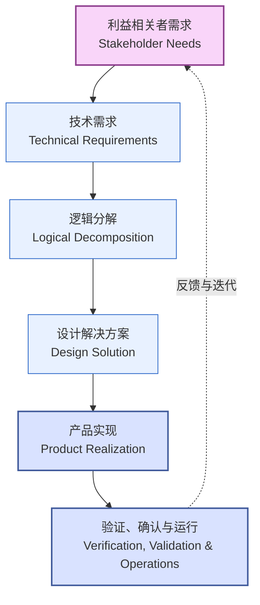
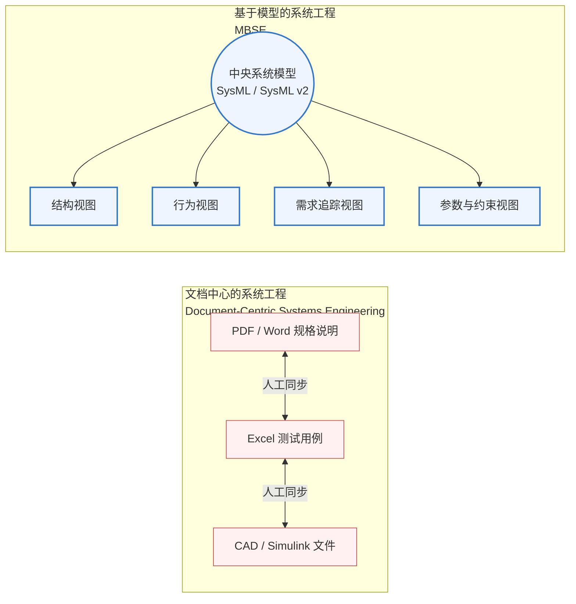
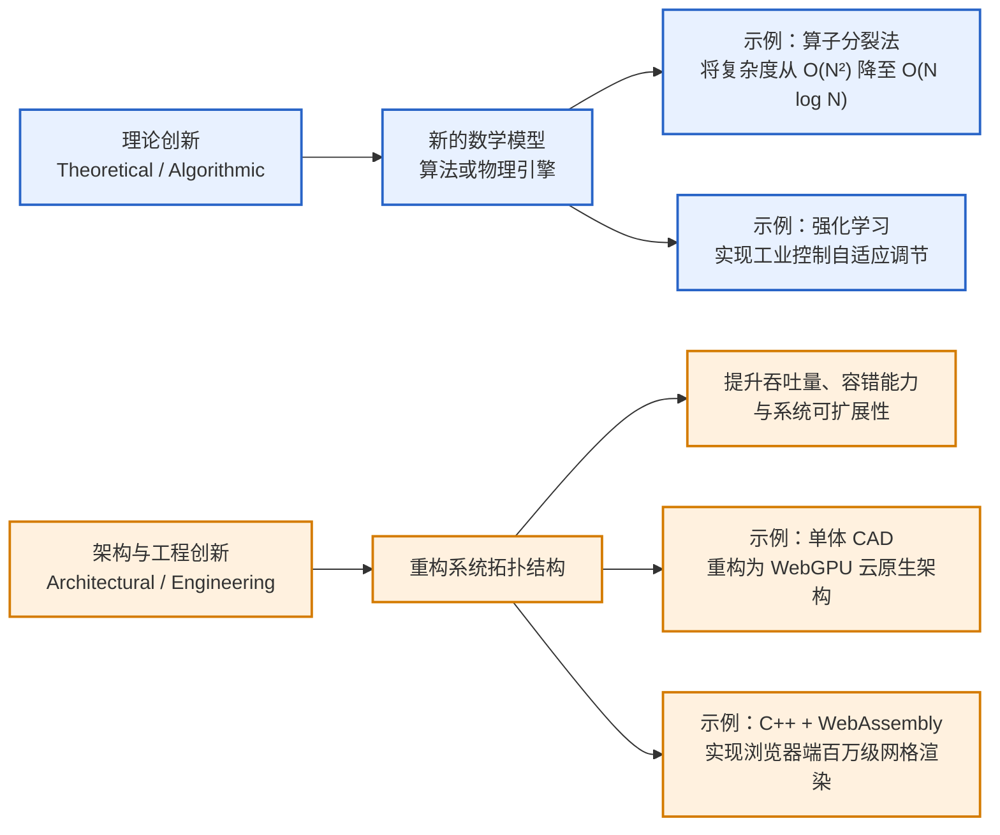
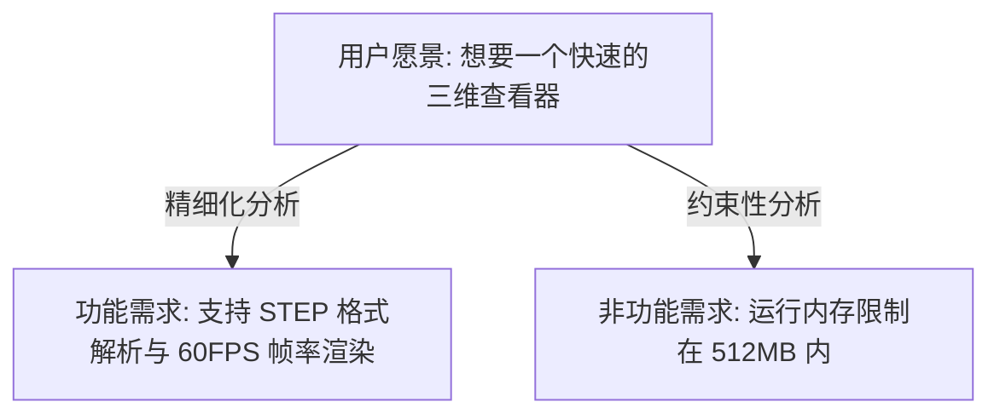
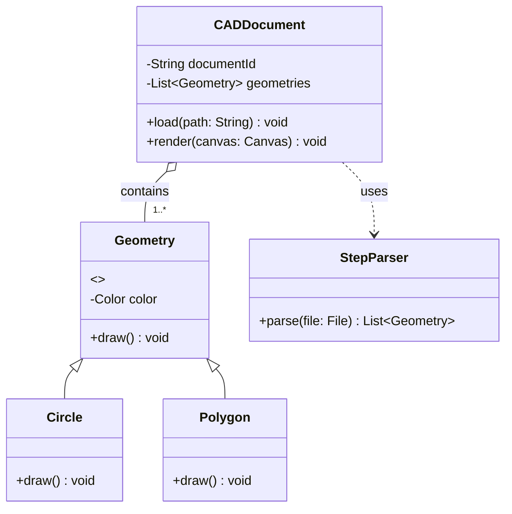
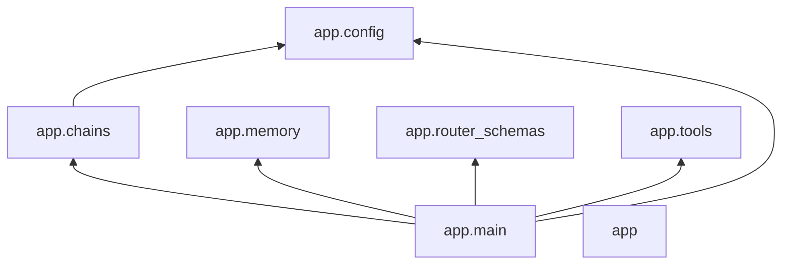
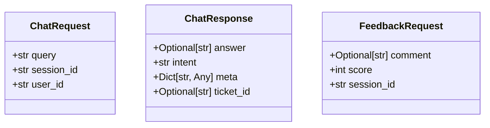
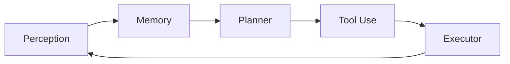
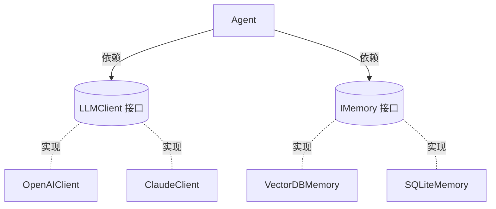
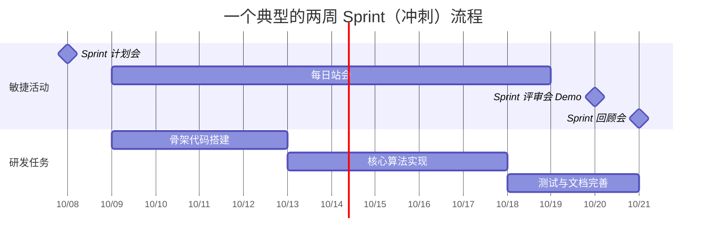

# 第一部分
## 系统分析

第 1-2 周

---
layout: two-cols
---
# 第1周：理论

- NASA 系统工程引擎 (NASA Systems Engineering Engine)
- 基于模型的系统工程 (MBSE) 核心思想
- 工业软件的本质、分类与技术壁垒
- 如何科学地定义工程问题与技术创新
- **实践指南**：协同仓库构建与问题定义

::right::

# 第1周：实践

- 分组
- 定义要解决的工程问题
- 在协作平台上建立小组项目仓库

📋 检查：确认定义的工程问题

---
layout: two-cols
---

# NASA 系统工程引擎
### NASA Systems Engineering Engine

[NASA系统工程手册](https://www.nasa.gov/wp-content/uploads/2018/09/nasa_systems_engineering_handbook_0.pdf)
NASA SP-2016-6105 标准定义了一个高度结构化的系统工程流程：

1. **系统设计流程 (System Design)**:
   - 利益相关者需求定义 (Stakeholder Expectations)
   - 技术需求定义 (Technical Requirements)
   - 逻辑分解 (Logical Decomposition)
   - 设计解决方案定义 (Design Solution)
2. **产品实现流程 (Product Realization)**:
   - 转换、集成、验证、确认与运行 (Transition, Integration, Verification, Validation, Operations)
3. **技术管理流程 (Technical Management)**:
   - 决策分析、技术规划、需求管理、风险管理等

::right::


```mermaid{scale:0.5}
flowchart TD
    A["利益相关者需求<br/>Stakeholder Needs"] --> B["技术需求<br/>Technical Requirements"]
    B --> C["逻辑分解<br/>Logical Decomposition"]
    C --> D["设计解决方案<br/>Design Solution"]
    D --> E["产品实现<br/>Product Realization"]
    E --> F["验证、确认与运行<br/>Verification, Validation & Operations"]
    F -. 反馈与迭代 .-> A

    classDef start fill:#f9d5f9,stroke:#8c3c8c,stroke-width:2px;
    classDef process fill:#e8f1ff,stroke:#2864c7,stroke-width:1px;
    classDef endNode fill:#d9e2ff,stroke:#405a9b,stroke-width:2px;

    class A start;
    class B,C,D process;
    class E,F endNode;
```

核心思想：
系统工程不是单一线性过程，而是递归 (Recursive) 和 迭代 (Iterative) 的过程。每一次物理分解都伴随着需求的下发与验证。

---

# NASA 系统工程引擎


---

# NASA项目生命周期


---
layout: two-cols
---

# 基于模型的系统工程 (Model-Based Systems Engineering, MBSE)

::left::


```mermaid{scale: 0.4}
flowchart LR
    subgraph D[文档中心的系统工程
Document-Centric Systems Engineering]
        Doc1[PDF / Word 规格说明]
        Doc2[Excel 测试用例]
        Doc3[CAD / Simulink 文件]

        Doc1 <-->|人工同步| Doc2
        Doc2 <-->|人工同步| Doc3
    end

    subgraph M[基于模型的系统工程
MBSE]
        Model((中央系统模型
SysML / SysML v2))
        Model --> View1[结构视图]
        Model --> View2[行为视图]
        Model --> View3[需求追踪视图]
        Model --> View4[参数与约束视图]
    end

    classDef document fill:#fff1f1,stroke:#cc5555,stroke-width:1px;
    classDef model fill:#eef5ff,stroke:#3377cc,stroke-width:2px;
    class Doc1,Doc2,Doc3 document;
    class Model,View1,View2,View3,View4 model;
```

::right::

**SysML (System Modeling Language)**：MBSE 的事实标准，涵盖四根支柱：
- **结构 (Structure)**
- **行为 (Behavior)**
- **需求 (Requirements)**
- **参数 (Parametrics)**


**MBSE的优势**：消除歧义、保持设计一致性、支持早期仿真与验证。


---
layout: two-cols
---
# 工业软件

#### 工业软件 = 软件+工业知识
#### 系统工程
#### 工业技术软件化
#### 软件知识工业化
#### 基于模型的开发

::right::

- 工业软件是工业知识的**数字化、模型化与软件化**载体。
- 工业软件需要用系统工程方法和基于模型的开发方法来实现。
- “工业技术软件化”是把设计、生产、控制、运维等领域的机理、经验、规范和工艺流程，转化为算法、模型、代码及数字化工具，使隐性经验可计算、可视化、可复制。
- “软件知识工业化”是将软件开发形成的知识、方法和工具，按照工业需求进行标准化、模块化、平台化和工程化，形成稳定可靠、可持续迭代的软件产品。
- 二者结合，推动工业知识沉淀复用，提升研发效率、生产质量和管理水平，并促进工业能力规模化传播。

---

# 工业软件类别


---
layout: two-cols
---

::left::

## 工业软件例子
* **CAD** (计算机辅助设计)：几何建模内核、拓扑关系。
* **CAE** (计算机辅助工程)：偏微分方程求解、网格剖分。
* **CAM** (计算机辅助制造)：数控轨迹规划。
* 流程与产品生命周期管理：MES/PLM

**技术壁垒**：
  * 数值计算的精度与稳定性（如：Double precision 溢出控制）。
  * 实时性与高并发事务处理。
  * 领域知识（物理、材料、力学）的深度融合。

::right::

## 参考代码
```cpp
#include 

struct HalfEdge {
    int origin = -1;
    int next = -1;
    int twin = -1;
    int face = -1;
};

// 判断网格是否为封闭流形结构
bool isManifold(const std::vector& edges) {
    // 工业 CAD 内核通常还需要进行更复杂的几何与拓扑校验。
    // 这里仅检查每条半边是否存在对应的孪生半边。
    for (const auto& edge : edges) {
        if (edge.twin < 0) {
            return false; // 存在开边界
        }
    }

    return true;
}
```
---
class: text-sm
---

# 科学地定义工程问题：5W1H 与 痛点映射
### How to Define an Engineering Problem
研究生阶段的创新应避免“造轮子”，而应致力于“解决真实问题”。

| 维度 (5W1H) | 核心追问 | 本质分析 |
|---|---|---|
| **What (什么问题)** | 这个工程瓶颈的核心现象是什么？ | 识别物理现象、数据瓶颈或算力边界。 |
| **Why (为什么解决)** | 现有的开源软件或商业软件为什么做不好？ | 找到现有方案的技术限制（如高复杂度、高延迟）。 |
| **Who (谁受影响)** | 谁是这个软件系统的最终用户？ | 定义用户画像 (User Persona) 和操作环境。 |
| **Where (在哪里发生)** | 该问题发生在生命周期的哪个阶段？ | 确定是运行期、设计期还是部署期。 |
| **When (何时发生)** | 在什么边界条件/极值场景下会触发？ | 定义极限输入、高并发或边缘设备限制。 |
| **How (如何度量)** | 如何定量评估“问题被成功解决”？ | **关键指标 (KPI)**：吞吐量提高30%，内存降低50%等。 |

---


# 可以尝试解决的工程问题

仅供参考，可选择自己想要解决的问题。

- [教育智能体](https://github.com/bettermorn/AIAgent/blob/main/docs/AIAgentType.md#%E6%95%99%E8%82%B2%E5%85%B8%E5%9E%8B%E6%99%BA%E8%83%BD%E4%BD%93)
- AI for SE：代码智能基础模型类,代码生成与补全类,自动化测试与修复类,代码审查与质量保障类,需求工程与文档生成类,Agent化软件工程类
- SE for AI: AI/ML 系统测试类,MLOps 与工程实践类,AI系统可解释性与可靠性类,大模型工程化类,AI系统安全与合规类,需求与架构方法论类
- 益智游戏智能体
- 能源智能体，电力交易等
- 健康医药智能体
- 。。。。。。
  


---

# 产品描述

```text
对于                 （目标用户）
他们                 （诉求和机会）
产品/项目             是一个（产品/项目）类别
它能够               （关键特性，优势和客户为什么选择的理由）
不同于               （竞争对手的产品）
我们的产品/项目      （关键的差异化特性）
```

- 产品名称
- 发布时间
- 目标客户+数量有多少
- 解决了什么问题+这个问题对于目标客户来说有多大价值
- 解决方案+类似产品，如何差异化
- 何时交付+主要的里程碑：根据生命周期如分析、设计、开发、测试、发布、迭代
- 团队背景


---

# 产品描述参考案例

```text
对于 （目标用户：高校教和学计算机系统与处理器芯片课程的师生）
他们 （诉求和机会：希望避免在构建相关课程本地化实验环境时遇到的困难，能随时随地开展课程实验项目）
敏捷思沃云平台 是一个（产品），
它能够 （关键特性：为学生提供全在线的软硬件一体化实验环境、云上代码编辑与版本托管环境、多种指令集架构简易处理器的逻辑设计框架、软件持续集成和持续部署功能与以及独特的云化可编程逻辑（FPGA）验证算力资源
       优势：支持多种应用场景，因为云平台具有CPU、FPGA、GPU、DPU等多种异构算力资源
       客户为什么选择的理由：产品集成度好，用户体验好）
不同于 （竞争对手的产品：是否有竞品？）
我们的敏捷思沃云平台 （关键的差异化特性：能够支持多人多种工作）
```

---

# 产品描述参考案例（续）

```
名称：我行MAXUS  C2B汽车定制平台
发布时间：2016年7月15日
目标客户：希望定制个性化、多样化的汽车用户
解决了什么问题：解决了用户对车的多样化需求，为智能化大规模定制生产打造商业模式和实现方法
对客户的价值：	
- 随心而配PAY，消费者不用为个性化支付溢价 
- OTDOrder To Delivery交付高效透明 
- 主机厂认证保障 
- 提供功能性+个性化选择 
- 为消费者带来参与乐趣
解决方案：运营微信公众号、交互平台、微信群
无类似产品，国内首家C2B平台，大众需求定制 vs 国外高端定制
何时交付：4月20日上海车展发布，9月交车。
主要里程碑：根据生命周期
- 用户参与产品定义：目标客户线下调研、 泛大众通过交互平台、大咖竞品试驾活动（专业人士） .
- 用户参与产品开发：5 大分类 60 个可执行的设计点   校园设计大赛
- 用户参与验证：     选拔超级用户试车员、用户质检师参与耐久、性能、高温、高寒、高原等试验认证全过程 
```
---
layout: two-cols
---

# 技术的创新路径
::left::

```mermaid{scale: 0.5}
flowchart LR
    A["理论创新<br/>Theoretical / Algorithmic"] --> A1["新的数学模型<br/>算法或物理引擎"]
    A1 --> A2["示例：算子分裂法<br/>将复杂度从 O(N²) 降至 O(N log N)"]
    A1 --> A3["示例：强化学习<br/>实现工业控制自适应调节"]

    B["架构与工程创新<br/>Architectural / Engineering"] --> B1["重构系统拓扑结构"]
    B1 --> B2["提升吞吐量、容错能力<br/>与系统可扩展性"]
    B1 --> B3["示例：单体 CAD<br/>重构为 WebGPU 云原生架构"]
    B1 --> B4["示例：C++ + WebAssembly<br/>实现浏览器端百万级网格渲染"]

    classDef theory fill:#e8f1ff,stroke:#2864c7,stroke-width:2px;
    classDef engineering fill:#fff1df,stroke:#d47b00,stroke-width:2px;
    class A,A1,A2,A3 theory;
    class B,B1,B2,B3,B4 engineering;
```

::right::

1. 理论创新 (Theoretical / Algorithmic)

引入新的数学模型、算法或物理引擎。

例如：在流体仿真中引入算子分裂法，将时间复杂度从 O(N^2) 降至 O(N log N)。

在工业控制中引入强化学习实现自适应调节。

2. 架构/工程创新 (Architectural / Engineering)

重构系统拓扑结构，提升吞吐、容错或可扩展性。
  
例如：将单体桌面版 CAD 重构为基于 WebGPU 的云原生协同 CAD 架构。
  
利用 C++ 与 WebAssembly 混合编译，实现浏览器端百万级网格渲染。

💡 给研究生的建议： 硕士阶段更推荐“场景驱动的工程架构创新”或“先进算法在垂直工业领域的应用创新”，既有学术发表度，又有工程落地性。

---
layout: two-cols
class: text-sm
---
::left::

## 设计思维

- 一种以人为中心（Human-Centered）的创新方法论，源自设计师解决问题的方式，后被斯坦福大学 d.school、IDEO 等机构系统化，广泛应用于产品设计、服务设计、商业创新、教育、社会问题解决等领域。先理解"人们真正需要什么"，通过不断地共情、定义、构思、原型、测试的循环过程，找到既满足用户需求、又技术可行、又商业可持续的解决方案。
- 斯坦福 d.school 的可以反复循环、跳跃迭代的设计思维模型：1. 共情：深入理解用户的真实需求、痛点、情境和情感，而非停留在表面需求。2. 定义：把收集到的信息综合、提炼，形成清晰的问题陈述。3. 构思：不做评判地大量产生解决方案创意，追求数量而非一开始就追求质量。4. 原型：把想法快速具象化，成本低、速度快，目的是"让想法可以被测试"，而非做出完美产品。5. 测试：让真实用户体验原型，收集反馈，验证或推翻假设，然后返回前面任意阶段进行迭代。
- IDEO 三阶段模型：灵感（Inspiration）→ 构思（Ideation）→ 实施（Implementation）。
- 双钻石模型（Double Diamond）（英国设计协会提出）：发现（Discover，发散）→ 定义（Define，收敛）→ 发展（Develop，发散）→ 交付（Deliver，收敛）。


::right::

## 设计思维流程


- 图片来源：Fred Estes. Design Thinking: A Guide to Innovation. 2025. Twenty-First Century Books™
- 参考 [设计思维](https://github.com/bettermorn/IntelligentSWEPractice/wiki/%E3%80%90%E4%BA%A7%E5%93%81%E6%96%B9%E6%B3%95%E8%AE%BA%E3%80%91%E8%AE%BE%E8%AE%A1%E6%80%9D%E7%BB%B4) 
  

---

# 第1周：实践

- 分组
- 定义要解决的工程问题
- 在协作平台上建立小组项目仓库


📋 检查：确认学生定义的工程问题

---

# 第 1 周实践：定义你的工程项目与仓库构建
### Practice: Repository Setup & Problem Definition

- 各小组需要在协作平台（GitHub / Gitee）上建立项目仓库，并提交规范的 `README.md`。参考[README.md的内容](https://github.com/bettermorn/IntelligentSWEPractice/wiki/%E3%80%90%E8%BD%AF%E4%BB%B6%E5%BC%80%E5%8F%91%E3%80%91%E5%9C%A8GitHub%E4%B8%AD%E4%BD%BF%E7%94%A8Markdown%E5%92%8CWiki#2-%E5%85%B8%E5%9E%8B%E4%BD%BF%E7%94%A8%E5%9C%BA%E6%99%AF)
- 各小组在协作平台（GitHub） 上建立Kanban，Team planning，Bug tracker 等项目。

```bash
# 1. 初始化项目仓库结构
mkdir smart-edu-app && cd smart-edu-app
git init

# 2. 规范的分支管理策略
git checkout -b main      # 生产分支
git checkout -b develop   # 开发主分支

# 3. 规范的项目目录结构
mkdir -p docs/{requirements,algorithm,software,mgmt,retrospection} \
         code/{backend,frontend,core_engine} \
         tests/{unit,integration} \
         .github/workflows
```

- **任务要求**：在 `docs/requirements/problem_definition.md` 中完成 5W1H 报告和产品描述。
- **检查点**：第一周结束前，各组提交仓库链接，通过 GitHub Issues 获得第一轮反馈。

---
layout: two-cols
---

# 第2周：理论

- 软件功能的科学定义：功能性与非功能性需求
- 面向对象分析与设计 (OOAD) 核心：从领域模型到高内聚低耦合
- 敏捷方法论在学术/工业研发中的应用 (Scrum, Kanban)
- **实践指南**：编写高质量的需求规范书与 UML 设计

::right::

# 第2周：实践

- 定义要解决工程问题的软件作品功能


📋 检查：确认软件作品的功能

---
class: text-sm
---
# 软件功能定义：从愿景到系统需求
### Software Functional Definition

需求分析是软件工程中最容易导致失败的环节。我们必须将含糊的用户期望转化为精确的系统需求。


```mermaid{scale:0.7}
graph TD
    UserVision[用户愿景: 想要一个快速的三维查看器] -->|精细化分析| FunctionalReq[功能需求: 支持 STEP 格式解析与 60FPS 帧率渲染]
    UserVision -->|约束性分析| NonFunctionalReq[非功能需求: 运行内存限制在 512MB 内]
```

* **功能需求 (FRs)**：系统**必须做什么**（输入、处理、输出）。
* **非功能需求 (NFRs)**：系统必须**如何表现**（URPS：可用性 Usability, 可靠性 Reliability, 性能 Performance, 支持性 Supportability）。


- ❌ 坏的需求样例： "系统界面要好看，速度要快。"
- 👍 好的需求样例 (可测量的)： "系统在加载 100MB 以上的 CAD 模型时，首屏渲染时间（LCP）需小于 3.0s，且 CPU 利用率不高于 60%。"

---

# URPS 模型概述

FURPS 模型中，**F（功能性）对应功能需求**，其余 **URPS 四项为非功能性需求**，常用于刻画系统质量属性。将其应用于 AI Agent（如 LLM-based 对话/任务型智能体）设计：

| 维度 | 定义 | AI Agent 场景示例 |
|---|---|---|
| **U**sability 可用性 | 易学性、操作效率、用户满意度 | 自然语言交互是否自然流畅、新手上手成本 |
| **R**eliability 可靠性 | 故障频率、可恢复性、准确性 | Agent 幻觉率、工具调用失败后能否自我纠错 |
| **P**erformance 性能 | 响应时间、吞吐量、资源占用 | 首 token 延迟（TTFT）、并发会话吞吐量 |
| **S**upportability 支持性 | 可维护性、可配置性、可测试性、可扩展性 | 新增工具/插件的接入成本、日志可观测性 |

> 相较功能需求（"Agent 能做什么"），URPS 回答的是 **"Agent 做得怎样、好不好维护"** 的问题。

---
layout: two-cols
---


::left::

##  Usability（可用性）需求示例

```text
需求ID: NFR-U-01
描述: 用户首次与 Agent 对话时，无需阅读文档即可完成一次任务（如订机票）
验收标准:
  - 新用户任务完成率 ≥ 90%（未经培训）
  - 平均交互轮次 ≤ 5 轮
  - 用户主观满意度评分 ≥ 4/5（SUS 量表）
```


::right::

## Reliability（可靠性）需求示例

```text
需求ID: NFR-R-01
描述: Agent 在工具调用失败时应具备自我纠错与重试能力
验收标准:
  - 工具调用失败后自动重试 ≤ 2 次，成功率提升 ≥ 30%
  - 连续运行 72 小时无崩溃（MTBF ≥ 72h）
  - 幻觉（hallucination）导致的事实性错误率 ≤ 5%
```

> Agent 的可靠性不仅指系统不崩溃，还包括**输出内容的事实正确性与行为一致性**。

---
layout: two-cols
---


::left::

## ⚡ Performance（性能）需求示例

```text
需求ID: NFR-P-01
描述: Agent 响应速度满足实时交互体验
验收标准:
  - 首 token 延迟 (TTFT) ≤ 800ms
  - 端到端任务完成延迟 ≤ 3s（简单查询）
  - 支持并发会话数 ≥ 1000，P99 延迟不超过均值 2 倍
  - GPU 显存占用 ≤ 24GB（单实例推理）
```


::right::

## 🛠️ Supportability（支持性）需求示例

```text
需求ID: NFR-S-01
描述: Agent 工具链/插件应可低成本扩展与维护
验收标准:
  - 新增一个 Tool 接口平均接入时间 ≤ 1 人日（符合 OCP 原则）
  - 全链路日志覆盖率 100%（Prompt/工具调用/返回结果可追溯）
  - 支持灰度发布与 A/B 测试配置切换，无需重新部署
  - 单元测试覆盖率 ≥ 80%
```

💡 Supportability 直接决定 Agent 系统的**长期演进成本**，是工程化落地中常被低估的维度。


---
layout: two-cols
---

# 面向对象分析与设计 (OOAD)
#### Object-Oriented Analysis & Design

OOAD 的核心在于**控制复杂度**。

1. **OOA (分析)**：在问题域中寻找对象，构建**领域模型 (Domain Model)**。
2. **OOD (设计)**：将分析模型转化为设计类，应用**设计原则 (SOLID)** 和**设计模式**。

#### 关键原则：SOLID
- **S**ingle Responsibility (单一职责)
- **O**pen/Closed (开闭原则)
- **L**iskov Substitution (里氏替换)
- **I**nterface Segregation (接口隔离)
- **D**ependency Inversion (依赖倒置)

::right::



```mermaid{scale:0.6}
classDiagram
    class CADDocument {
        -String documentId
        -List~Geometry~ geometries
        +load(path: String) void
        +render(canvas: Canvas) void
    }

    class Geometry {
        <>
        -Color color
        +draw() void
    }

    class Circle {
        +draw() void
    }

    class Polygon {
        +draw() void
    }

    class StepParser {
        +parse(file: File) List~Geometry~
    }

    CADDocument o-- "1..*" Geometry : contains
    CADDocument ..> StepParser : uses
    Geometry <|-- Circle
    Geometry <|-- Polygon
```


设计说明：`CADDocument` 与 `Geometry` 之间是聚合关系。渲染引擎只依赖抽象的 `Geometry` 类型，新增几何类型时不需要修改 `CADDocument`，符合开闭原则（OCP）。


---

# Python 项目逆向工程生成UML

## `pyreverse` + PlantUML 或 Graphviz

`pyreverse` 是 Pylint 提供的工具，可以从 Python 项目生成 UML 类图，适合分析类、继承关系和模块关系。

安装：

```bash
pip install pylint graphviz
```

在项目根目录执行：

```bash
pyreverse -o png -p MyProject your_package/
```

例如：
```bash
pyreverse -o png -p RAG_QA app/
```


---
layout: two-cols
---

# AI Agent UML 例子


::left::



```mermaid
flowchart BT
    config["app.config"]
    chains["app.chains"] --> config
    main["app.main"] --> config
    main --> chains
    main --> memory["app.memory"]
    main --> schemas["app.router_schemas"]
    main --> tools["app.tools"]
    app["app"]
```

箭头方向为「依赖 → 被依赖」：`app.main` 依赖其余全部模块，`app.chains` 与 `app.main` 都依赖 `app.config` 读取配置。

::right::


```mermaid
classDiagram
    class ChatRequest {
        +str query
        +str session_id
        +str user_id
    }

    class ChatResponse {
        +Optional[str] answer
        +str intent
        +Dict[str, Any] meta
        +Optional[str] ticket_id
    }

    class FeedbackRequest {
        +Optional[str] comment
        +int score
        +str session_id
    }
```    

三个类均为 `app/router_schemas.py` 中的 Pydantic 模型：`ChatRequest` / `ChatResponse` 用于 `/chat` 接口，`FeedbackRequest` 用于 `/feedback` 接口（`meta` 中携带回答的来源列表 `sources`）。


---

# SOLID 驱动的 Agent 架构

| 原则 | Agent 设计体现 |
|---|---|
| SRP | Perception / Memory / Planner / Tool 各司其职 |
| OCP | 工具通过插件注册扩展，无需改核心代码 |
| LSP | 多个 LLM 后端可安全互换 |
| ISP | 按能力拆分细粒度接口（感知/规划/记忆/移动） |
| DIP | Agent 依赖抽象接口，具体实现通过注入组装 |

> 遵循 SOLID 可让多智能体系统（Multi-Agent System）更易测试、扩展与维护。

---

# 引言：为什么 Agent 设计需要 SOLID？

AI Agent 系统通常包含：**感知（Perception）、记忆（Memory）、规划（Planner）、工具调用（Tool）、执行（Executor）** 等模块。


```mermaid
flowchart LR
  P[Perception] --> M[Memory]
  M --> Pl[Planner]
  Pl --> T[Tool Use]
  T --> E[Executor]
  E --> P
```

若将这些逻辑全部塞进一个 `Agent` 类，会导致：
- 难以维护、测试、扩展
- 模块间强耦合，替换 LLM / 工具时牵一发动全身

> SOLID 原则最初用于面向对象设计，同样适用于指导 Agent 系统的模块化架构。


---
layout: two-cols
---

::left::

# 1️⃣ Single Responsibility Principle（单一职责）

一个类/模块只负责一件事，只有一个引起变化的原因。

❌ 反例：一个 `Agent` 类同时做感知、规划、记忆、工具调用

```python
class MonolithicAgent:
    def perceive(self, input): ...
    def plan(self): ...
    def remember(self, data): ...
    def call_tool(self, name, args): ...
    def execute(self): ...
```


::right::

✅ 拆分为职责单一的组件：

```python
class Perception:
    def parse(self, raw_input): ...

class Memory:
    def store(self, event): ...
    def retrieve(self, query): ...

class Planner:
    def generate_plan(self, goal, memory): ...

class ToolExecutor:
    def run(self, tool_name, args): ...
```
> 好处：Planner 逻辑变化（换规划算法）不会影响 Memory 或 ToolExecutor。

---


# 2️⃣ Open/Closed Principle（开闭原则）

**对扩展开放，对修改关闭** —— 新增工具/策略时无需改动已有代码。

✅ 用抽象基类 + 插件化工具注册实现：

```python{scale: 0.5}
from abc import ABC, abstractmethod

class Tool(ABC):
    @abstractmethod
    def run(self, args: dict) -> str: ...

class SearchTool(Tool):
    def run(self, args): return f"搜索结果: {args['query']}"

class CalculatorTool(Tool):
    def run(self, args): return str(eval(args['expr']))

class ToolRegistry:
    def __init__(self):
        self._tools: dict[str, Tool] = {}
    def register(self, name: str, tool: Tool):
        self._tools[name] = tool
    def call(self, name, args):
        return self._tools[name].run(args)
```

> 新增 `WeatherTool`、`CodeExecTool` 只需实现 `Tool` 接口并注册，**不需要修改 `ToolRegistry` 或 `Agent` 核心代码**。


---
layout: two-cols
---

# 3️⃣ Liskov Substitution Principle（里氏替换）

**子类必须能够替换其父类而不破坏程序正确性。**

场景：Agent 需要支持多种 LLM 后端（OpenAI、Claude、本地模型）。

```python{scale: 0.6}
class LLMClient(ABC):
    @abstractmethod
    def generate(self, prompt: str) -> str: ...

class OpenAIClient(LLMClient):
    def generate(self, prompt):
        return call_openai_api(prompt)

class ClaudeClient(LLMClient):
    def generate(self, prompt):
        return call_claude_api(prompt)

class LocalLlamaClient(LLMClient):
    def generate(self, prompt):
        return run_local_model(prompt)
```

::right::

```python
def run_agent(llm: LLMClient, prompt: str):
    return llm.generate(prompt)   # 任意子类都可安全替换
```

> ⚠️ 违反示例：若某个子类 `generate()` 抛出未声明的异常或返回不同语义的结果（如要求额外鉴权参数），则破坏了可替换性。

---
layout: two-cols
---

# 4️⃣ Interface Segregation Principle（接口隔离）

::left::

**不应强迫客户端依赖它不需要的接口** —— 拆分"胖接口"为多个小接口。

❌ 反例：一个臃肿的 `IAgentCapability` 接口

```python
class IAgentCapability(ABC):
    def perceive(self): ...
    def plan(self): ...
    def remember(self): ...
    def speak(self): ...
    def move(self): ...   # 并非所有 Agent 都需要
```


::right::

✅ 按能力拆分为细粒度接口：

```python
class IPerceivable(ABC):
    def perceive(self, input): ...

class IPlannable(ABC):
    def plan(self, goal): ...

class IMemorizable(ABC):
    def remember(self, data): ...

class ChatAgent(IPerceivable, IPlannable, IMemorizable):
    ...   # 无需实现 IMovable 等无关接口

class RoboticAgent(IPerceivable, IPlannable, IMovable):
    ...
```

> 对话型 Agent 不被迫实现 `move()`，机器人 Agent 不被迫实现无关的对话能力。


---
layout: two-cols
---

::left::

# 5️⃣ Dependency Inversion Principle（依赖倒置）

**高层模块不应依赖低层模块，二者都应依赖抽象；抽象不应依赖细节。**

❌ 反例：Agent 直接依赖具体实现（硬编码 OpenAI、具体数据库）

```python
class Agent:
    def __init__(self):
        self.llm = OpenAIClient()        # 具体依赖
        self.memory = SQLiteMemory()      # 具体依赖
```


✅ 依赖抽象接口，通过**依赖注入**解耦：

```python{scale:0.7}
class Agent:
    def __init__(self, llm: LLMClient, memory: IMemory, planner: IPlannable):
        self.llm = llm
        self.memory = memory
        self.planner = planner

# 组装（Composition Root）
agent = Agent(
    llm=ClaudeClient(),
    memory=VectorDBMemory(),
    planner=TreeOfThoughtPlanner(),
)
```

::right::


```mermaid
flowchart TB
  Agent -->|依赖| LLMClient[(LLMClient 接口)]
  Agent -->|依赖| IMemory[(IMemory 接口)]
  LLMClient -.实现.- OpenAIClient
  LLMClient -.实现.- ClaudeClient
  IMemory -.实现.- VectorDBMemory
  IMemory -.实现.- SQLiteMemory
```

> 更换 LLM 提供商或记忆存储方案时，**只需替换注入对象**，`Agent` 核心逻辑零改动。

---

# 敏捷开发方法 (Agile Methodology)
### 针对科学研究与不确定性项目的轻量级管理

研究生的项目往往面临“高学术不确定性”，传统的瀑布模型无法适应，推荐使用 **Scrum / Kanban**。


```mermaid
gantt
    title 一个典型的两周 Sprint（冲刺）流程
    dateFormat YYYY-MM-DD
    axisFormat %m/%d

    section 敏捷活动
    Sprint 计划会 :milestone, plan, 2026-10-08, 0d
    每日站会 :daily, 2026-10-09, 10d
    Sprint 评审会 Demo :milestone, review, 2026-10-20, 0d
    Sprint 回顾会 :milestone, retrospective, 2026-10-21, 0d

    section 研发任务
    骨架代码搭建 :skeleton, 2026-10-09, 4d
    核心算法实现 :algorithm, 2026-10-13, 5d
    测试与文档完善 :testing, 2026-10-18, 3d
```

- **Product Backlog**：所有想做的功能池。
- **Sprint Backlog**：本周期（通常2周）承诺完成的任务。
- **定义完成 (Definition of Done, DoD)**：例如“代码通过单元测试，分支合并入 `develop` 且文档已更新”才算完成。
- 参考 [敏捷开发](https://github.com/bettermorn/IntelligentSWEPractice/wiki/%E3%80%90%E5%B7%A5%E7%A8%8B%E6%96%B9%E6%B3%95%E8%AE%BA%E3%80%91%E6%95%8F%E6%8D%B7%E5%BC%80%E5%8F%91)

---

# Scrum的精髓

- SCRUM使得我们能够专注于如何在**最短**的时间内实现**最有价值**的部分。
- SCRUM使得我们能够快速地经常地监督实际产品发展的状况.（每两周或一个月）
- 团队按照**商业价值**的高低先完成高优先级的产品功能，并自主管理，凝结了团队智慧创造出最好的方法因而提高效率。
- 每隔一两周或者一个月，我们就可以看到实实在在的可以上线的产品。此时，就可以下一步的决定是继续完善功能实现更多需求或者直接发布了。

---
class: text-sm
---

# 使用GitHub做Scrum

Scrum 需要三类支撑：**可视化流程 / 迭代计划 / 缺陷追踪**


| Scrum 要素 | GitHub 对应功能 |实现目标|
|---|---|---|
| Sprint Backlog 可视化 | **Projects (Kanban Board)** |可视化Sprint执行状态|
| Sprint / 里程碑规划 | **Milestones + Team Planning** |支持Sprint计划与评审|
| 缺陷与任务追踪 | **Issues (Bug Tracker)** |缺陷与任务统一入口|


- GitHub **代码、任务、缺陷同源**，减少上下文切换

- Scrum 的"计划—执行—追踪—复盘"全部在同一平台完成

* GitHub Projects 官方文档首页：https://docs.github.com/en/issues/planning-and-tracking-with-projects
* Projects 快速上手指南：https://docs.github.com/en/issues/planning-and-tracking-with-projects/learning-about-projects/quickstart-for-projects
* Projects 自动化设置：https://docs.github.com/en/issues/planning-and-tracking-with-projects/automating-your-project

---

# Kanban 看板：GitHub Projects

把 Sprint Backlog 转化为可拖拽的看板，列对应 Scrum 流程：


```mermaid
flowchart LR
  A[📋 Backlog] --> B[📝 To Do]
  B --> C[🚧 In Progress]
  C --> D[🔍 In Review]
  D --> E[✅ Done]
```

**实践要点：**
- 每张卡片 = 一个 Issue / PR，可挂 Story Points、标签（`feature`、`bug`、`chore`）
- 使用自动化规则：PR 合并 → 卡片自动移至 *Done*
- 燃尽图可借助 GitHub Insights 或第三方可视化插件生成，替代传统独立燃尽图工具


---
layout: two-cols
---

# Team Planning：迭代与里程碑

::left::

**Sprint Planning 对应操作：**
- 创建 **Milestone**（如 `Sprint-5`），设定起止日期
- 将本迭代 Issue 批量绑定到该 Milestone
- 使用 **Assignees** 明确任务负责人
- 结合 **GitHub Projects 视图（Table / Roadmap）** 做排期

::right::

**Daily / Review / Retro 支持：**
- Daily Standup：看板 *In Progress* 列即为站会素材
- Sprint Review：Milestone 进度条（已关闭/总数）自动统计
- Retro：用 Discussions 或专门 Issue 记录复盘要点

> GitHub Milestone 把计划与真实代码进度绑定。

---

# Bug Tracker：Issues 管理缺陷

**标准化流程：**

```yaml
# .github/ISSUE_TEMPLATE/bug_report.yml（简化示例）
name: Bug Report
labels: [bug]
body:
  - type: textarea
    attributes:
      label: 复现步骤
  - type: textarea
    attributes:
      label: 期望 vs 实际行为
  - type: dropdown
    attributes:
      label: 优先级
      options: [P0, P1, P2]
```

- 使用 **Labels**（`bug` / `priority:P0`）+ **Milestone** 定位缺陷所属 Sprint
- Bug 卡片同样进入 Kanban 看板，与功能任务统一排期
- PR 中 `Fixes #123` 语法自动关闭对应 Issue，形成闭环


---
class: text-sm
---

# 软件功能规范书


| 模板部分 | 标准/方法来源 |
|---|---|
| 系统角色 (Actor) | UML（OMG 标准）中用例图的"参与者"概念，源自面向对象分析设计方法 |
| 功能树 + FR-x.y 编号 | IEEE 830 / 现行 ISO/IEC/IEEE 29148 关于"功能性需求"条目化编写的做法，以及产品管理中的 Feature-Driven 拆解思路 |
| 领域模型 UML（类图） | OMG 发布的 UML 2.x 规范，是面向对象分析（OOA）阶段的标准建模语言 |
| 整体文档骨架（引言/术语/角色/功能/约束） | 国内软件企业最常用的 **GB/T 8567-2006《计算机软件文档编制规范》** 配套的"软件需求规格说明书"模板传统 |


一份**专业、国际化改写版的实用SRS 模板**：

1. 整体章节骨架 → 继承自 **GB/T 8567-2006** 及其衍生的企业模板传统（引言/角色/功能描述/约束）；
2. 功能编号体系 → 继承自 **IEEE 830 / ISO-IEC-IEEE 29148** 关于功能性需求可编号、可追溯的要求；
3. Actor 与领域模型图 → 严格遵循 **OMG UML 2.x** 规范；
4. "功能树"命名方式 → 借用了产品管理/敏捷实践中的功能拆解思维，并非任何正式标准条文。

说明：此模板非某一部标准文件的"官方模板"，是业界在 GB/T 8567 / IEEE 830（及其后继 ISO/IEC/IEEE 29148）基础上，结合 UML 建模规范和现代产品管理术语自行整合出的实用模板。


---
class: text-sm
---

# 第 2 周实践：软件功能规范书撰写
### Practice: Functional Specification & UML Domain Modeling
本周各组必须在协作仓库中提交 `docs/requirements/functional_spec.md`和`docs/requirements/nonfunctional_spec.md`。

```markdown
# 软件系统功能规格说明书 (示例模板)

## 1. 系统角色 (Actor)
* **工业分析师**：执行数据导入、算法配置与结果可视化。
* **系统管理员**：执行用户授权与配置审计。

## 2. 功能树 (Feature Tree)
* 模型导入模块
  * FR-1.1: 支持 STEP 物理数据包解析
  * FR-1.2: 异常文件鲁棒性容错与日志上报
* 求解器模块
  * FR-2.1: 并行化有限元方程组求解 (支持 OpenMP)

## 3. 领域模型 (Domain Model UML)
[在此处插入 Mermaid 类图]
```
可参考 [多智能体 AI Agent 工业分析平台：软件功能规格说明书](https://github.com/bettermorn/AIAgent/blob/main/docs/AIAgentFunSpec.md)
- **汇报要求**：第二周课上，每组用 3 分钟展示其领域类图与功能分解，教师确认后方能进入系统原型设计。
