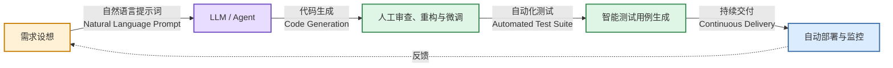
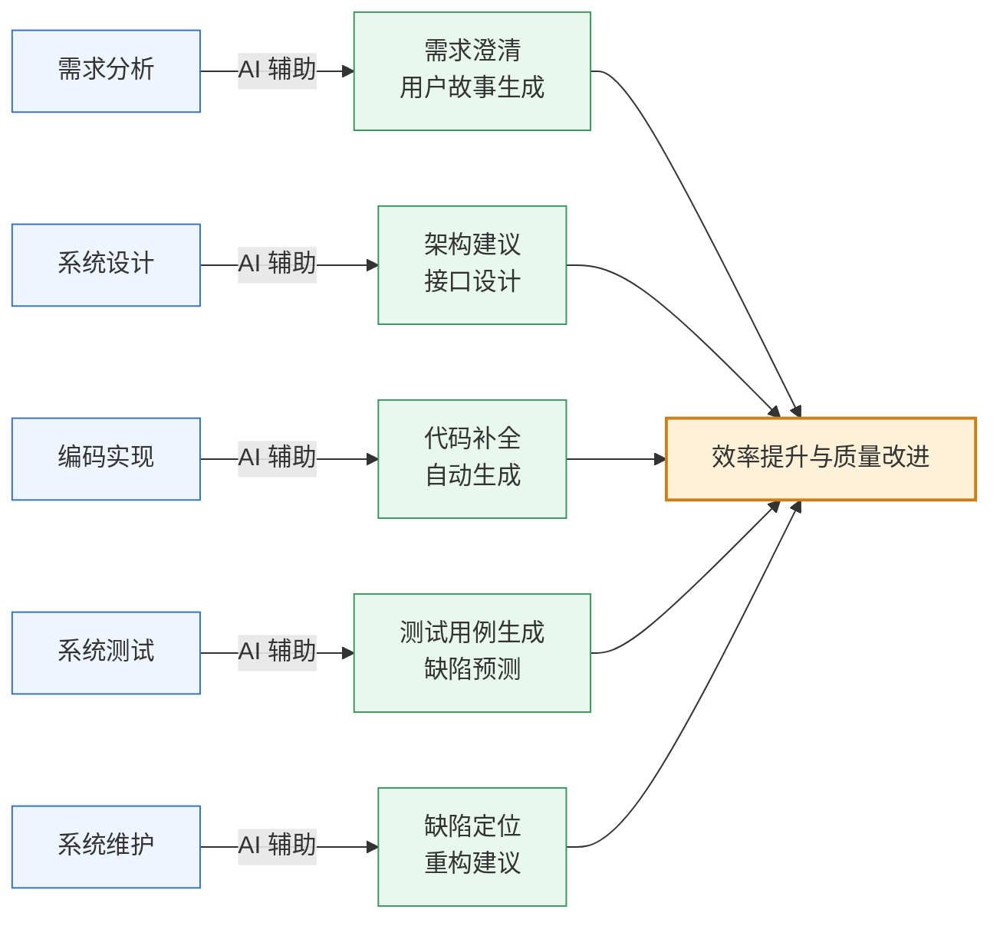
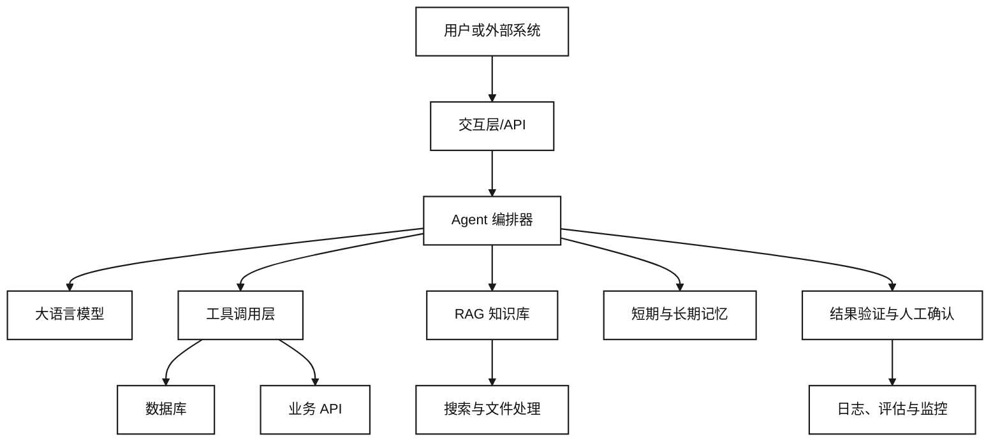
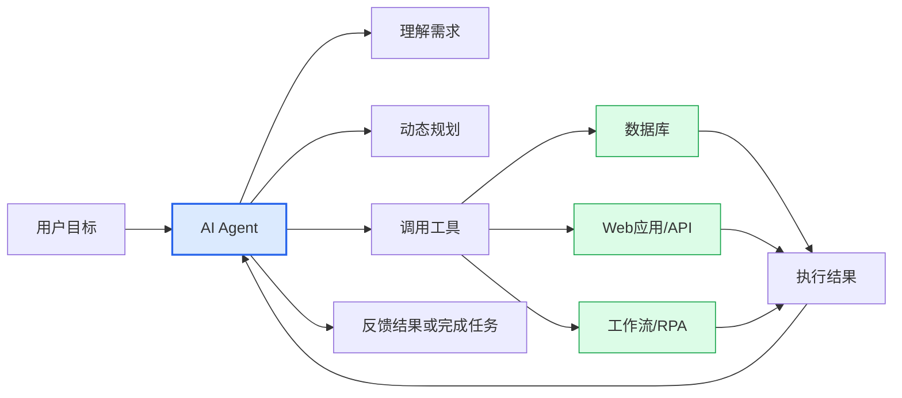
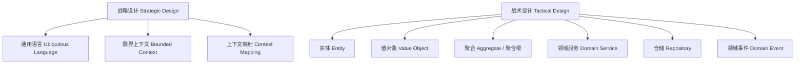

# 第二部分
## 系统设计

第 3-6 周
---
layout: two-cols
---

# 第3周：理论

- 智能软件工程的研究与实践
- 什么是智能软件工程 (Smart Software Engineering / AI4SE)？
- 大语言模型 (LLM) 在需求、代码生成与重构中的应用
- 如何编写符合 INVEST 原则的用户故事 (User Stories)
- **实践指南**：利用 AI 辅助设计（v0.dev / Figma / React）构建高保真原型

::right::

# 第3周：实践

- 编写用户故事
- 使用 AI 工具及原型设计工具设计软件作品原型
- 调研技术方案

📋 检查：确认软件作品原型设计

---

# 智能软件工程 (Smart Software Engineering)
### 当软件工程遇到大语言模型 (AI4SE)
学术界与工业界正经历从传统的“人写代码”向“人机协同 (Human-in-the-loop AI Coding)”的范式转变。

* **研究热点**：基于 Agent 的软件工程自治、静态代码分析大模型、代码大模型对齐（RLHF for coding）。
* **核心生产力**：不仅是 Copilot 自动补全，更是在架构生成、单元测试生成方面的突破。

---
layout: two-cols
---
# 编写高质量的用户故事
### Writing INVEST User Stories
用户故事是敏捷开发中描述功能需求的核心工具。
**标准模板：**
> 作为一名 `[角色]`，
> 我想要 `[某种功能]`，
> 以便能够 `[实现某种价值]`。

#### INVEST 原则：
* **I**ndependent（独立的）
* **N**egotiable（可协商的）
* **V**aluable（有价值的）
* **E**stimable（可估算的）
* **S**mall（小巧的）
* **T**estable（可测试的）
::right::

#### 用户故事与验收标准实例：

```yaml
用户故事:
  角色: 作为一名结构工程师
  功能: 我想要一键导入 STEP 格式的文件
  价值: 从而避免手动转换格式造成的精度损失。

验收标准 (Acceptance Criteria - Gherkin 语法):
  场景: 导入一个有效的 STEP 模型
    Given 用户在主界面并点击了"导入"按钮
    When 用户选择了一个标准的 50MB "engine.step" 文件
    Then 系统应在 5.0 秒内完成解析并无损渲染
    And 系统状态栏应显示 "导入成功，包含 1420 个面"
```

---

# AI 辅助原型设计：从自然语言到交互式代码
### AI-Assisted Prototyping

在进行大规模开发前，利用 AI 生成工具快速完成**高保真交互原型 (Interactive Prototype)**，能够极大降低需求偏离的风险。

* **工具推荐**：
  * **v0.dev / Bolt.new** (前端 UI 的自然语言生成)
  * **Figma AI** (组件化交互设计)
  * **Uizard** (手绘草图转换为高保真 UI)


给 AI 的 Prompt 示例：

"Generate a responsive Tailwind React dashboard for a Scientific Simulation Control System. It should contain an interactive 3D canvas placeholder (using Three.js icons), a left sidebar showing the simulation parameters (density, gravity, step size), a bottom panel showing a live-updated charting log for error rates, and a clear run/pause control cluster."为一个科学仿真控制系统生成一个响应式的 Tailwind React 仪表盘。该仪表盘应包含一个交互式 3D 画布占位符（使用 Three.js 图标）、一个显示仿真参数（密度、重力、步长）的左侧边栏、一个显示实时更新的误差率图表日志的底部面板，以及一个清晰的运行/暂停控制组件。

---

# 示例代码：一个简易的三维渲染原型组件 (React)
### Example Code: Prototype Component for Three.js Viewport

```tsx{scale: 0.4}
// src/components/SimulationViewport.tsx
import React, { useState } from 'react';

type SimulationParams = {
  density: number;
  viscosity: number;
};

export const SimulationViewport: React.FC = () => {
  const [isPlaying, setIsPlaying] = useState(false);
  const [params, setParams] = useState({
    density: 1.2,
    viscosity: 0.01,
  });

  const updateParam = (
    key: keyof SimulationParams,
    value: number,
  ) => {
    setParams((current) => ({
      ...current,
      [key]: value,
    }));
  };

  return (
    

      

        

          

            3D Simulation Space
          


                      className={
              isPlaying
                ? 'text-emerald-400'
                : 'text-slate-400'
            }
          >
            {isPlaying
              ? 'Status: Solving Navier–Stokes...'
              : 'Status: Idle'}
          
        


        

          
            Three.js / WebGPU Viewport
          
        

      


      

        

          Control Panel
        


        
          Density: {params.density.toFixed(2)}
        

                  type="range"
          min="0.1"
          max="5"
          step="0.1"
          value={params.density}
          onChange={(event) =>
            updateParam(
              'density',
              Number.parseFloat(event.target.value),
            )
          }
          className="mb-4 w-full"
        />

        
          Viscosity: {params.viscosity.toFixed(3)}
        

                  type="range"
          min="0"
          max="1"
          step="0.001"
          value={params.viscosity}
          onChange={(event) =>
            updateParam(
              'viscosity',
              Number.parseFloat(event.target.value),
            )
          }
          className="mb-6 w-full"
        />

                  type="button"
          onClick={() => setIsPlaying((current) => !current)}
          className={`w-full rounded py-2 font-semibold text-white ${
            isPlaying
              ? 'bg-rose-600 hover:bg-rose-500'
              : 'bg-emerald-600 hover:bg-emerald-500'
          }`}
        >
          {isPlaying
            ? 'Pause Simulation'
            : 'Run Simulation'}
        
      

    

  );
};
```
---

# 第 3 周实践：用户故事地图与技术方案调研
### Practice: User Story Mapping & Tech Stack Investigation
本周各组要将前期的软件定义转化为具体的研发路线，并完成原型设计。

#### 第 3 周汇报要求：

1. **用户故事清单 (docs/requirements/user_stories.md)**：
   * 至少编写 5 个符合 INVEST 规范的用户故事。
   * 每个故事需配有详细的 验收条件 (Acceptance Criteria)。

2. **原型展示**：提交利用 AI (如 v0.dev / Figma) 生成的交互式原型页面，上台 Demo 交互流程。

3. **技术方案调研报告 (docs/architecture/tech_stack.md)**：
   * 论证核心技术选型。例如：为什么选用 WebAssembly 还是 C++ 原生运行？
   * 列出团队在未来 2 周内需要学习的新技术（制定自学计划与 Milestone）。


* **检查点**：教师将严格评估**原型的可行性**以及**技术选型的科学性**，确认后方可进入系统开发（第四阶段）。

---

# 用户故事地图


---

# 课后思考与阅读建议

为第4周学术文献阅读汇报做准备，各组需选择多篇 IEEE/ACM 顶级会议/期刊论文进行研读

## 阅读内容

- AI for SE（用AI技术改进软件工程）
- SE for AI（用软件工程方法保障AI系统质量）

## 建议阅读路径

- 优先从顶会（ICSE、FSE、ASE）近三年的 AI4SE 专题论文和 Survey 类综述文章入手，快速建立领域全景认知。
- 再针对具体子方向（如代码生成、自动修复、Agent系统）深入阅读代表性工作和最新 SOTA 论文。
- 同时建议关注 arXiv 上的预印本，因为该领域迭代速度快，很多前沿工作尚未正式发表即已产生广泛影响。

---

# 研究AI for SE（用AI技术改进软件工程）

- **1. 代码智能基础模型类**：Codex、CodeBERT、CodeT5、StarCoder、Code Llama 等代码预训练模型论文，了解代码表征学习和生成模型的演进。

- **2. 代码生成与补全类**：研究大模型在代码补全、函数生成、代码翻译（跨语言转换）方面的应用与评测基准（如 HumanEval、MBPP）。

- **3. 自动化测试与修复类**：涵盖测试用例自动生成、变异测试、程序自动修复（APR，Automated Program Repair）、缺陷定位（Fault Localization）等主题。

- **4. 代码审查与质量保障类**：AI 辅助代码评审、静态分析结合深度学习的漏洞检测、代码坏味道识别等论文。

- **5. 需求工程与文档生成类**：利用 NLP/LLM 进行需求提取、用户故事自动生成、API 文档/注释自动生成的研究。

- **6. Agent 化软件工程类**：近两年热门的 AI Agent 自动化编程（如 SWE-bench、Devin 类系统、多 Agent 协作开发）论文，代表了 AI for SE 的最新前沿。


---

# 研究SE for AI（用软件工程方法保障AI系统质量）

- **1. AI/ML 系统测试类**：机器学习模型测试方法、数据drift检测、模型鲁棒性测试、对抗样本测试相关论文。

- **2. MLOps 与工程实践类**：研究机器学习流水线（Pipeline）工程化、模型版本管理、CI/CD for ML、特征存储（Feature Store）设计等主题。

- **3. AI系统可解释性与可靠性类**：探讨AI黑盒问题的可解释性方法、模型可信度评估、故障模式分析（Failure Mode Analysis）。

- **4. 大模型工程化类**：研究 LLM 应用的Prompt工程规范、RAG系统架构设计、大模型评测框架（Evaluation Framework）构建方法。

- **5. AI系统安全与合规类**：涵盖 Prompt 注入防护、数据隐私保护、AI伦理与合规性（如 EU AI Act 相关技术标准）研究。

- **6. 需求与架构方法论类**：探讨面向AI系统的需求工程方法、AI系统特有的架构模式（如MLOps架构、Agent架构设计模式）。


期待在下周的文献汇报中，听到各位从研究生科研视角带来的深刻洞见！

---

# 第4周

## 理论
### AI 与软件工程的相互影响

🎤 汇报：智能软件工程文献阅读

---


# 本周学习目标

- 理解 AI 对软件工程全生命周期的渗透：哪些环节被"加速"，哪些被"重塑"
- 区分 **AI 辅助开发** 与 **AI 原生软件** 两个不同命题
- 掌握目前主流的 AI 编码工具及其能力边界
- 认知 AI 带来的新问题：代码安全、版权、幻觉、对工程师能力的影响
- 能够评估：目前要从事的项目中，AI 可以应用到哪些环节

---
layout: two-cols
---
# AI 辅助开发（AI for SE）
把 AI 当工具，**提升软件工程的效率**

- AI 写代码、生成测试、修 Bug
- AI 读文档、做评审
- 工程师仍是主体

::right::

# AI 原生软件（SE for AI）
把 AI **嵌入软件本身**，成为产品能力

- 智能推荐、对话式交互
- 代码里跑着大模型
- 工程问题转为"如何可靠地使用AI"


💡 对具体项目：既在用 AI 辅助开发（第3周已用AI工具做原型），又在考虑把 AI 算法模型作为作品功能（第6周技术方案）——这正是两者的结合


---

# AI 在软件全生命周期中的应用



---

# 国际主流 AI 编码工具一览

| 工具 | 定位 | 典型能力 |
|---|---|---|
| **GitHub Copilot** | 行内补全 | 内联代码补全、聊天交互、Copilot Workspace |
| **Cursor** | AI 优先编辑器 | 全库理解、AI 编辑、代码库问答 |
| **Claude Code** | 编程代理 | 多文件修改、任务拆解、自主执行 |
| **Codeium / Windsurf** | 替代方案 | 免费补全、多语言 |
| **JetBrains AI** | IDE 集成 | 在 IntelliJ/PyCharm 内使用 |
| **ChatGPT / Claude** | 通用对话 | 代码解释、面试题、文档生成 |
| **GitHub Copilot / CodeRabbit** | 代码评审 | 自动 PR 审查、找 Bug |

---
class: text-sm
---

# 中文主流 AI 编码工具一览


| 工具 | 定位 | 典型能力 |
|---|---|---|
| **通义灵码（Tongyi Lingma）** | IDE 插件 / 行内补全 | 代码补全、单元测试生成、代码解释，支持主流 IDE（阿里云） |
| **CodeGeeX** | 开源代码大模型 | 多语言代码生成/补全，支持 VS Code、IntelliJ 插件（智谱 & 清华） |
| **文心快码（Baidu Comate）** | AI 编程助手 | 智能补全、代码生成、单测生成、代码解释（百度文心大模型） |
| **DeepSeek Coder / DeepSeek-V3** | 开源代码大模型 | 代码生成、补全、调试，性能对标国际主流模型（DeepSeek） |
| **MarsCode** | AI 编程助手 | 代码补全、Bug 修复、代码解释，集成于 IDE（字节跳动） |
| **CodeFuse** | 企业级代码大模型 | 代码生成、代码评审、知识库问答，开源生态（蚂蚁集团） |
| **腾讯云 AI 代码助手** | IDE 插件 | 代码补全、代码解释、注释生成，集成腾讯云开发环境（腾讯） |
| **讯飞星火代码助手** | 编程辅助工具 | 代码生成、解释、调试建议，基于星火大模型（科大讯飞） |
| **Kimi（Moonshot AI）** | 通用对话/长文本 | 代码解释、长上下文代码分析、文档生成（月之暗面） |

---

#  中文主流 AI 编码工具补充说明

- **通义灵码**、**文心快码**、**MarsCode** 等属于国内大厂推出的“行内补全类”工具，功能上与 GitHub Copilot 类似，且深度适配国内开发者常用工具链（如飞书、钉钉集成、Gitee 等）。
- **CodeGeeX**、**DeepSeek Coder** 属于**开源代码大模型**，可自部署或通过 API 调用，在国际评测榜（如 HumanEval、MBPP）中表现优异，是中国开源社区的重要贡献。
- **CodeFuse** 更偏向企业级场景，强调代码知识库检索和内部研发效能提升。
- 大多具备**中文语境优化**优势，例如更好理解中文注释、中文需求描述转代码等，在本土化开发场景中体验更佳。

---
layout: two-cols
---

# ✅ AI 擅长

- 生成**样板代码**（CRUD、配置、DTO）
- 补全重复性高、有明确模式的内容
- 单测生成、注释生成、文档翻译
- 给出**常见问题**的已知解法
- 快速搭出一个可运行的原型


::right::


# ❌ AI 的局限

- **不理解业务语义**——它不知道"为什么这样设计"
- 生成看似正确实则**隐藏 Bug** 的代码
- **幻觉**：编造不存在的 API、库、函数
- 不会主动质疑不合理的需求
- 处理**大型复杂系统**的全局一致性能力有限
- 无法替你拍板架构决策


---
class: text-sm
---

# 幻觉（Hallucination）案例：AI 编造不存在的 API


```java
// AI 生成的代码（示例）
// 假设用了一个不存在的库方法
import com.example.redis.StringRedisTemplate;

public class CacheService {
    public String get(String key) {
        return redisTemplate
            .getOrElse(key, () -> "default"); // ❌ 该方法不存在
    }
}
```

AI 很自信地编造了一个 `getOrElse` 方法，看起来像通用的 Redis 缓存 API，但实际不存在。

```java
// ✅ 真实存在的 Redis API
public String get(String key) {
    String v = redisTemplate.opsForValue().get(key);
    if (v == null) {
        return "default";
    }
    return v;
}
```

⚠️ 结论：AI 生成代码必须经过**编译/运行验证**，以及**人工代码审查**，不能盲信。呼应第9周"代码质量工具"。


---

# AI 时代的安全新问题
- **Prompt Injection（提示注入）**：恶意用户通过输入让 AI 模型执行非预期指令
- **数据泄露**：把公司敏感代码喂给外部 AI，可能被用于训练
- **供应链风险**：AI 推荐的不熟悉依赖包可能存在恶意代码
- **不可审计性**：AI 生成的复杂代码，人类难以审查其正确性
- **版权模糊**：AI 生成代码是否存在版权问题，法律尚未统一

🔒 **应对**：企业会部署私有化模型 / 使用"带安全审查的AI" / 设置代码上传白名单 / 对AI生成的代码必须强制走评审流程

---
layout: two-cols
---

# AI 对软件工程师角色的冲击
- **初级编码工作被替代**：样板代码、重复工作交给 AI
- **工程师能力重心上移**：从"会写代码"转向"会提问、会审查、会架构"
- **Prompt Engineering** 成为软技能
- **更强调**：系统设计、领域理解、质量意识、责任心

::right::

# 启示

在项目里：

- 哪些工作 AI 能做（让 AI 做）
- 哪些工作只能人来判断（业务决策、架构取舍）
- 如何在作品中体现"人机协作"而非"AI 替代人"

---
class: text-sm
---

# AI 工程比较

|比较维度 |提示词工程|上下文工程|驾驭层工程|循环工程|
|---|---|---|---|---|
|核心问题|如何把任务表达清楚|模型当前需要知道什么|如何约束模型执行|如何通过多轮反馈完成任务|
|主要对象|指令、角色、示例、输出格式|文档、历史、状态、记忆、工具结果|运行时、工具、权限、沙箱、验证器|计划、行动、观察、反馈、重试、终止|
|关注粒度|单次调用或单条消息|当前调用所需的信息集合|一次受控任务运行|从开始到结束的完整任务轨迹|
|技术本质|语言控制和任务表达|信息选择、压缩、排序和注入|运行控制、权限约束和系统编排|反馈控制、状态转移和搜索优化|
|核心目标|提高单轮回答质量|提高信息相关性和完整性|提高安全性、稳定性和可观测性|提高复杂任务的完成率和可恢复性|

---
class: text-sm
---

# AI 工程比较

|维度|提示词工程|上下文工程|驾驭层工程|循环工程|
|--|--|--|--|--|
|操作对象|单次调用的文本|上下文窗口里的全部内容|模型之外的运行时骨架|控制流与时间结构|
|时间尺度|一轮|一次会话|一个任务期（含多次工具调用）|跨多轮/多任务|
|交付物|一段字符串|一个上下文组装流水线|一套代码、接口、沙箱、权限|一张状态机/流程图|
|核心约束|指令是否被理解|注意力是稀缺资源|动作空间是否可观测、可回滚|过程是否收敛、何时停止|
|典型手段|角色设定、格式约束、示例、思维链|检索、记忆、摘要压缩、按需加载、子代理隔离|工具 schema、沙箱、状态持久化、错误回传格式、日志回放|终止条件、预算、计划-执行-验证、并行/串行、人工升级点|
|度量|指令遵循率、格式正确率|同模型下的任务成功率、token 成本|任务成功率、故障恢复率、安全事件|收敛率、步数/成本分布、人工介入率|


---
# AI Agent架构



参考[AI Agent常见工作流模式](https://github.com/bettermorn/AIAgent/blob/main/docs/AIAgentConcept.md#%E5%B8%B8%E8%A7%81agent%E5%B7%A5%E4%BD%9C%E6%B5%81%E6%A8%A1%E5%BC%8F)

---
class: text-sm
---

# AI Agent类型

| 类型 | 工作方式 | 适用场景 | 主要特点 |
|---|---|---|---|
| 被动响应型 Agent | 接收用户明确指令后执行单次任务，不主动规划，也不会持续跟踪任务状态 | 问答、信息检索、文本生成、简单数据查询、客服 FAQ | 自主程度最低；响应速度快；行为可控；通常不具备长期记忆和连续执行能力 |
| 辅助决策型 Agent（Copilot） | 在用户主导下提供建议、草稿、分析结果或操作辅助，由用户确认后完成最终决策和执行 | 编程辅助、文档撰写、销售支持、数据分析、办公自动化 | 人机协作；用户拥有最终控制权；能够理解上下文并提供个性化建议；适合高风险或需要人工审核的任务 |
| 任务执行型 Agent | 用户给出目标后，Agent 会自行拆解任务、调用工具并执行多个步骤，但通常需要关键节点确认 | 自动生成报表、数据清洗、部署应用、处理工单、执行标准业务流程 | 具备一定规划和工具调用能力；可连续执行任务；在关键操作前通常需要人工审批；兼顾效率与可控性 |
| 半自主型 Agent | 仅需接收较高层次的目标，能够自主规划、执行、监控和调整任务，遇到异常或高风险情况时请求人工介入 | 复杂数据工程、自动化运维、研究分析、供应链管理、营销活动编排 | 自主程度较高；具备状态跟踪、错误恢复和动态调整能力；采用“人在回路中”机制；适合流程较复杂但仍需监督的任务 |
| 全自主型 Agent | 根据目标或约束条件独立完成任务，包括规划、决策、工具调用、执行、评估和迭代，通常无需人工逐步干预 | 长时间运行的监控系统、自动化交易模拟、虚拟企业运营、复杂科研探索、无人化流程 | 自主程度最高；能够持续运行和自我调整；对环境感知、记忆、规划和安全控制要求高；存在误操作、目标偏离和合规风险 |
| 多 Agent 协作系统 | 多个具有不同职责的 Agent 分工协作，由协调 Agent 或通信机制分配任务、汇总结果和处理冲突 | 软件研发团队模拟、复杂研究项目、端到端业务流程、跨部门自动化 | 通过角色分工提升复杂任务处理能力；可并行执行；系统设计和协作成本较高；需要统一权限、通信和结果校验机制 |

**高风险操作均采用“人在回路中”机制，Agent 可以生成建议、编排任务和提交申请，但涉及控制、工单关闭、成绩发布、科研任务提交等操作必须经过授权审批。**


---

# AI Agent 技术栈

|层级|主要职责|推荐技术|
｜--｜--｜--｜
|前端交互层|对话、文件上传、结果展示|React、Next.js、Vue、Nuxt|
|API 层|鉴权、限流、接口管理|FastAPI、NestJS、Spring Boot、Kong|
|Agent 层|Prompt、工具调用、状态和流程编排|LangGraph、LangChain、LlamaIndex|
|模型层|模型调用、路由和成本控制|OpenAI、Claude、Gemini、LiteLLM|
|数据层|业务数据、向量数据、缓存|PostgreSQL、pgvector、Redis、Milvus|
|基础设施层|部署、监控、日志和安全|Docker、Kubernetes、Prometheus、Vault|


参考 [AI Agent](https://github.com/bettermorn/AIAgent/blob/main/docs/)


---
layout: two-cols
class: text-sm
---

# 应用软件与 AI Agent：区别与联系

::left::



**核心关系：**

- 应用软件强调“提供什么业务功能”
- AI Agent强调“能否围绕目标自主理解、规划和行动”
- AI Agent通常调用应用软件、数据库和API完成任务
- 一个应用软件可以内置Agent；一个Agent也可以操作多个应用软件

::right::

| 对比维度 | 传统应用软件 | AI Agent |
|---|---|---|
| 核心定位 | 提供固定业务功能 | 面向目标自主完成任务 |
| 交互方式 | 菜单、按钮、表单、固定参数 | 自然语言、文档、语音、事件 |
| 执行逻辑 | 预先设计好的规则和流程 | 动态理解、规划、执行和调整 |
| 自主性 | 通常需要用户逐步操作 | 可自主选择步骤和调用工具 |
| 任务范围 | 单一、明确、流程固定 | 多步骤、开放、跨系统 |
| 结果特点 | 稳定、确定、易复现 | 灵活，但可能存在不确定性 |
| 典型例子 | ERP、OA、电商、银行系统 | 客服Agent、研究Agent、办公Agent |


应用软件是“可使用的业务工具”，  AI Agent是“能够理解目标并协调多个工具完成任务的智能执行层”。参考[AI Agent](https://github.com/bettermorn/AIAgent/)


---

# 本周汇报题目
## 智能软件工程文献阅读

请选择多篇关于 AI 与软件工程的文献（建议从以下方向选择）：

- AI for SE:  代码智能基础模型类,代码生成与补全类,自动化测试与修复类,代码审查与质量保障类,需求工程与文档生成类,Agent 化软件工程类
- SE for AI:  AI/ML 系统测试类,MLOps 与工程实践类,AI系统可解释性与可靠性类,大模型工程化类,AI系统安全与合规类,需求与架构方法论类
- AI 时代软件工程师的职业发展研究


🎤 **汇报要求**：2-3 分钟概述文献核心内容；结合你们自己的项目，说明从中获得的启发；指出该研究的局限性

---
layout: two-cols
---
# 第5周：理论
- 项目管理的沟通管理和风险管理

::right::

# 第5周：实践

- 制定项目管理的沟通管理计划和风险管理计划

🎤 汇报：智能软件工程文献阅读


---

# 项目管理的沟通管理

- 沟通:交换信息
- 项目经理会与团队成员和其他项目相关方沟通，包括来自组织内部（组织的各个层级和组织外部的人员。不同相关方可能有不同的文化和组织背景，以及不同的专业水平、观点和兴趣，有效的沟通可以建立起桥梁。


---
layout: two-cols
---

# 制定沟通管理计划


| 沟通内容  | 沟通频度  |  沟通方式 |  产出物 |
| ------------ | ------------ | ------------ | ------------ |
|   |   |   |   |
|   |   |   |   |
|   |   |   |   |
|   |   |   |   |
|   |   |   |   |

::right::

# 注意事项：
- 条目的顺序可根据生命周期：分析、设计、开发、测试、发布、运行维护
- 沟通内容的粒度不能太粗，也不能太细，可写出每个生命周期需要沟通的主题
- 沟通频度：即时、每天、每周、每月等
- 沟通方式包括：邮件、电话、即时通信工具、视频会议、面对面交流、项目协作平台（项目仓库）
- 产出物包括文档（含产品设计、技术设计方案、开发测试维护中常见问题原因和解决方法等）、代码、达成一致的工作方式等。


---

# 项目管理的风险管理

- 理解 什么是风险？
> - 风险是指存在不确定的问题。 
> - 单个风险：一旦发生，会对一个或多个项目目标产生正面或负面影响的不确定事件或条件。 
> - 整体项目风险：不确定性对项目整体的影响，是相关方面临的项目结果正面和负面变异区间。它源于包括单个风险在内的所有不确定性。
- 规划风险管理、识别风险、开展风险分析、规划风险应对、实施风险应对和监督风险的各个过程；
- 提高正面风险的概率和或影响，降低负面风险的概率和或影响，提高项目成功的可能性；


---
layout: two-cols
---
# 风险管理:识别风险
- 资源：软件、材料、人力（人员变动）
- 项目管理 ：估计（任务、工期）、规划和安全（包括信息安全等）
- 外部因素：客户依赖（客户需求变化）、供应商（第三方软件）
- 技术：配置管理（项目协作仓库）、设计、需求、技术
- 进度：进度约束
::right::

# 风险分析的外部依赖案例

1. 项目是否依赖外部组织或独立项目的投入、决策或批准？
2. 项目所需的输入文件（系统概述、测试用例）是否可用和充足？
3. 是否高度依赖供应商/分包商？
  
---

# 制定风险管理计划

| 风险名称  |所属维度（如资源、项目管理、外部因素、技术、进度）   |  风险说明 | 影响程度（重要性）  | 对工作量的影响（高、中、低）  | 对进度和成本的影响（高、中、低）  | 优先权（紧急程度）  | 跟踪频率  |
| ------------ | ------------ | ------------ | ------------ | ------------ | ------------ | ------------ | ------------ |
|   |   |   |   |   |   |   |   |
|   |   |   |   |   |   |   |   |
|   |   |   |   |   |   |   |   |
|   |   |   |   |   |   |   |   |

---
layout: two-cols
---

# 第6周：理论
- 领域驱动设计方法 Domain-Driven Design (DDD)
- AI Agent,参考 [AI Agent参考资源](https://github.com/bettermorn/AIAgent/) 自行研究

::right::

# 第6周：实践

- 参考[技术参考](https://github.com/bettermorn/IntelligentSWEPractice/wiki/%E6%8A%80%E6%9C%AF%E5%8F%82%E8%80%83), 确认技术方案（语言、平台、框架、架构图；数据分析技术、人工智能算法模型、区块链、虚拟现实技术等）
- 规划新技术学习

📋 检查：确认软件作品原型设计

---

# 第6周学习目标

- 理解为什么需要 DDD —— 解决"业务与代码脱节"问题
- 掌握**战略设计**：限界上下文、通用语言、上下文映射
- 掌握**战术设计**：实体、值对象、聚合、领域服务、仓储
- 能够为自己的项目画出限界上下文图
- 能够将一个业务场景转化为领域模型代码
- 理解如何设计AI Agent

---
layout: two-cols
---

# 为什么需要 DDD？

传统开发的问题：

- 业务专家说的话，程序员翻译成代码后**语义走样**
- 一个 `User` 类被塞进了下单、支付、物流所有逻辑 → **贫血模型 / 上帝类**
- 团队越大，模块边界越模糊，"改一处，坏三处"


::right::

```java
// ❌ 贫血模型（Anemic Model）反例
public class Order {
    private String id;
    private BigDecimal amount;
    private String status;
    // 只有 getter/setter，没有行为
}

public class OrderService {
    public void pay(Order order) {
        // 所有业务逻辑都堆在 Service 里
        if (order.getStatus().equals("PAID")) {
            throw new RuntimeException("已支付");
        }
        order.setStatus("PAID");
        // ... 100 行判断逻辑
    }
}
```


⚠️ 领域知识散落在 Service 各处，无法复用、难以测试

---

# DDD 核心概念地图



---
layout: two-cols
---

# 1. 通用语言（Ubiquitous Language）

**做法**：业务专家 + 开发人员用**同一套词汇**，写进代码、文档、注释里，杜绝"翻译损耗"

**案例场景**：图书馆借阅系统

| 业务语言 | 代码命名 |
|---|---|
| 读者 | `Reader` |
| 借阅 | `Loan`（不是 `Borrow`）|
| 逾期 | `Overdue` |
| 续借 | `Renew` |

::right::

# 参考代码

```java
// ✅ 代码直接使用业务语言，无需注释解释
public class Loan {
    private Reader reader;
    private Book book;
    private LocalDate dueDate;

    public boolean isOverdue() {
        return LocalDate.now().isAfter(dueDate);
    }

    public void renew() {
        if (isOverdue()) {
            throw new CannotRenewException("逾期不可续借");
        }
        this.dueDate = dueDate.plusDays(14);
    }
}
```


💡 课堂练习：为你们的项目列出 10 个核心业务术语，中英文对照，作为团队"词汇表"


---

# 2. 限界上下文（Bounded Context）

一个大系统按业务边界拆分成多个"上下文"，**同一个词在不同上下文里可以有不同含义**

销售上下文

Product = 带价格、促销信息的商品


仓储上下文

Product = 带库存数量、货架位置的物品


物流上下文

Product = 带重量、体积、包装方式的货物


⚠️ **常见错误**：新手总想设计一个"万能 Product 类"给所有模块共用 —— 这正是 DDD 要避免的


---
layout: two-cols
---

# 3. 上下文映射（Context Mapping）

上下文之间如何协作？常见模式：


- **共享内核**（Shared Kernel）：两个团队共用一部分模型
- **防腐层**（Anti-Corruption Layer, ACL）：隔离外部/遗留系统的模型污染
- **发布者-订阅者**：通过领域事件解耦


::right::

```java
// 防腐层示例：隔离第三方支付接口的模型
public class PaymentAntiCorruptionLayer {

    private final ThirdPartyPaySDK sdk;

    public PaymentResult pay(Order order) {
        // 把第三方 SDK 的丑陋结构
        // 翻译成我们自己的领域模型
        ThirdPartyPayRequest req =
            new ThirdPartyPayRequest(
                order.getId().toString(),
                order.getAmount().toPlainString()
            );
        ThirdPartyPayResponse resp = sdk.charge(req);

        return resp.getCode() == 0
            ? PaymentResult.success()
            : PaymentResult.failed(resp.getMsg());
    }
}
```

---
layout: two-cols
---

# 4 实体 Entity
- 有唯一标识（ID）
- 有生命周期，属性可变
- 两个实体即使属性相同，ID 不同也不相等

```java
public class Reader {
    private final ReaderId id; // 标识
    private String name;
    private String phone;

    // equals 基于 id 判断
    @Override
    public boolean equals(Object o) {
        return o instanceof Reader r
            && id.equals(r.id);
    }
}
```
::right::

# 值对象 Value Object
- 没有标识，只有属性
- **不可变**（Immutable）
- 属性相同即相等

```java
public final class Money {
    private final BigDecimal amount;
    private final String currency;

    public Money(BigDecimal amount, String currency) {
        this.amount = amount;
        this.currency = currency;
    }

    public Money add(Money other) {
        // 不可变：返回新对象，不修改自身
        return new Money(
            this.amount.add(other.amount), currency);
    }

    @Override
    public boolean equals(Object o) {
        return o instanceof Money m
            && amount.equals(m.amount)
            && currency.equals(m.currency);
    }
}
```


---
layout: two-cols
---

# 5. 聚合与聚合根（Aggregate Root）

**聚合** = 一组相关对象的集合，对外只暴露**聚合根**，保证一致性边界


```java{scale:0.6}
// Order 是聚合根，OrderItem 是内部实体
public class Order {
    private OrderId id;
    private List items = new ArrayList<>();
    private OrderStatus status;

    // 外部不能直接操作 items 列表
    // 必须通过聚合根的方法
    public void addItem(Product product, int qty) {
        if (status != OrderStatus.DRAFT) {
            throw new IllegalStateException(
                "订单已提交，不能修改");
        }
        items.add(new OrderItem(product, qty));
    }

    public Money totalAmount() {
        return items.stream()
            .map(OrderItem::subtotal)
            .reduce(Money.ZERO, Money::add);
    }

    public void submit() {
        if (items.isEmpty()) {
            throw new IllegalStateException("订单为空");
        }
        this.status = OrderStatus.SUBMITTED;
    }
}
```

::right::


# 设计原则

- 一个事务只修改**一个聚合**
- 聚合内部保证不变量（invariant）：
  比如"总金额 = 各明细之和"
- 聚合之间通过 ID 引用，不直接持有对象引用
- 聚合尽量设计得小，避免锁竞争


🎯 练习：在你们的系统中找出 2-3 个聚合根，画出聚合边界图


---
layout: two-cols
---
# 6. 领域服务 & 仓储

### 领域服务（Domain Service）
当一个操作**不自然属于**某个实体或值对象时使用

```java
// 转账涉及两个账户，不属于单个 Account
public class TransferService {
    public void transfer(
            Account from, Account to, Money amount) {
        from.withdraw(amount);
        to.deposit(amount);
    }
}
```
::right::
### 仓储（Repository）
封装持久化细节，让领域层不关心数据库

```java
public interface OrderRepository {
    Optional findById(OrderId id);
    void save(Order order);
}

// 基础设施层实现，领域层不感知具体技术
public class JpaOrderRepository
        implements OrderRepository {
    private final OrderJpaDao dao;

    public Optional findById(OrderId id) {
        return dao.findById(id.value())
            .map(OrderMapper::toDomain);
    }
}
```

---
layout: two-cols
---

# 分层架构与 DDD

```
├── domain/              # 领域层：核心业务逻辑
│   ├── model/           #   实体、值对象、聚合
│   ├── service/         #   领域服务
│   ├── event/           #   领域事件
│   └── repository/      #   仓储接口（不含实现）
├── application/         # 应用层：用例编排
│   └── OrderAppService.java
├── infrastructure/      # 基础设施层：技术实现
│   ├── persistence/     #   仓储实现、ORM
│   └── external/        #   第三方接口、防腐层
└── interfaces/          # 接口层：Controller、DTO
```

::right::

```java
// 应用层：编排用例，不含业务规则
@Service
public class OrderAppService {
    private final OrderRepository orderRepo;
    private final InventoryDomainService inventory;

    @Transactional
    public void submitOrder(SubmitOrderCommand cmd) {
        Order order = orderRepo.findById(cmd.orderId())
            .orElseThrow();

        inventory.reserve(order);  // 调用领域服务
        order.submit();            // 调用聚合根方法

        orderRepo.save(order);
    }
}
```


✅ 依赖方向：interfaces → application → domain ← infrastructure
（依赖倒置，领域层不依赖任何技术框架）


---
layout: two-cols
---

# 本周实践任务

::left::

## 选择1 DDD

1. 与组员一起提炼项目的**通用语言表**（至少10个术语）
2. 画出项目的**限界上下文图**（可用 draw.io / Miro / Mermaid）
3. 识别至少 2 个**聚合根**，标注聚合边界
4. 用代码写出至少 1 个实体、1 个值对象、1 个聚合根示例
5. 确认技术方案（含 AI 算法模型如何融入领域模型）
6. 规划新技术学习

::right::

## 选择2 AI Agent  

1. 明确 Agent 核心目标和典型使用场景
2. 确定 Agent 能力范围，明确可做与不可做
3. 设计Agent架构
4. 设计工具调用方法
5. 设计多论交互状态管理与用户体验
6. 设计安全与合规
7. 规划新技术学习

🎤 本周汇报：系统设计技术方案

