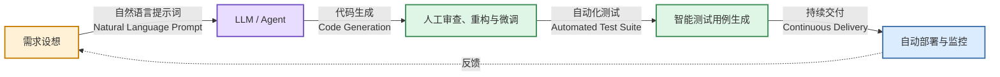
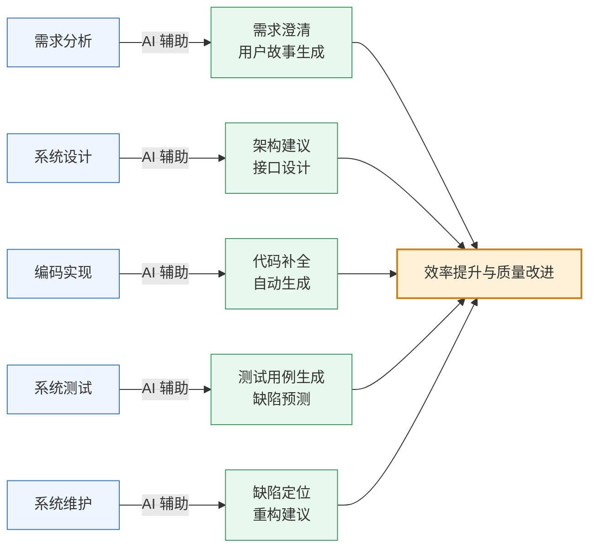
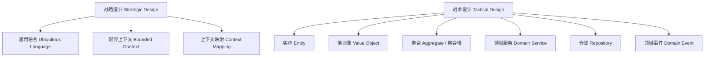

# 第二部分
## 系统设计

第 3-6 周
---
layout: two-cols
---

# 第3周：理论

- 智能软件工程的研究与实践
- 什么是智能软件工程 (Smart Software Engineering / AI4SE)？
- 大语言模型 (LLM) 在需求、代码生成与重构中的应用
- 如何编写符合 INVEST 原则的用户故事 (User Stories)
- **实践指南**：利用 AI 辅助设计（v0.dev / Figma / React）构建高保真原型

::right::

# 第3周：实践

- 编写用户故事
- 使用 AI 工具及原型设计工具设计软件作品原型
- 调研技术方案

📋 检查：确认软件作品原型设计

---

# 智能软件工程 (Smart Software Engineering)
### 当软件工程遇到大语言模型 (AI4SE)
学术界与工业界正经历从传统的“人写代码”向“人机协同 (Human-in-the-loop AI Coding)”的范式转变。

* **研究热点**：基于 Agent 的软件工程自治、静态代码分析大模型、代码大模型对齐（RLHF for coding）。
* **核心生产力**：不仅是 Copilot 自动补全，更是在架构生成、单元测试生成方面的突破。

---
layout: two-cols
---
# 编写高质量的用户故事
### Writing INVEST User Stories
用户故事是敏捷开发中描述功能需求的核心工具。
**标准模板：**
> 作为一名 `[角色]`，
> 我想要 `[某种功能]`，
> 以便能够 `[实现某种价值]`。

#### INVEST 原则：
* **I**ndependent（独立的）
* **N**egotiable（可协商的）
* **V**aluable（有价值的）
* **E**stimable（可估算的）
* **S**mall（小巧的）
* **T**estable（可测试的）
::right::

#### 用户故事与验收标准实例：

```yaml
用户故事:
  角色: 作为一名结构工程师
  功能: 我想要一键导入 STEP 格式的文件
  价值: 从而避免手动转换格式造成的精度损失。

验收标准 (Acceptance Criteria - Gherkin 语法):
  场景: 导入一个有效的 STEP 模型
    Given 用户在主界面并点击了"导入"按钮
    When 用户选择了一个标准的 50MB "engine.step" 文件
    Then 系统应在 5.0 秒内完成解析并无损渲染
    And 系统状态栏应显示 "导入成功，包含 1420 个面"
```

---

# AI 辅助原型设计：从自然语言到交互式代码
### AI-Assisted Prototyping

在进行大规模开发前，利用 AI 生成工具快速完成**高保真交互原型 (Interactive Prototype)**，能够极大降低需求偏离的风险。

* **工具推荐**：
  * **v0.dev / Bolt.new** (前端 UI 的自然语言生成)
  * **Figma AI** (组件化交互设计)
  * **Uizard** (手绘草图转换为高保真 UI)


给 AI 的 Prompt 示例：

"Generate a responsive Tailwind React dashboard for a Scientific Simulation Control System. It should contain an interactive 3D canvas placeholder (using Three.js icons), a left sidebar showing the simulation parameters (density, gravity, step size), a bottom panel showing a live-updated charting log for error rates, and a clear run/pause control cluster."

---

# 示例代码：一个简易的三维渲染原型组件 (React)
### Example Code: Prototype Component for Three.js Viewport

```tsx
// src/components/SimulationViewport.tsx
import React, { useState } from 'react';

type SimulationParams = {
  density: number;
  viscosity: number;
};

export const SimulationViewport: React.FC = () => {
  const [isPlaying, setIsPlaying] = useState(false);
  const [params, setParams] = useState({
    density: 1.2,
    viscosity: 0.01,
  });

  const updateParam = (
    key: keyof SimulationParams,
    value: number,
  ) => {
    setParams((current) => ({
      ...current,
      [key]: value,
    }));
  };

  return (
    

      

        

          

            3D Simulation Space
          


                      className={
              isPlaying
                ? 'text-emerald-400'
                : 'text-slate-400'
            }
          >
            {isPlaying
              ? 'Status: Solving Navier–Stokes...'
              : 'Status: Idle'}
          
        


        

          
            Three.js / WebGPU Viewport
          
        

      


      

        

          Control Panel
        


        
          Density: {params.density.toFixed(2)}
        

                  type="range"
          min="0.1"
          max="5"
          step="0.1"
          value={params.density}
          onChange={(event) =>
            updateParam(
              'density',
              Number.parseFloat(event.target.value),
            )
          }
          className="mb-4 w-full"
        />

        
          Viscosity: {params.viscosity.toFixed(3)}
        

                  type="range"
          min="0"
          max="1"
          step="0.001"
          value={params.viscosity}
          onChange={(event) =>
            updateParam(
              'viscosity',
              Number.parseFloat(event.target.value),
            )
          }
          className="mb-6 w-full"
        />

                  type="button"
          onClick={() => setIsPlaying((current) => !current)}
          className={`w-full rounded py-2 font-semibold text-white ${
            isPlaying
              ? 'bg-rose-600 hover:bg-rose-500'
              : 'bg-emerald-600 hover:bg-emerald-500'
          }`}
        >
          {isPlaying
            ? 'Pause Simulation'
            : 'Run Simulation'}
        
      

    

  );
};
```
---

# 第 3 周实践：用户故事地图与技术方案调研
### Practice: User Story Mapping & Tech Stack Investigation
本周各组要将前期的软件定义转化为具体的研发路线，并完成原型设计。

# 第 3 周汇报要求：

1. **用户故事清单 (docs/requirements/user_stories.md)**：
   * 至少编写 5 个符合 INVEST 规范的用户故事。
   * 每个故事需配有详细的 验收条件 (Acceptance Criteria)。

2. **原型展示**：
   * 提交利用 AI (如 v0.dev / Figma) 生成的交互式原型页面，上台 Demo 交互流程。

3. **技术方案调研报告 (docs/architecture/tech_stack.md)**：
   * 论证核心技术选型。例如：为什么选用 WebAssembly 还是 C++ 原生运行？
   * 列出团队在未来 2 周内需要学习的新技术（制定自学计划与 Milestone）。


* **检查点**：助教和导师将严格评估**原型的可行性**以及**技术选型的科学性**，确认后方可进入系统开发（第四阶段）。

---
layout: center
class: text-center
---

# 课后思考与阅读建议
### Academic Papers for Next Week (Week 4 PREVIEW)

为第4周学术文献阅读汇报做准备，各组需在以下领域选择多篇 IEEE/ACM 顶级会议/期刊论文进行研读：

1. **大语言模型赋能代码生成**：*“Is Your Code Generated by ChatGPT Reliable?”*
2. **基于大模型的自动软件缺陷定位**：*“Automated Program Repair in the Era of LLMs”*
3. **软件协同系统**：研究现代协作设计工具（如 Figma / WebAssembly CAD）的协同冲突消解算法（OT 或 CRDT）。

期待在下周的文献汇报中，听到各位从研究生科研视角带来的深刻洞见！

---

# 第4周

## 理论
### AI 与软件工程的相互影响

🎤 汇报：智能软件工程文献阅读

---
layout: cover
class: text-center
background: '#3a1e5f'
---

# 本周学习目标

- 理解 AI 对软件工程全生命周期的渗透：哪些环节被"加速"，哪些被"重塑"
- 区分 **AI 辅助开发** 与 **AI 原生软件** 两个不同命题
- 掌握目前主流的 AI 编码工具及其能力边界
- 认知 AI 带来的新问题：代码安全、版权、幻觉、对工程师能力的影响
- 能够评估：你们的项目中，AI 可以应用到哪些环节

---
layout: two-cols
---

# 一个核心区分

### AI 辅助开发（AI for SE）
把 AI 当工具，**提升软件工程的效率**

- AI 写代码、生成测试、修 Bug
- AI 读文档、做评审
- 工程师仍是主体

::right::

### AI 原生软件（SE for AI）
把 AI **嵌入软件本身**，成为产品能力

- 智能推荐、对话式交互
- 代码里跑着大模型
- 工程问题转为"如何可靠地使用AI"


💡 对你们的项目：你们既在用 AI 辅助开发（第3周已用AI工具做原型），又在考虑把 AI 算法模型作为作品功能（第6周技术方案）——这正是两者的结合


---

# AI 在软件全生命周期中的应用



---

# 主流 AI 编码工具一览

| 工具 | 定位 | 典型能力 |
|---|---|---|
| **GitHub Copilot** | 行内补全 | 内联代码补全、聊天交互、Copilot Workspace |
| **Cursor** | AI 优先编辑器 | 全库理解、AI 编辑、代码库问答 |
| **Claude Code** | 编程代理 | 多文件修改、任务拆解、自主执行 |
| **Codeium / Windsurf** | 替代方案 | 免费补全、多语言 |
| **JetBrains AI** | IDE 集成 | 在 IntelliJ/PyCharm 内使用 |
| **ChatGPT / Claude** | 通用对话 | 代码解释、面试题、文档生成 |
| **GitHub Copilot / CodeRabbit** | 代码评审 | 自动 PR 审查、找 Bug |

---

# 能力边界：AI 能做什么，不能做什么


### ✅ AI 擅长

- 生成**样板代码**（CRUD、配置、DTO）
- 补全重复性高、有明确模式的内容
- 单测生成、注释生成、文档翻译
- 给出**常见问题**的已知解法
- 快速搭出一个可运行的原型


### ❌ AI 的局限

- **不理解业务语义**——它不知道"为什么这样设计"
- 生成看似正确实则**隐藏 Bug** 的代码
- **幻觉**：编造不存在的 API、库、函数
- 不会主动质疑不合理的需求
- 处理**大型复杂系统**的全局一致性能力有限
- 无法替你拍板架构决策


---

# 幻觉（Hallucination）案例：AI 编造不存在的 API


```java
// AI 生成的代码（示例）
// 假设用了一个不存在的库方法
import com.example.redis.StringRedisTemplate;

public class CacheService {
    public String get(String key) {
        return redisTemplate
            .getOrElse(key, () -> "default"); // ❌ 该方法不存在
    }
}
```

AI 很自信地编造了一个 `getOrElse` 方法，看起来像通用的 Redis 缓存 API，但实际不存在。

```java
// ✅ 真实存在的 Redis API
public String get(String key) {
    String v = redisTemplate.opsForValue().get(key);
    if (v == null) {
        return "default";
    }
    return v;
}
```

⚠️ 结论：AI 生成代码必须经过**编译/运行验证**，以及**人工代码审查**，不能盲信。呼应第9周"代码质量工具"。


---

# AI 时代的安全新问题
- **Prompt Injection（提示注入）**：恶意用户通过输入让 AI 模型执行非预期指令
- **数据泄露**：把公司敏感代码喂给外部 AI，可能被用于训练
- **供应链风险**：AI 推荐的不熟悉依赖包可能存在恶意代码
- **不可审计性**：AI 生成的复杂代码，人类难以审查其正确性
- **版权模糊**：AI 生成代码是否存在版权问题，法律尚未统一

🔒 **应对**：企业会部署私有化模型 / 使用"带安全审查的AI" / 设置代码上传白名单 / 对AI生成的代码必须强制走评审流程

---
layout: two-cols
---

# AI 对软件工程师角色的冲击
- **初级编码工作被替代**：样板代码、重复工作交给 AI
- **工程师能力重心上移**：从"会写代码"转向"会提问、会审查、会架构"
- **Prompt Engineering** 成为软技能
- **更强调**：系统设计、领域理解、质量意识、责任心

::right::

### 给你们的启示

你们的项目里：

- 哪些工作 AI 能做（让 AI 做）
- 哪些工作只能人来判断（业务决策、架构取舍）
- 如何在作品中体现"人机协作"而非"AI 替代人"

---
layout: center
---

# 本周汇报题目
## 智能软件工程文献阅读

请选择多篇关于 AI 与软件工程的文献（建议从以下方向选择）：

- AI 辅助代码生成的最新研究（如 GitHub Copilot 的实证研究）
- 大模型用于软件测试 / 缺陷定位
- 基于 LLM 的需求分析 / 架构设计
- AI 时代软件工程师的职业发展研究

🎤 **汇报要求**：2-3 分钟概述文献核心内容；结合你们自己的项目，说明从中获得的启发；指出该研究的局限性
---
layout: two-cols
---
# 第5周：理论
- 项目管理的沟通管理和风险管理

::right::

# 第5周：实践

- 制定项目管理的沟通计划和风险管理计划

🎤 汇报：智能软件工程文献阅读
---
layout: cover
class: text-center
background: '#3a1e5f'
---

# 第6周：理论
## 领域驱动设计方法
### Domain-Driven Design (DDD)

---

# 本周学习目标

- 理解为什么需要 DDD —— 解决"业务与代码脱节"问题
- 掌握**战略设计**：限界上下文、通用语言、上下文映射
- 掌握**战术设计**：实体、值对象、聚合、领域服务、仓储
- 能够为自己的项目画出限界上下文图
- 能够将一个业务场景转化为领域模型代码

---
layout: two-cols
---

# 为什么需要 DDD？

传统开发的问题：

- 业务专家说的话，程序员翻译成代码后**语义走样**
- 一个 `User` 类被塞进了下单、支付、物流所有逻辑 → **贫血模型 / 上帝类**
- 团队越大，模块边界越模糊，"改一处，坏三处"


::right::

```java
// ❌ 贫血模型（Anemic Model）反例
public class Order {
    private String id;
    private BigDecimal amount;
    private String status;
    // 只有 getter/setter，没有行为
}

public class OrderService {
    public void pay(Order order) {
        // 所有业务逻辑都堆在 Service 里
        if (order.getStatus().equals("PAID")) {
            throw new RuntimeException("已支付");
        }
        order.setStatus("PAID");
        // ... 100 行判断逻辑
    }
}
```


⚠️ 领域知识散落在 Service 各处，无法复用、难以测试

---

# DDD 核心概念地图



---

# 1. 通用语言（Ubiquitous Language）

**做法**：业务专家 + 开发人员用**同一套词汇**，写进代码、文档、注释里，杜绝"翻译损耗"

**案例场景**：图书馆借阅系统

| 业务语言 | 代码命名 |
|---|---|
| 读者 | `Reader` |
| 借阅 | `Loan`（不是 `Borrow`）|
| 逾期 | `Overdue` |
| 续借 | `Renew` |


```java
// ✅ 代码直接使用业务语言，无需注释解释
public class Loan {
    private Reader reader;
    private Book book;
    private LocalDate dueDate;

    public boolean isOverdue() {
        return LocalDate.now().isAfter(dueDate);
    }

    public void renew() {
        if (isOverdue()) {
            throw new CannotRenewException("逾期不可续借");
        }
        this.dueDate = dueDate.plusDays(14);
    }
}
```


💡 课堂练习：为你们的项目列出 10 个核心业务术语，中英文对照，作为团队"词汇表"


---

# 2. 限界上下文（Bounded Context）

一个大系统按业务边界拆分成多个"上下文"，**同一个词在不同上下文里可以有不同含义**

销售上下文

Product = 带价格、促销信息的商品


仓储上下文

Product = 带库存数量、货架位置的物品


物流上下文

Product = 带重量、体积、包装方式的货物


⚠️ **常见错误**：新手总想设计一个"万能 Product 类"给所有模块共用 —— 这正是 DDD 要避免的


---
layout: two-cols
---

# 3. 上下文映射（Context Mapping）

上下文之间如何协作？常见模式：


- **共享内核**（Shared Kernel）：两个团队共用一部分模型
- **防腐层**（Anti-Corruption Layer, ACL）：隔离外部/遗留系统的模型污染
- **发布者-订阅者**：通过领域事件解耦


::right::

```java
// 防腐层示例：隔离第三方支付接口的模型
public class PaymentAntiCorruptionLayer {

    private final ThirdPartyPaySDK sdk;

    public PaymentResult pay(Order order) {
        // 把第三方 SDK 的丑陋结构
        // 翻译成我们自己的领域模型
        ThirdPartyPayRequest req =
            new ThirdPartyPayRequest(
                order.getId().toString(),
                order.getAmount().toPlainString()
            );
        ThirdPartyPayResponse resp = sdk.charge(req);

        return resp.getCode() == 0
            ? PaymentResult.success()
            : PaymentResult.failed(resp.getMsg());
    }
}
```

---

# 4. 实体 vs 值对象


### 实体 Entity
- 有唯一标识（ID）
- 有生命周期，属性可变
- 两个实体即使属性相同，ID 不同也不相等

```java
public class Reader {
    private final ReaderId id; // 标识
    private String name;
    private String phone;

    // equals 基于 id 判断
    @Override
    public boolean equals(Object o) {
        return o instanceof Reader r
            && id.equals(r.id);
    }
}
```


### 值对象 Value Object
- 没有标识，只有属性
- **不可变**（Immutable）
- 属性相同即相等

```java
public final class Money {
    private final BigDecimal amount;
    private final String currency;

    public Money(BigDecimal amount, String currency) {
        this.amount = amount;
        this.currency = currency;
    }

    public Money add(Money other) {
        // 不可变：返回新对象，不修改自身
        return new Money(
            this.amount.add(other.amount), currency);
    }

    @Override
    public boolean equals(Object o) {
        return o instanceof Money m
            && amount.equals(m.amount)
            && currency.equals(m.currency);
    }
}
```


---

# 5. 聚合与聚合根（Aggregate Root）

**聚合** = 一组相关对象的集合，对外只暴露**聚合根**，保证一致性边界


```java
// Order 是聚合根，OrderItem 是内部实体
public class Order {
    private OrderId id;
    private List items = new ArrayList<>();
    private OrderStatus status;

    // 外部不能直接操作 items 列表
    // 必须通过聚合根的方法
    public void addItem(Product product, int qty) {
        if (status != OrderStatus.DRAFT) {
            throw new IllegalStateException(
                "订单已提交，不能修改");
        }
        items.add(new OrderItem(product, qty));
    }

    public Money totalAmount() {
        return items.stream()
            .map(OrderItem::subtotal)
            .reduce(Money.ZERO, Money::add);
    }

    public void submit() {
        if (items.isEmpty()) {
            throw new IllegalStateException("订单为空");
        }
        this.status = OrderStatus.SUBMITTED;
    }
}
```


**设计原则**：

- 一个事务只修改**一个聚合**
- 聚合内部保证不变量（invariant）：
  比如"总金额 = 各明细之和"
- 聚合之间通过 ID 引用，不直接持有对象引用
- 聚合尽量设计得小，避免锁竞争


🎯 课堂练习：在你们的系统中找出 2-3 个聚合根，画出聚合边界图


---

# 6. 领域服务 & 仓储


### 领域服务（Domain Service）
当一个操作**不自然属于**某个实体或值对象时使用

```java
// 转账涉及两个账户，不属于单个 Account
public class TransferService {
    public void transfer(
            Account from, Account to, Money amount) {
        from.withdraw(amount);
        to.deposit(amount);
    }
}
```


### 仓储（Repository）
封装持久化细节，让领域层不关心数据库

```java
public interface OrderRepository {
    Optional findById(OrderId id);
    void save(Order order);
}

// 基础设施层实现，领域层不感知具体技术
public class JpaOrderRepository
        implements OrderRepository {
    private final OrderJpaDao dao;

    public Optional findById(OrderId id) {
        return dao.findById(id.value())
            .map(OrderMapper::toDomain);
    }
}
```


---
layout: two-cols
---

# 分层架构与 DDD

```
├── domain/              # 领域层：核心业务逻辑
│   ├── model/           #   实体、值对象、聚合
│   ├── service/         #   领域服务
│   ├── event/           #   领域事件
│   └── repository/      #   仓储接口（不含实现）
├── application/         # 应用层：用例编排
│   └── OrderAppService.java
├── infrastructure/      # 基础设施层：技术实现
│   ├── persistence/     #   仓储实现、ORM
│   └── external/        #   第三方接口、防腐层
└── interfaces/          # 接口层：Controller、DTO
```

::right::

```java
// 应用层：编排用例，不含业务规则
@Service
public class OrderAppService {
    private final OrderRepository orderRepo;
    private final InventoryDomainService inventory;

    @Transactional
    public void submitOrder(SubmitOrderCommand cmd) {
        Order order = orderRepo.findById(cmd.orderId())
            .orElseThrow();

        inventory.reserve(order);  // 调用领域服务
        order.submit();            // 调用聚合根方法

        orderRepo.save(order);
    }
}
```


✅ 依赖方向：interfaces → application → domain ← infrastructure
（依赖倒置，领域层不依赖任何技术框架）


---
layout: center
---

# 本周实践任务


1. 与组员一起提炼项目的**通用语言表**（至少10个术语）
2. 画出项目的**限界上下文图**（可用 draw.io / Miro / Mermaid）
3. 识别至少 2 个**聚合根**，标注聚合边界
4. 用代码写出至少 1 个实体、1 个值对象、1 个聚合根示例
5. 确认技术方案（含 AI 算法模型如何融入领域模型）


🎤 本周汇报：系统设计技术方案（含限界上下文图 + 核心聚合设计）

# 第6周：实践

- 确认技术方案（包括人工智能算法模型等）
- 制定新技术学习方法


🎤 汇报：系统设计技术方案