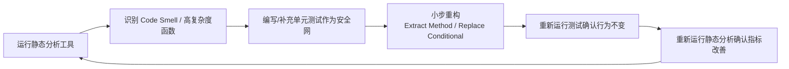

# 第三部分
## 系统开发

第 7-10 周


---
layout: two-cols
---

# 第7周：理论

- 软件开发方法

::right::

# 第7周：实践

- 用各种技术和工具开发系统功能


🛠️ 检查：为学生提供开发指导


---

# 第8周


  
— 无新理论内容 —


## 实践
用各种技术和工具开发系统功能


🛠️ 检查：为学生提供开发指导


---
layout: two-cols
---


# 第9周：理论

- 如何编写卓越的代码：软件代码质量

::right::


---
layout: cover
class: text-center
background: '#1e5f3a'
---

# 第9周
## 如何编写卓越的代码
### 软件代码质量

---

# 本周学习目标

- 理解代码质量的**可度量维度**：可读性、可维护性、复杂度、重复度、安全性
- 掌握 **SOLID 原则**及常见反例
- 学会使用静态分析工具：**SonarQube / ESLint / Checkstyle / PMD**
- 学会看懂**圈复杂度（Cyclomatic Complexity）**和**代码坏味道（Code Smell）**
- 完成一次真实的"代码质量检查 → 重构"闭环


---
layout: two-cols
---
# 什么是"卓越的代码"？

### ❌ 能跑就行的代码

```python
def calc(x, y, t):
    if t == 1:
        r = x + y
    elif t == 2:
        r = x - y
    elif t == 3:
        r = x * y
    elif t == 4:
        if y != 0:
            r = x / y
        else:
            r = 0
    return r
```


::right::


### ✅ 卓越的代码

```python
from enum import Enum

class Operation(Enum):
    ADD = "+"
    SUBTRACT = "-"
    MULTIPLY = "*"
    DIVIDE = "/"

def calculate(x: float, y: float,
              op: Operation) -> float:
    match op:
        case Operation.ADD: return x + y
        case Operation.SUBTRACT: return x - y
        case Operation.MULTIPLY: return x * y
        case Operation.DIVIDE:
            if y == 0:
                raise ZeroDivisionError("除数不能为0")
            return x / y
```


💡 区别不在"能否运行"，而在于：命名语义化、意图清晰、异常显式处理、易扩展、易测试


---

# 代码质量的五个可度量维度

| 维度 | 说明 | 常用指标/工具 |
|---|---|---|
| **可读性** | 命名、注释、格式是否清晰 | Checkstyle / ESLint |
| **复杂度** | 逻辑分支是否过多 | 圈复杂度 (Cyclomatic Complexity) |
| **重复度** | 是否存在复制粘贴代码 | SonarQube Duplication |
| **可测试性** | 是否易于编写单元测试 | 单元测试覆盖率 |
| **安全性** | 是否存在已知漏洞模式 | SonarQube / Semgrep / Snyk |

---
layout: two-cols
---

# 圈复杂度（Cyclomatic Complexity）

**定义**：程序中线性无关路径的数量，每多一个 `if/for/while/case/&&/||` 就 +1


```java
// 圈复杂度 = 6（较高，难测试）
public String grade(int score) {
    if (score >= 90) {
        return "A";
    } else if (score >= 80) {
        return "B";
    } else if (score >= 70) {
        return "C";
    } else if (score >= 60) {
        return "D";
    } else {
        return "F";
    }
}
```


::right::


```java
// 圈复杂度 = 1（用数据结构替代分支）
private static final NavigableMap
    GRADE_TABLE = new TreeMap<>(Map.of(
        60, "D", 70, "C", 80, "B", 90, "A"));

public String grade(int score) {
    var entry = GRADE_TABLE.floorEntry(score);
    return entry != null ? entry.getValue() : "F";
}
```


📏 经验值：函数圈复杂度 > 10 建议重构；> 20 属于高风险代码


---
layout: two-cols
---
# 常见代码坏味道（Code Smell）


- **过长函数**（Long Method）：超过 50 行
- **过大类**（God Class）：职责过多
- **重复代码**（Duplicated Code）
- **过长参数列表**（>4个参数）
- **霰弹式修改**（Shotgun Surgery）：改一个需求要动十几个文件
- **依恋情结**（Feature Envy）：方法过度调用另一个类的数据

::right::

```java
// 依恋情结示例
class OrderPrinter {
    void print(Order order) {
        // 过度访问 Customer 的内部数据
        System.out.println(
            order.getCustomer().getName() + " - " +
            order.getCustomer().getAddress().getCity() +
            order.getCustomer().getAddress().getStreet()
        );
    }
}

// ✅ 重构：把格式化逻辑移到 Customer 自己身上
class Customer {
    String formattedAddress() {
        return address.getCity() + address.getStreet();
    }
}
```


---

# SOLID 原则速览（附反例/正例）


| 原则 | 一句话 |
|---|---|
| **S** 单一职责 | 一个类只做一件事，只有一个改变的理由 |
| **O** 开闭原则 | 对扩展开放，对修改关闭 |
| **L** 里氏替换 | 子类必须能替换父类而不破坏程序 |
| **I** 接口隔离 | 不强迫客户端依赖不需要的接口 |
| **D** 依赖倒置 | 依赖抽象，不依赖具体实现 |


---
layout: two-cols
---
# 开闭原则实战：支付方式扩展


```java
// ❌ 违反开闭原则：新增支付方式要改这个方法
public class PaymentService {
    public void pay(String type, BigDecimal amount) {
        if (type.equals("alipay")) {
            // 支付宝逻辑
        } else if (type.equals("wechat")) {
            // 微信逻辑
        }
        // 每加一种支付方式都要改这里！
    }
}
```
::right::
```java
// ✅ 符合开闭原则：新增支付方式只需新增实现类
public interface PaymentMethod {
    void pay(BigDecimal amount);
}

public class AlipayPayment implements PaymentMethod {
    public void pay(BigDecimal amount) { /* ... */ }
}

public class WechatPayment implements PaymentMethod {
    public void pay(BigDecimal amount) { /* ... */ }
}

public class PaymentService {
    public void pay(PaymentMethod method, BigDecimal amount) {
        method.pay(amount); // 无需修改本类
    }
}
```


---
layout: two-cols
---

# 静态代码分析工具选型

**多语言通用**
- SonarQube / SonarLint（IDE 插件）
- Semgrep（自定义安全规则）

**Java**
- Checkstyle（代码风格）
- PMD（潜在缺陷、复杂度）
- SpotBugs（Bug 模式检测）

::right::

**JavaScript/TypeScript**
- ESLint + Prettier
- SonarJS

**Python**
- Pylint / Ruff（速度快）
- mypy（类型检查）

**AI 辅助**
- GitHub Copilot Code Review
- Claude Code / Cursor 代码审查

---

# 实战：用 SonarQube 检查代码

```bash
# 1. 本地启动 SonarQube（Docker 方式，用于教学演示）
docker run -d --name sonarqube -p 9000:9000 sonarqube:community

# 2. 安装 sonar-scanner
brew install sonar-scanner   # macOS
# 或下载对应平台的 zip 包

# 3. 项目根目录创建 sonar-project.properties
```

```properties
sonar.projectKey=my-course-project
sonar.sources=src
sonar.tests=test
sonar.java.binaries=target/classes
sonar.host.url=http://localhost:9000
sonar.token=${SONAR_TOKEN}
```

```bash
# 4. 执行扫描
sonar-scanner

# 5. 浏览器打开 http://localhost:9000 查看报告：
#    - Bugs / Vulnerabilities / Code Smells
#    - 圈复杂度、重复率、测试覆盖率
#    - Quality Gate 是否通过（红/绿）
```

---

# 实战：用 ESLint 检查前端代码

```bash
npm install eslint --save-dev
npx eslint --init
```

```json
// .eslintrc.json
{
  "extends": ["eslint:recommended", "plugin:@typescript-eslint/recommended"],
  "rules": {
    "complexity": ["warn", 10],
    "max-lines-per-function": ["warn", 50],
    "no-unused-vars": "error",
    "eqeqeq": "error"
  }
}
```

```bash
# 检查
npx eslint src/ --ext .ts,.tsx

# 自动修复能修复的问题
npx eslint src/ --ext .ts,.tsx --fix
```


💡 建议把 lint 检查接入 pre-commit hook（用 husky + lint-staged），提交前自动拦截


---
layout: two-cols
---

# 单元测试覆盖率也是质量指标

```java
// 待测代码
public class DiscountCalculator {
    public BigDecimal calculate(BigDecimal price, int memberLevel) {
        if (memberLevel >= 3) {
            return price.multiply(new BigDecimal("0.8"));
        } else if (memberLevel >= 1) {
            return price.multiply(new BigDecimal("0.9"));
        }
        return price;
    }
}
```
::right::
```java
// JUnit5 测试：覆盖所有分支
class DiscountCalculatorTest {
    private final DiscountCalculator calc = new DiscountCalculator();

    @Test
    void 高级会员打八折() {
        assertEquals(new BigDecimal("80.0"),
            calc.calculate(new BigDecimal("100"), 3));
    }

    @Test
    void 普通会员打九折() {
        assertEquals(new BigDecimal("90.0"),
            calc.calculate(new BigDecimal("100"), 1));
    }

    @Test
    void 非会员不打折() {
        assertEquals(new BigDecimal("100"),
            calc.calculate(new BigDecimal("100"), 0));
    }
}
```

```bash
mvn test jacoco:report   # 生成覆盖率报告 target/site/jacoco/index.html
```

---

# 重构闭环：从检测到修复




🔑 核心纪律：先写测试，再重构；每次重构后立刻跑测试 —— 保证"重构不改变外部行为"


---

# 课堂练习：现场重构


```java
// 请找出至少3个坏味道并重构
public class OrderProcessor {
    public String process(int type, double amount, String user, int status, boolean flag) {
        String result = "";
        if (type == 1) {
            if (amount > 1000) {
                if (status == 0) {
                    result = user + " VIP order pending: " + amount * 0.9;
                } else {
                    result = user + " VIP order done: " + amount * 0.9;
                }
            } else {
                result = user + " normal order: " + amount;
            }
        } else if (type == 2) {
            result = user + " refund: " + (-amount);
        }
        if (flag) {
            System.out.println(result);
        }
        return result;
    }
}
```


- 提示1：魔法数字（`1`, `2`, `1000`, `0`）应替换为枚举/常量
- 提示2：嵌套 if 圈复杂度过高，考虑提取方法或使用策略模式
- 提示3：布尔参数 `flag` 是"标志参数"坏味道，应拆成两个方法


---
layout: center
---

# 本周实践任务


1. 为项目配置至少一个静态分析工具（SonarQube/ESLint/Pylint 任选）
2. 运行扫描，记录当前 Bug 数、Code Smell 数、圈复杂度、重复率
3. 选出 Top 5 最严重问题，逐一重构（先补测试，再重构）
4. 重新扫描，对比重构前后指标变化，形成质量报告


✅ 本周检查：检查代码质量（提交扫描报告截图 + 重构前后对比）


# 第9周：实践

- 使用软件代码质量工具检查代码质量
- 并修改代码


✅ 检查：检查代码质量


---

# 第10周


  
— 无新理论内容 —


## 实践
用各种工具开发系统功能


🎤 汇报：系统代码质量情况