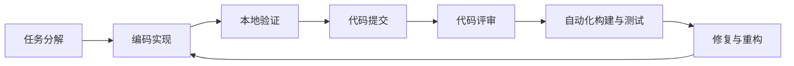
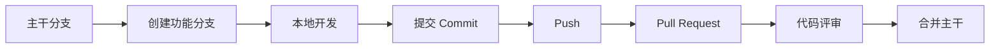
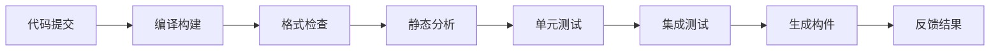
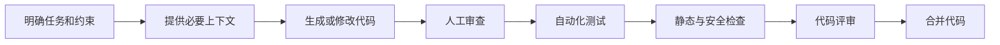
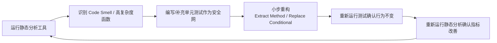

# 第三部分
## 系统开发

第 7-10 周

使架构变成可执行的软件，也使工程规范最终体现为软件质量

---
layout: two-cols
---

# 第7周：理论

- 软件开发方法

::right::

# 第7周：实践

- 用各种技术和工具开发系统功能


🛠️ 检查：为学生提供开发指导


---
layout: two-cols
---
# 第7周：软件开发方法的过程
```text
任务拆分
  ↓
编码实现
  ↓
本地构建与测试
  ↓
Git 提交
  ↓
代码评审
  ↓
CI 自动化验证
  ↓
重构与质量改进
  ↓
形成可交付的软件构件
```
::right::

# 软件开发的工作重点
1. 实现阶段目标  
2. 实现阶段主要活动  
3. 编码实现与编码规范  
4. Git 协作开发  
5. 代码评审  
6. 自动化测试  
7. 构建与持续集成  
8. 安全开发  
9. AI 辅助编程  


---
# 1 软件开发方法的目标


- 将需求和架构设计转化为可运行的软件
- 通过协作开发持续增加系统功能
- 尽早发现并修复缺陷
- 保持代码的可读性、可维护性和可测试性
- 为后续测试、部署和运行提供可靠构件


实现阶段并不等于“单纯写代码”，而是一个包含编码、测试、评审、构建和质量控制的工程活动。

---

# 2 软件开发（实现）阶段的主要活动



## 主要工作

- 将设计任务拆分为可执行的开发任务
- 创建分支并实现功能
- 编写单元测试和必要的集成测试
- 进行本地构建和静态检查
- 提交 Pull Request
- 根据评审意见修改代码
- 通过 CI Pipeline 验证变更

---
layout：two-cols
---

# 3 开发任务的拆分

一个好的开发任务应当：

- 目标明确
- 修改范围清晰
- 能够独立验证
- 具有明确的完成标准
- 尽量在较短周期内完成

::right::

# 示例：实现订单创建功能

可以拆分为：

1. 定义订单领域对象
2. 实现订单创建接口
3. 增加参数校验
4. 实现库存检查
5. 增加订单持久化逻辑
6. 编写单元测试
7. 编写接口测试
8. 更新 API 文档


任务拆分的目标不是增加任务数量，而是降低复杂度和协作风险。


---
layout：two-cols
---


# 4 编码关注点

- 模块职责是否清晰
- 接口设计是否稳定
- 依赖关系是否合理
- 异常和边界条件是否处理
- 数据校验是否完整
- 并发和资源释放是否安全
- 日志是否足以支持问题定位

::right::

# 编码常见技术原则

- 高内聚、低耦合
- 单一职责原则
- 面向接口编程
- 依赖倒置
- 封装变化
- 避免重复代码
- 避免过早优化


代码首先应当正确，其次应当清晰，最后才是针对真实瓶颈进行优化。


---
layout：two-cols
---

# 5 编码规范的作用

- 降低代码阅读成本
- 减少常见错误
- 统一团队协作方式
- 支持自动化检查
- 提高长期可维护性

::right::


# 编码常用工具

| 场景 | 常用工具 |
|---|---|
| Java | Checkstyle、SpotBugs、PMD |
| JavaScript / TypeScript | ESLint、Prettier、TypeScript |
| Python | Ruff、Black、mypy、Pylint |
| Go | gofmt、go vet、golangci-lint |
| 多语言质量分析 | SonarQube、Semgrep |


## 推荐实践

- 格式化工具自动运行
- 静态检查纳入 CI
- 禁止提交明显的调试代码
- 统一命名、异常处理和日志规范
- 将规范写入项目文档

---

# 6 Git 分支与协作开发



## 推荐工作流

- 每项任务使用独立分支
- 分支名称包含任务编号
- 提交保持小步、独立、可理解
- 通过 Pull Request 合并代码
- 保护主干分支
- 合并前必须通过自动检查

## 常用工具

- Git GitHub GitLab
- Bitbucket
- Gerrit

---

# 7 提交信息与版本管理

## Conventional Commits

```text
feat: 增加订单创建接口
fix: 修复库存扣减并发问题
refactor: 重构用户认证模块
test: 增加订单服务单元测试
docs: 更新接口使用说明
chore: 升级项目依赖
```

## 良好提交的特征

- 一个提交完成一个主要逻辑变化
- 提交信息说明“做了什么”
- 避免提交无关格式修改
- 避免提交生成文件和敏感信息
- 必要时在提交信息中说明原因


提交历史不仅用于回滚，也是团队理解系统演进过程的重要工程资产。


---
layout：two-cols
---

# 8 代码评审（Code Review）内容

- 是否正确实现需求和验收标准
- 是否符合架构和模块边界
- 是否存在安全漏洞
- 异常和边界条件是否完整
- 测试是否覆盖关键逻辑
- 是否引入不必要的复杂度
- 是否影响性能和可维护性

::right::

# Code Review 评审原则

- 小型 Pull Request 更容易高质量评审
- 评论代码，不针对个人
- 解释问题和风险，而不是只给结论
- 对重要设计问题进行讨论
- 评审意见应当可执行


代码评审的目标不是寻找个人错误，而是改善代码和共享知识。

---
layout:two-cols
---

# 9 自动化测试策略

实现阶段应尽可能让测试与代码同步进行。


## 单元和集成测试

### 单元测试

- 验证独立函数或模块
- 执行速度快
- 定位问题准确

### 集成测试

- 验证模块之间的协作
- 检查数据库、缓存和消息系统交互

::right::


## 接口和端到端测试

### 接口测试

- 验证 API 输入、输出和错误处理
- 保证服务契约稳定

### 端到端测试

- 验证完整业务流程
- 成本较高，应覆盖关键路径

---
layout:two-cols
---

# 10 测试技术与工具

## 常用测试技术

- 等价类划分
- 边界值分析
- 判定表
- 状态迁移测试
- 参数化测试
- Mock 与 Stub
- 契约测试
- 属性测试
- 变异测试

::right::

## 常用工具

| 语言或场景 | 测试工具 |
|---|---|
| Java | JUnit、Mockito、Testcontainers |
| Python | pytest、unittest、Hypothesis |
| JavaScript | Jest、Vitest、Supertest |
| API | Postman、REST Assured |
| Web UI | Playwright、Cypress、Selenium |
| 性能 | JMeter、k6、Gatling、Locust |


测试覆盖率是辅助指标，不等于软件质量。关键是测试是否覆盖重要行为、边界条件和失败场景。


---
layout:two-cols
---

# 11 构建与依赖管理

### 构建过程

1. 获取依赖
2. 编译源代码
3. 执行静态检查
4. 运行自动化测试
5. 生成构件
6. 记录版本和构建信息

### 常用工具

- Java：Maven、Gradle
- JavaScript：npm、pnpm、Yarn
- Python：Poetry、uv、pip-tools
- Go：Go Modules
- .NET：NuGet、dotnet CLI
- 通用构建：Make、Bazel、Buck

::right::

### 构建工程实践

- 锁定依赖版本
- 使用统一构建命令
- 构建结果可重复
- 缓存稳定依赖
- 生成可追踪的构件版本
- 定期更新和审计第三方依赖

---
layout:two-cols
---

# 12 持续集成（CI）

持续集成要求开发者频繁将代码合并到共享代码库，并通过自动化流程验证变更。



## CI 工具

- GitHub Actions
- GitLab CI/CD
- Jenkins
- Azure Pipelines
- Buildkite
- CircleCI

::right::

## CI 设计原则

- 快速反馈
- 自动化执行
- 失败立即通知
- 构建环境一致
- 不允许失败代码进入主干
- Pipeline 配置也应纳入版本控制

---
layout:two-cols
---

# 13 实现阶段的软件安全

安全检查应当尽早进入开发流程，即 DevSecOps。

## 编码阶段

- 输入校验
- 输出编码
- 安全的身份认证
- 最小权限原则
- 防止 SQL 注入
- 防止跨站脚本攻击
- 避免硬编码密钥

::right::

## 工具支持

- SAST：SonarQube、Semgrep、CodeQL
- SCA：Snyk、Dependabot、OWASP Dependency-Check
- 容器扫描：Trivy
- DAST：OWASP ZAP
- 密钥管理：Vault、云平台 Secret Manager


绝不能将密码、API Key、Token 或用户隐私数据直接提交到代码仓库。


---
layout:two-cols
---

# 14 重构与技术债务

## 什么时候需要重构？

- 代码重复严重
- 模块职责混乱
- 修改一个功能需要影响多个模块
- 测试难以编写
- 缺陷频繁出现
- 新功能开发速度持续下降

::right::

## 常见重构方式

- 提取函数和类
- 拆分过大的模块
- 消除重复逻辑
- 引入接口隔离依赖
- 改善命名
- 简化条件分支
- 重构数据访问逻辑

## 重构原则

1. 先建立测试保护网
2. 小步修改
3. 每次修改后运行测试
4. 不将重构和大规模功能变更混在一起
5. 记录技术债务及其影响

---
layout:two-cols
---
# 15 AI 辅助软件实现

## AI 适合辅助的任务

- 生成样板代码
- 编写单元测试
- 解释陌生代码
- 生成 API 文档
- 辅助代码重构
- 分析错误日志
- 生成 SQL、脚本和正则表达式
- 总结 Pull Request

::right::

## 工程师必须负责

- 验证业务逻辑
- 审查架构影响
- 检查安全风险
- 确认性能和资源消耗
- 运行测试和静态检查
- 避免泄露敏感信息
- 确认第三方代码许可


**AI 可以生成代码，但不能替代工程判断。**


---

# 16 AI 辅助编码的推荐流程



## 使用原则

- 先明确输入、输出和验收标准
- 要求 AI 说明修改思路和影响范围
- 限制修改文件和代码范围
- 不直接接受未经验证的结果
- 将 AI 生成代码视为普通外部贡献
- 通过测试、评审和 CI 建立质量保障

---
layout:two-cols
---

# 17 实现阶段的质量门禁

代码进入主干前至少应满足：

- 编译或构建成功
- 格式检查通过
- 静态分析通过
- 单元测试通过
- 关键集成测试通过
- 依赖漏洞检查通过
- 代码评审完成
- 没有泄露敏感信息
- 变更说明完整
- 必要的文档已更新

::right::

## 质量门禁示例

```text
Build              PASS
Unit Tests         PASS
Integration Tests  PASS
Static Analysis    PASS
Security Scan      PASS
Code Review        APPROVED
```

---
layout:two-cols
---

# 18 实现阶段的工程度量

## 交付效率

- 任务完成周期
- Pull Request 周期
- 构建耗时
- 部署频率
- 代码评审等待时间

## 代码质量

- 缺陷密度
- 单元测试覆盖率
- 静态分析问题数
- 重复代码比例
- 代码复杂度
- 技术债务规模

::right::

## 流程稳定性

- 构建失败率
- 测试失败率
- 变更失败率
- 缺陷逃逸率
- 回滚次数


度量指标应服务于改进，而不是简单用于评价个人绩效。


---
layout：two-cols
---

# 19 一个典型任务：实现用户注册接口

### 开发步骤

1. 创建 `feature/user-register` 分支
2. 定义请求对象和响应对象
3. 实现参数校验
4. 实现密码安全存储
5. 实现用户持久化
6. 处理重复注册异常
7. 编写单元测试
8. 编写接口测试
9. 执行静态检查和安全扫描
10. 提交 Pull Request
11. 根据评审意见修改
12. 通过 CI 后合并主干

::right::

### 需要验证的场景

- 正常注册
- 邮箱格式错误
- 密码强度不足
- 用户已存在
- 数据库异常
- 重复请求
- 敏感信息不能出现在日志中

---

# 20 实现阶段的推荐工具链

```text
任务管理：Jira / GitHub Issues / GitLab Issues

版本控制：Git + GitHub / GitLab

开发环境：VS Code / IntelliJ IDEA / PyCharm

构建工具：Maven / Gradle / npm / pnpm / uv

代码规范：ESLint / Prettier / Ruff / Checkstyle

静态分析：SonarQube / Semgrep / CodeQL

测试工具：JUnit / pytest / Jest / Playwright

安全工具：Snyk / Trivy / OWASP ZAP

持续集成：GitHub Actions / GitLab CI / Jenkins

构件管理：Nexus / Artifactory / GitHub Packages

协作工具：Pull Request / Wiki / Confluence
```

---

# 21 研究生应关注的深层问题

实现阶段不仅关注“如何实现”，还应研究：

- 如何提高代码变更的可预测性？
- 如何自动发现潜在缺陷？
- 如何设计高效的测试选择策略？
- 如何衡量代码评审的有效性？
- 如何降低持续集成的反馈延迟？
- 如何识别和控制技术债务？
- 如何评估 AI 生成代码的可靠性？
- 如何在效率、质量和安全之间进行权衡？


研究生阶段应尝试将工程实践问题转化为可观察、可测量、可验证的研究问题。


---

# 22  总结

软件开发的实现阶段可以概括为：


### 清晰任务

将复杂需求拆分为可执行任务


### 高质量代码

保持清晰、可维护、可测试


### 自动化验证

用测试、检查和 CI 尽早发现问题


### 协作交付

通过 Git、评审和反馈持续集成


**实现阶段的核心不是写出更多代码，  
而是持续交付可信赖的软件变更。**

---

# 软件开发方法讨论

1. 为什么代码评审不能完全由自动化工具替代？
2. 测试金字塔是否适用于所有类型的软件系统？
3. Trunk-Based Development 与 Git Flow 如何选择？
4. 如何判断一次重构是否真正降低了技术债务？
5. AI 生成代码应当经过哪些质量门禁？
6. 如何设计一个既快速又可靠的 CI Pipeline？
7. 代码覆盖率、缺陷密度和变更失败率之间有什么关系？


---
# 第8周


  
— 无新理论内容 —


# 第8周实践
用各种技术和工具开发系统功能


🛠️ 检查：为学生提供开发指导


---
layout: two-cols
---


# 第9周：理论

- 如何编写卓越的代码：软件代码质量

::right::

# 第9周：实践
- 使用软件代码质量工具检查代码质量，并修改代码
🛠️ 检查：代码质量

---


# 第9周如何编写卓越的代码 学习目标

- 理解代码质量的**可度量维度**：可读性、可维护性、复杂度、重复度、安全性
- 掌握 **SOLID 原则**及常见反例
- 学会使用静态分析工具：**SonarQube / ESLint / Checkstyle / PMD**
- 学会看懂**圈复杂度（Cyclomatic Complexity）**和**代码坏味道（Code Smell）**
- 完成一次真实的"代码质量检查 → 重构"闭环

---
layout: two-cols
---
# 什么是"卓越的代码"？

### ❌ 能跑就行的代码

```python
def calc(x, y, t):
    if t == 1:
        r = x + y
    elif t == 2:
        r = x - y
    elif t == 3:
        r = x * y
    elif t == 4:
        if y != 0:
            r = x / y
        else:
            r = 0
    return r
```


::right::


### ✅ 卓越的代码

```python
from enum import Enum

class Operation(Enum):
    ADD = "+"
    SUBTRACT = "-"
    MULTIPLY = "*"
    DIVIDE = "/"

def calculate(x: float, y: float,
              op: Operation) -> float:
    match op:
        case Operation.ADD: return x + y
        case Operation.SUBTRACT: return x - y
        case Operation.MULTIPLY: return x * y
        case Operation.DIVIDE:
            if y == 0:
                raise ZeroDivisionError("除数不能为0")
            return x / y
```


💡 区别不在"能否运行"，而在于：命名语义化、意图清晰、异常显式处理、易扩展、易测试


---

# 代码质量的五个可度量维度

| 维度 | 说明 | 常用指标/工具 |
|---|---|---|
| **可读性** | 命名、注释、格式是否清晰 | Checkstyle / ESLint |
| **复杂度** | 逻辑分支是否过多 | 圈复杂度 (Cyclomatic Complexity) |
| **重复度** | 是否存在复制粘贴代码 | SonarQube Duplication |
| **可测试性** | 是否易于编写单元测试 | 单元测试覆盖率 |
| **安全性** | 是否存在已知漏洞模式 | SonarQube / Semgrep / Snyk |

---
layout: two-cols
---

# 圈复杂度（Cyclomatic Complexity）

**定义**：程序中线性无关路径的数量，每多一个 `if/for/while/case/&&/||` 就 +1


```java
// 圈复杂度 = 6（较高，难测试）
public String grade(int score) {
    if (score >= 90) {
        return "A";
    } else if (score >= 80) {
        return "B";
    } else if (score >= 70) {
        return "C";
    } else if (score >= 60) {
        return "D";
    } else {
        return "F";
    }
}
```


::right::


```java
// 圈复杂度 = 1（用数据结构替代分支）
private static final NavigableMap
    GRADE_TABLE = new TreeMap<>(Map.of(
        60, "D", 70, "C", 80, "B", 90, "A"));

public String grade(int score) {
    var entry = GRADE_TABLE.floorEntry(score);
    return entry != null ? entry.getValue() : "F";
}
```


📏 经验值：函数圈复杂度 > 10 建议重构；> 20 属于高风险代码


---
layout: two-cols
---
# 常见代码坏味道（Code Smell）


- **过长函数**（Long Method）：超过 50 行
- **过大类**（God Class）：职责过多
- **重复代码**（Duplicated Code）
- **过长参数列表**（>4个参数）
- **霰弹式修改**（Shotgun Surgery）：改一个需求要动十几个文件
- **依恋情结**（Feature Envy）：方法过度调用另一个类的数据

::right::

```java
// 依恋情结示例
class OrderPrinter {
    void print(Order order) {
        // 过度访问 Customer 的内部数据
        System.out.println(
            order.getCustomer().getName() + " - " +
            order.getCustomer().getAddress().getCity() +
            order.getCustomer().getAddress().getStreet()
        );
    }
}

// ✅ 重构：把格式化逻辑移到 Customer 自己身上
class Customer {
    String formattedAddress() {
        return address.getCity() + address.getStreet();
    }
}
```


---

# SOLID 原则速览


| 原则 | 一句话 |
|---|---|
| **S** 单一职责 | 一个类只做一件事，只有一个改变的理由 |
| **O** 开闭原则 | 对扩展开放，对修改关闭 |
| **L** 里氏替换 | 子类必须能替换父类而不破坏程序 |
| **I** 接口隔离 | 不强迫客户端依赖不需要的接口 |
| **D** 依赖倒置 | 依赖抽象，不依赖具体实现 |


---
layout: two-cols
---
# 开闭原则实战：支付方式扩展


```java
// ❌ 违反开闭原则：新增支付方式要改这个方法
public class PaymentService {
    public void pay(String type, BigDecimal amount) {
        if (type.equals("alipay")) {
            // 支付宝逻辑
        } else if (type.equals("wechat")) {
            // 微信逻辑
        }
        // 每加一种支付方式都要改这里！
    }
}
```
::right::
```java
// ✅ 符合开闭原则：新增支付方式只需新增实现类
public interface PaymentMethod {
    void pay(BigDecimal amount);
}

public class AlipayPayment implements PaymentMethod {
    public void pay(BigDecimal amount) { /* ... */ }
}

public class WechatPayment implements PaymentMethod {
    public void pay(BigDecimal amount) { /* ... */ }
}

public class PaymentService {
    public void pay(PaymentMethod method, BigDecimal amount) {
        method.pay(amount); // 无需修改本类
    }
}
```


---
layout: two-cols
---

# 静态代码分析工具选型


**多语言通用**
- SonarQube / SonarLint（IDE 插件）
- Semgrep（自定义安全规则）

**Java**
- Checkstyle（代码风格）
- PMD（潜在缺陷、复杂度）
- SpotBugs（Bug 模式检测）

::right::

**JavaScript/TypeScript**
- ESLint + Prettier
- SonarJS

**Python**
- Pylint / Ruff（速度快）
- mypy（类型检查）

**AI 辅助**
- GitHub Copilot Code Review
- Claude Code / Cursor 代码审查

---

# 实战：用 SonarQube 检查代码

```bash
# 1. 本地启动 SonarQube（Docker 方式，用于教学演示）
docker run -d --name sonarqube -p 9000:9000 sonarqube:community

# 2. 安装 sonar-scanner
brew install sonar-scanner   # macOS
# 或下载对应平台的 zip 包

# 3. 项目根目录创建 sonar-project.properties
```

```properties
sonar.projectKey=my-course-project
sonar.sources=src
sonar.tests=test
sonar.java.binaries=target/classes
sonar.host.url=http://localhost:9000
sonar.token=${SONAR_TOKEN}
```

```bash
# 4. 执行扫描
sonar-scanner

# 5. 浏览器打开 http://localhost:9000 查看报告：
#    - Bugs / Vulnerabilities / Code Smells
#    - 圈复杂度、重复率、测试覆盖率
#    - Quality Gate 是否通过（红/绿）
```

---

# 实战：用 ESLint 检查前端代码

```bash
npm install eslint --save-dev
npx eslint --init
```

```json
// .eslintrc.json
{
  "extends": ["eslint:recommended", "plugin:@typescript-eslint/recommended"],
  "rules": {
    "complexity": ["warn", 10],
    "max-lines-per-function": ["warn", 50],
    "no-unused-vars": "error",
    "eqeqeq": "error"
  }
}
```

```bash
# 检查
npx eslint src/ --ext .ts,.tsx

# 自动修复能修复的问题
npx eslint src/ --ext .ts,.tsx --fix
```


💡 建议把 lint 检查接入 pre-commit hook（用 husky + lint-staged），提交前自动拦截


---
layout: two-cols
---

# 单元测试覆盖率也是质量指标

```java
// 待测代码
public class DiscountCalculator {
    public BigDecimal calculate(BigDecimal price, int memberLevel) {
        if (memberLevel >= 3) {
            return price.multiply(new BigDecimal("0.8"));
        } else if (memberLevel >= 1) {
            return price.multiply(new BigDecimal("0.9"));
        }
        return price;
    }
}
```
::right::
```java
// JUnit5 测试：覆盖所有分支
class DiscountCalculatorTest {
    private final DiscountCalculator calc = new DiscountCalculator();

    @Test
    void 高级会员打八折() {
        assertEquals(new BigDecimal("80.0"),
            calc.calculate(new BigDecimal("100"), 3));
    }

    @Test
    void 普通会员打九折() {
        assertEquals(new BigDecimal("90.0"),
            calc.calculate(new BigDecimal("100"), 1));
    }

    @Test
    void 非会员不打折() {
        assertEquals(new BigDecimal("100"),
            calc.calculate(new BigDecimal("100"), 0));
    }
}
```

```bash
mvn test jacoco:report   # 生成覆盖率报告 target/site/jacoco/index.html
```

---

# 重构闭环：从检测到修复




🔑 核心纪律：先写测试，再重构；每次重构后立刻跑测试 —— 保证"重构不改变外部行为"


---

# 课堂练习：现场重构


```java{scale:0.7}
// 请找出至少3个坏味道并重构
public class OrderProcessor {
    public String process(int type, double amount, String user, int status, boolean flag) {
        String result = "";
        if (type == 1) {
            if (amount > 1000) {
                if (status == 0) {
                    result = user + " VIP order pending: " + amount * 0.9;
                } else {
                    result = user + " VIP order done: " + amount * 0.9;
                }
            } else {
                result = user + " normal order: " + amount;
            }
        } else if (type == 2) {
            result = user + " refund: " + (-amount);
        }
        if (flag) {
            System.out.println(result);
        }
        return result;
    }
}
```


- 提示1：魔法数字（`1`, `2`, `1000`, `0`）应替换为枚举/常量
- 提示2：嵌套 if 圈复杂度过高，考虑提取方法或使用策略模式
- 提示3：布尔参数 `flag` 是"标志参数"坏味道，应拆成两个方法


---


# 第9周实践任务


1. 为项目配置至少一个静态分析工具（SonarQube/ESLint/Pylint 任选）
2. 运行扫描，记录当前 Bug 数、Code Smell 数、圈复杂度、重复率
3. 选出 Top 5 最严重问题，逐一重构（先补测试，再重构）
4. 重新扫描，对比重构前后指标变化，形成质量报告


✅ 本周检查：检查代码质量（提交扫描报告截图 + 重构前后对比）


---

# 第10周


  
— 无新理论内容 —


## 实践
用各种工具开发系统功能


🎤 汇报：系统代码质量情况
