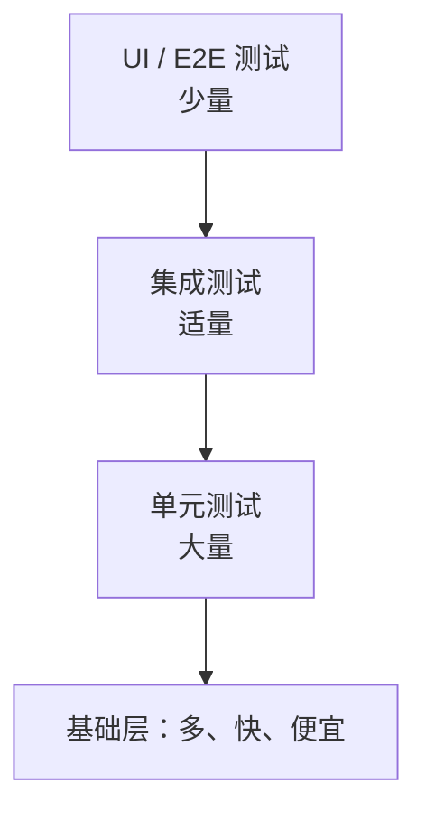

# 第四部分
## 系统测试

第 11-13 周


---
layout: two-cols
---

# 第11周：理论

- 软件测试的方法

::right::

# 第11周：实践

- 编写软件作品的测试用例

📋 检查 确认测试用例

---

# 第11周 软件测试的方法 学习目标

- 理解测试的目的：**证明正确性** ≠ **降低缺陷风险**
- 掌握测试金字塔：单元/集成/系统/验收测试
- 区分**黑盒测试**（功能）与**白盒测试**（结构）
- 掌握**等价类划分、边界值分析**等经典设计方法
- 会写规范的测试用例文档
- 了解自动化测试工具：JUnit / pytest / Jest / Selenium


---

# 测试的目的：一个关键认知


### ❌ 常见误解

"测试是为了证明程序没错"

实际上：**测试永远无法证明没有 Bug**（Dijkstra 名言："程序测试只能证明 Bug 存在，不能证明 Bug 不存在"）


### ✅ 正确理解

测试是为了：

- **降低**缺陷流入生产环境的**风险**
- 给重构/修改提供**安全网**
- 驱动**设计和重构**（测试先行）
- 用**成本换质量**：越晚发现缺陷，修复成本越高


📈 缺陷发现越晚修复成本越高（需求阶段 1x → 发布后 100x）


---
layout: two-cols
---

# 测试金字塔




- **单元测试**：最多，最快，隔离小函数
- **集成测试**：验证模块配合
- **端到端（E2E）**：验证完整流程，慢，贵


::right::

### 比例建议

| 层级 | 数量比例 | 运行速度 |
|---|---|---|
| 单元 | ~70% | 毫秒级 |
| 集成 | ~20% | 秒级 |
| E2E | ~10% | 分钟级 |


⚠️ 常见误区："测试金字塔倒置"——全是 E2E，又慢又脆，改一处全崩


---
layout: two-cols
---


# 黑盒（功能测试）
只看输入输出，不关心内部实现

```python
# 只测接口行为
def test_login_success(client):
    resp = client.post('/api/login',
        json={"username": "admin", "password": "123456"})
    assert resp.status_code == 200
    assert "token" in resp.json()
```

::right::


# 白盒（结构测试）
关注代码内部路径、分支、条件

```python
# 依据代码逻辑设计用例，覆盖每个分支
def test_calculate_positive(calc):
    assert calc.calculate(Operation.ADD, 10, 5) == 15

def test_calculate_divide_by_zero(calc):
    with pytest.raises(ZeroDivisionError):
        calc.calculate(Operation.DIVIDE, 10, 0)
```


💡 实际工作中两种结合：黑盒设计测试目标，白盒补充覆盖盲区（识别未测试的分支）


---
layout: two-cols
---

# 测试用例设计方法 1：等价类划分

将输入域划分成若干个**等价类**，每个类取一个代表值即可

**案例**：登录功能的"年龄"字段，合法范围 18-60

| 等价类类型 | 数据 | 预期结果 |
|---|---|---|
| 有效等价类 | 18、35、60 | 通过 |
| 无效等价类-下限 | 17 | 提示"年龄过小" |
| 无效等价类-上限 | 61 | 提示"年龄过大" |
| 无效等价类-非数字 | "abc" | 提示"格式错误" |
| 无效等价类-空值 | "" | 提示"必填" |

::right::

```python
import pytest

def validate_age(age: str) -> str:
    if not age:
        return "必填"
    if not age.isdigit():
        return "格式错误"
    a = int(age)
    if a < 18:
        return "年龄过小"
    if a > 60:
        return "年龄过大"
    return "通过"

@pytest.mark.parametrize("age,expected", [
    ("", "必填"), ("abc", "格式错误"),
    ("17", "年龄过小"), ("61", "年龄过大"),
    ("35", "通过"), ("18", "通过"), ("60", "通过"),
])
def test_validate_age(age, expected):
    assert validate_age(age) == expected
```

---

# 测试用例设计方法 2：边界值分析 To do

**原理**：程序错误最容易发生在**边界附近**，所以对边界值及边界两侧的值都要测

**案例**：输入范围 [18, 60]

| 测试点 | 值 | 说明 |
|---|---|---|
| 下边界 | 18 | 恰好合法 |
| 下边界-1 | 17 | 非法 |
| 下边界+1 | 19 | 合法 |
| 上边界 | 60 | 恰好合法 |
| 上边界+1 | 61 | 非法 |
| 上边界-1 | 59 | 合法 |


🎯 经验：开发 80% 的 Bug 出在边界，边界值分析性价比最高


---

# 测试用例设计方法 3：判定表 To do

适合**多条件组合**的场景，列出所有条件组合及对应动作

**案例**：图书借阅系统中，"是否能续借"判定

| 规则 | 是否逾期 | 是否欠费 | 续借次数<3 | 是否允许续借 |
|---|---|---|---|---|
| 1 | N | N | Y | ✅ 允许 |
| 2 | N | N | N | ❌ 不允许(超次数) |
| 3 | N | Y | Y | ❌ 不允许(有欠费) |
| 4 | N | Y | N | ❌ 不允许 |
| 5 | Y | N | Y | ❌ 不允许(逾期) |
| 6 | Y | Y | Y | ❌ 不允许 |
| 7 | Y | N | N | ❌ 不允许 |
| 8 | Y | Y | N | ❌ 不允许 |

```java
// 对应代码逻辑
public boolean canRenew(Loan loan) {
    if (loan.isOverdue()) return false;
    if (loan.hasUnpaidFine()) return false;
    if (loan.renewalCount() >= 3) return false;
    return true;
}
```


💡 用法：先画判定表找出所有分支，再据此写测试，能显著提高覆盖率


---

# 测试用例设计方法 4：因果图 & 场景法（简述）


### 因果图法
- 找"原因"（输入条件）与"结果"（输出动作）的依赖关系
- 用逻辑符（与/或/非）组合
- 适合输入条件相互影响的情况


### 场景法（面试常考）
- 按**业务流程**组织用例，走完整流程
- 基本流：正常完成任务
- 备选流：异常分支、边界处理
- 适合电商下单、登录、支付等业务


用"购物→下单→支付→发货"串多条场景，
比孤立测每个按钮更能发现流程缺陷


---
layout: two-cols
---

# JS 测试示例：Jest

```javascript
// product.js
export function calculateTotal(items) {
  return items.reduce((sum, item) =>
    sum + item.price * item.quantity, 0);
}
```

```javascript
// product.test.js
import { calculateTotal } from './product.js';

describe('calculateTotal', () => {
  test('多个商品正确求和', () => {
    const items = [
      { price: 10, quantity: 2 },  // 20
      { price: 5, quantity: 3 },   // 15
    ];
    expect(calculateTotal(items)).toBe(35);
  });

  test('空购物车返回0', () => {
    expect(calculateTotal([])).toBe(0);
  });
});
```

::right::

# 接口测试示例：Postman / REST

```http
### 登录接口 - 正常
POST /api/login
Content-Type: application/json

{ "username": "admin", "password": "123456" }

> 

### 登录接口 - 密码错误
POST /api/login
Content-Type: application/json

{ "username": "admin", "password": "wrong" }
```


💡 还可用 Postman / curl / Katalon 做 API 测试，或 Selenium / Playwright 做 E2E UI 测试


---

# 自动化测试工具速查表

| 语言/场景 | 单元测试 | 覆盖率 | E2E |
|---|---|---|---|
| Java | JUnit 5 | JaCoCo | Selenium |
| Python | pytest | coverage.py | Selenium / Playwright |
| JS/TS | Jest / Vitest | NYC | Playwright / Cypress |
| Go | testing | go test -cover | Selenium |
| 接口 | Postman / REST | — | — |

---
class: text-sm
---

# AI 在软件测试中的主要应用

### 1. 测试用例生成（Test Case Generation）
- **智能用例生成**：基于需求文档、用户故事、代码结构或历史缺陷数据，利用 NLP（自然语言处理）和大语言模型自动生成测试用例，减少人工设计成本。
- **基于模型的测试（Model-Based Testing）**：AI 根据系统模型（状态机、UML 图等）自动推导测试路径。
- **组合测试优化**：利用遗传算法、粒子群优化等方法生成最小化但覆盖率高的测试组合（Pairwise/Combinatorial Testing）。

### 2. 测试用例优先级排序与选择（Test Prioritization & Selection）
- 在持续集成（CI/CD）场景下，代码变更频繁，AI 可以基于历史执行数据、缺陷密度、代码变更影响分析，预测哪些用例最可能发现缺陷，从而优化执行顺序，缩短反馈周期（这被称为 **Test Impact Analysis**）。

### 3. 缺陷预测与根因分析（Defect Prediction & Root Cause Analysis）
- 利用机器学习模型（如随机森林、XGBoost、神经网络）分析代码复杂度、变更历史、开发者行为等特征，预测高风险模块，指导测试资源分配。
- 通过日志聚类、异常检测算法自动定位缺陷根因，减少人工排查时间。

### 4. UI 自动化测试与视觉验证
- **计算机视觉（CV）驱动测试**：通过图像识别技术识别 UI 元素，不依赖传统的 DOM/XPath 定位，提升测试脚本的稳定性（即使 UI 布局变化也能识别元素）。
- **视觉回归测试（Visual Regression Testing）**：AI 对比截图差异，自动判断是否为"预期变化"还是"缺陷"，减少误报。
- **自愈测试脚本（Self-Healing Tests）**：当元素定位器失效时，AI 自动寻找最相似的替代元素，修复测试脚本，降低维护成本。

---

# AI 在软件测试中的主要应用（续）

### 5. 探索性测试与智能爬虫（AI-driven Exploratory Testing）
- 类似强化学习的 Agent 自动探索应用界面，模拟用户操作路径，发现未预期的崩溃或异常状态，常用于 Fuzz Testing 和移动 App 测试。

### 6. 性能测试与异常检测
- 利用时间序列分析（如 LSTM、Prophet）对性能指标（响应时间、CPU/内存占用）建模，自动检测性能异常或预测系统瓶颈。

### 7. 自然语言处理辅助测试
- 将需求文档、验收标准（Gherkin/BDD）通过 NLP 转化为可执行测试脚本。
- ChatBot/LLM 辅助测试人员编写测试用例、生成测试数据、解释失败原因。

### 8. 测试数据生成
- 利用生成对抗网络（GAN）、合成数据技术生成大规模、多样化且符合隐私要求的测试数据，尤其适用于边界值和异常场景覆盖。


---

# 典型 AI 测试框架与工具


| 分类 | 工具/框架 | 简介 |
|---|---|---|
| **视觉/自愈 UI 测试** | **Applitools Eyes** | 基于 AI 的视觉验证平台，自动检测 UI 变化，支持跨浏览器/设备的视觉回归测试 |
| | **Testim** | 使用机器学习识别和定位 UI 元素，具备自愈能力，降低脚本维护成本 |
| | **Mabl** | 低代码 AI 测试平台，自动生成回归测试、检测视觉与功能异常 |
| | **Functionize** | 基于 AI 的测试自动化，支持自然语言编写测试用例，自动适应 UI 变化 |
| | **Sofy.ai / ACCELQ** | AI 驱动的移动/Web 自动化测试平台 |
| **探索性/智能爬虫测试** | **Appvance IQ** | 使用 AI Agent 自主探索应用，生成测试脚本 |
| | **Eggplant AI（Keysight）** | 基于模型的 AI 测试，通过强化学习探索应用状态空间 |
| **测试用例生成/优化** | **Diffblue Cover** | 使用强化学习自动为 Java 代码生成单元测试 |
| | **Test.ai (now part of Appdome)** | 使用 CV/AI 进行移动应用自动化测试 |

---

# 典型 AI 测试框架与工具（续）

| 分类 | 工具/框架 | 简介 |
|---|---|---|
| **代码分析与缺陷预测** | **DeepCode（现 Snyk Code）** | 基于机器学习的静态代码分析，识别潜在缺陷与安全漏洞 |
| | **Facebook Sapienz** | Facebook 内部使用的基于搜索的自动化测试系统，结合遗传算法进行 Android/iOS 测试 |
| **性能与异常检测** | **Dynatrace（AI 引擎 Davis）** | 应用性能监控中集成 AI，用于异常检测和根因分析 |
| | **DataDog Watchdog** | AI 驱动的异常检测，辅助识别性能与可靠性问题 |
| **辅助编程/LLM 工具** | **GitHub Copilot** | 基于大语言模型辅助编写测试代码 |
| | **ChatGPT/Claude 等 LLM** | 可用于生成测试用例、测试数据、解释失败堆栈信息 |
| **开源/学术方向** | **EvoSuite** | 基于搜索的自动化单元测试生成工具（针对 Java），使用遗传算法 |
| | **Randoop** | 基于随机测试生成技术的 Java 单元测试工具 |
| | **AFL / AFL++（结合 ML Fuzzing）** | 模糊测试工具，结合机器学习优化变异策略（如 Neuzz、Angora） |

---
layout: two-cols
---

# AI 测试的优势与挑战

::left::
## 优势
- 提升测试效率，缩短回归测试周期
- 降低脚本维护成本（自愈能力）
- 更全面的覆盖率（智能探索、组合测试优化）
- 更早发现潜在缺陷（预测性分析）
  
::right::

## 挑战
- 模型的可解释性不足，误报/漏报仍需人工复核
- 对训练数据质量和数量依赖较高
- 在高度动态或业务逻辑复杂的场景下，AI 生成用例的"业务合理性"仍需人工把关
- 引入 AI 工具本身也带来新的安全与隐私风险（如测试数据泄露）
  
---

# 编写测试用例文档（规范模板）


| 用例编号 | 用例名称 | 前置条件 | 测试步骤 | 输入数据 | 预期结果 | 优先级 |
|---|---|---|---|---|---|---|
| TC-001 | 正常登录 | 用户已注册 | 1.打开登录页2.输入账号密码3.点击登录 | 正确账号+密码 | 登录成功跳转首页 | 高 |
| TC-002 | 密码错误 | 用户已注册 | 同上 | 错误密码 | 提示"密码错误" | 高 |
| TC-003 | 账号不存在 | 已入注册页 | 同上 | 不存在的账号 | 提示"用户不存在" | 中 |
| TC-004 | 密码为空 | 已入注册页 | 1.输入账号2.密码留空 3.点击登录 | 空密码 | 提示"请输入密码" | 高 |


📋 本周实践：为软件作品编写至少 10 个测试用例（覆盖等价类、边界值、场景法），包含预期结果


---

# 第11周实践任务


1. 为作品功能的**核心逻辑**编写单元测试（JUnit / pytest / Jest）
2. 用**等价类 + 边界值**为至少一个输入字段设计测试用例
3. 用**场景法**为一条关键业务流程编写端到端测试
4. 统计覆盖率，确保核心逻辑 ≥ 60%（第12周还会继续测）


📋 本周检查：确认学生的测试用例（提交测试用例文档 + 测试代码），


---

# 第12周

— 无新理论内容 —


## 实践
- 用测试用例测试作品
- 修改作品缺陷


📋 检查：确认测试用例


---
layout: two-cols
---

# 第13周：理论

- 软件产品原型测试方法

::right::

# 第13周：实践

- 小组交叉测试软件作品原型
---

# 软件产品原型测试方法
- 实际效果与用户期望
- 产品的可用性
- 竞品比较
- 功能设计
- 用户体验

---

# 实践软件产品原型测试方法

结对测试产品原型。从实际效果与用户期望、产品的可用性、竞品比较、功能设计和用户体验等方面回答问题，并给出建议。

#### 本小组名称：【   】

#### 被测试小组名称：【   】

#### 回答原型测试问题


---
class: text-sm
---
# 回答原型测试问题

| 问题                                                         | 参考目标           | 答案 |
| :----------------------------------------------------------- | ------------------ | ---- |
| 能否从首页看出产品能解决怎样的问题，首页哪些地方有吸引力（有价值） | 实际效果与用户期望 |    |
| 是否使用过同类产品或者网站？                                 | 竞品比较           |    |
| 是否比常用产品好？                                           | 产品的可用性       |   |
| 有多大可能性向同行推荐这款产品？                             | 产品的可用性       |  |
| 除了此产品，是否有其他解决办法？                             | 竞品比较           |   |
| 产品的功能是否能够满足需要？                                 | 功能设计           |   |
| 是否能快速找到自己想要的功能？                               | 用户体验           |    |
| 能否看到每个UI要求用户完成的最重要的任务？                   | 用户体验           |   |
| 每个UI用到的方案是否最简单？                                 | 用户体验           |    |
| UI的信息是否组织得当？                                       | 用户体验           |    |
| 设计是否易用且一目了然？                                     | 用户体验           |    |
| 设计标准是否一致？                                           | 用户体验           |   |
| 是否能减少用户点击次数？                                     | 用户体验           |    |

---

#### 建议（在这里分条给出对作品的建议）

