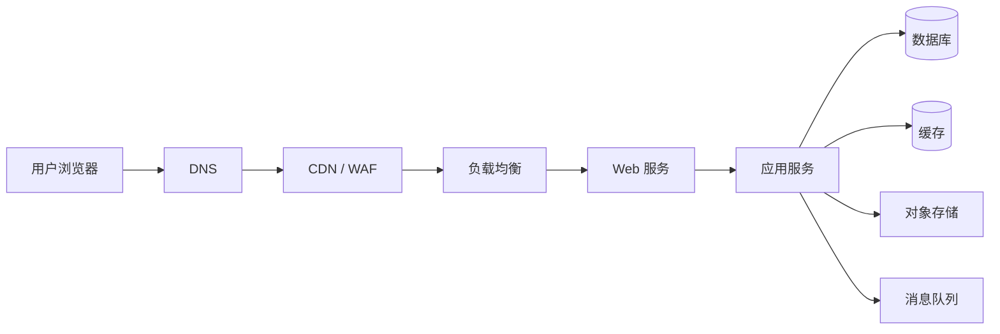
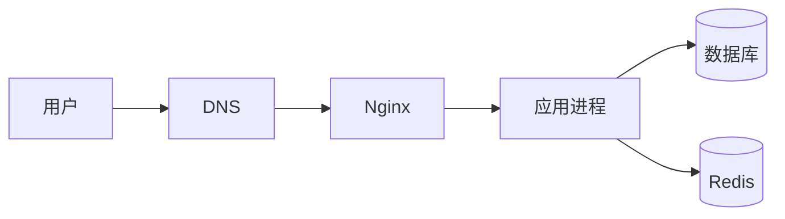
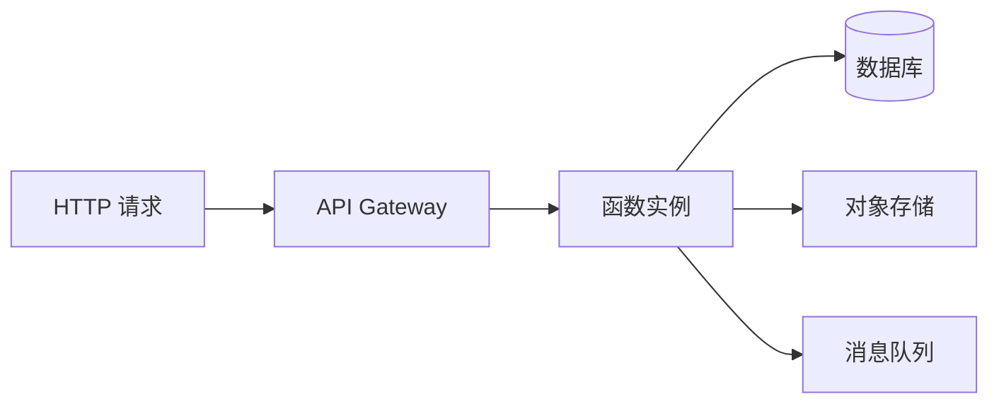

# 第五部分
## 系统发布

第 14-17 周

---
# 学习目标

- 选择适合项目的 Web 应用部署方式
- 建立从代码提交到生产发布的标准流程
- 配置构建、环境变量、域名和 HTTPS
- 设计灰度发布、回滚和故障处理方案
- 使用上线前、上线中和上线后的检查单

---
layout: two-cols
---

# 第14周：理论

- 部署和发布软件的方法及检查单

::right::

# 第14周：实践

- 部署作品

---


# Web 应用部署与发布

## 部署方法、发布流程与上线检查单


适用于前端、后端、全栈及微服务 Web 应用


---

# 1. Web 应用部署模型

---

## 什么是部署

部署是将软件从开发环境交付到可访问、可运行环境的过程。

通常包括：

1. 获取源代码
2. 安装依赖
3. 执行测试
4. 构建软件包
5. 配置运行环境
6. 发布到服务器或云平台
7. 配置域名和网络
8. 执行健康检查
9. 监控运行状态
10. 必要时回滚

---

## 典型 Web 应用组成



常见组件：

- 前端静态资源：HTML、CSS、JavaScript、图片
- Web 服务器：Nginx、Apache、Caddy
- 应用服务：Node.js、Java、Go、Python、PHP
- 数据服务：MySQL、PostgreSQL、MongoDB、Redis
- 基础设施：CDN、WAF、负载均衡、容器平台、云服务

---

## 部署方式总览

| 部署方式 | 适用场景 | 主要优点 | 主要限制 |
| --- | --- | --- | --- |
| 静态托管 | SPA、文档站、营销页 | 成本低、性能好、运维简单 | 不适合复杂服务端逻辑 |
| 虚拟机部署 | 传统单体应用 | 灵活、迁移成本低 | 扩缩容和环境一致性较弱 |
| Docker 部署 | 中小型服务、标准化交付 | 环境一致、易回滚 | 需要容器和镜像管理 |
| PaaS 部署 | 快速上线、团队规模较小 | 运维成本低 | 平台约束、长期成本需评估 |
| Serverless | 事件驱动、低频接口 | 按量计费、自动扩缩容 | 冷启动、运行时限制 |
| Kubernetes | 微服务、大规模系统 | 编排能力强、弹性好 | 学习和运维成本高 |

---

# 2. 静态 Web 应用部署

---

## 适合静态部署的应用

适用于：

- Vue、React、Angular 构建后的 SPA
- Vite、Nuxt Static、Next.js Static Export
- 文档站、博客、企业官网
- 不依赖服务端实时渲染的前端应用

构建结果通常是：

```text
dist/
├── index.html
├── assets/
│   ├── index-abc123.js
│   └── index-def456.css
├── favicon.ico
└── robots.txt
```

---

## 静态部署基本流程


推荐流程：

```bash
npm ci
npm run lint
npm run test
npm run build

# 检查构建产物
find dist -maxdepth 2 -type f | sort
```

---

## 静态托管方式

常见方案：

- 云对象存储：S3、OSS、COS、OBS
- CDN 静态站点托管
- GitHub Pages
- GitLab Pages
- Vercel、Netlify、Cloudflare Pages
- Nginx 或 Caddy 静态文件服务

选择时重点关注：

- 是否支持 HTTPS
- 是否支持自定义域名
- 是否支持 SPA History Fallback
- 是否支持 CDN 缓存刷新
- 是否支持访问日志和错误监控
- 是否支持预览环境和回滚

---

## Nginx 静态站点配置

```nginx
server {
    listen 80;
    server_name example.com;

    root /var/www/web/dist;
    index index.html;

    # SPA 路由回退
    location / {
        try_files $uri $uri/ /index.html;
    }

    # 静态资源长期缓存
    location ~* \.(js|css|png|jpg|jpeg|gif|svg|ico|woff2)$ {
        expires 30d;
        add_header Cache-Control "public, immutable";
    }

    # 禁止访问隐藏文件
    location ~ /\. {
        deny all;
    }
}
```

注意：

- 使用前端路由时必须配置 `try_files`
- 带内容哈希的静态资源可以长期缓存
- `index.html` 不建议设置过长缓存时间
- 发布后需要考虑 CDN 缓存刷新

---

## 静态应用的环境变量

不同环境使用不同配置：

```text
.env.development
.env.test
.env.production
```

示例：

```bash
# .env.production
VITE_API_BASE_URL=https://api.example.com
VITE_APP_ENV=production
VITE_SENTRY_DSN=https://example@sentry.io/project
```

注意：

- 前端环境变量会被打包进浏览器，不能保存密码和密钥
- 数据库密码、私钥、Token 必须放在服务端密钥管理系统
- 构建环境必须明确指定生产配置
- 发布前检查 API 地址、CDN 地址和第三方服务地址

---

# 3. 虚拟机部署

---

## 适用场景

虚拟机部署适用于：

- 传统单体 Web 应用
- 需要完整控制操作系统的项目
- 依赖特殊系统软件的服务
- 暂未容器化的旧系统
- 部署规模较小、架构较简单的系统

典型架构：



---

## 虚拟机部署步骤

```bash
# 1. 登录服务器
ssh deploy@example.com

# 2. 创建应用目录
sudo mkdir -p /opt/myapp/releases
sudo mkdir -p /opt/myapp/shared

# 3. 上传发布包
scp app-release.tar.gz deploy@example.com:/opt/myapp/releases/

# 4. 解压发布包
cd /opt/myapp/releases
tar -xzf app-release.tar.gz

# 5. 安装依赖
cd /opt/myapp/releases/20260910-120000
npm ci --omit=dev

# 6. 执行数据库迁移
npm run db:migrate

# 7. 重启应用
sudo systemctl restart myapp

# 8. 检查状态
sudo systemctl status myapp
curl -f http://127.0.0.1:3000/health
```

---

## systemd 服务示例

```ini
# /etc/systemd/system/myapp.service
[Unit]
Description=My Web Application
After=network.target

[Service]
Type=simple
User=deploy
WorkingDirectory=/opt/myapp/current
EnvironmentFile=/opt/myapp/shared/.env
ExecStart=/usr/bin/node server.js
Restart=always
RestartSec=5
LimitNOFILE=65535

[Install]
WantedBy=multi-user.target
```

启用服务：

```bash
sudo systemctl daemon-reload
sudo systemctl enable myapp
sudo systemctl start myapp
sudo systemctl status myapp
```

查看日志：

```bash
journalctl -u myapp -f
```

---

## 虚拟机发布目录建议

```text
/opt/myapp/
├── current -> releases/20260910-120000
├── releases/
│   ├── 20260909-180000/
│   ├── 20260910-100000/
│   └── 20260910-120000/
├── shared/
│   ├── .env
│   ├── logs/
│   └── uploads/
└── backups/
```

使用软链接实现快速回滚：

```bash
ln -sfn /opt/myapp/releases/20260910-120000 /opt/myapp/current
sudo systemctl restart myapp
```

回滚：

```bash
ln -sfn /opt/myapp/releases/20260910-100000 /opt/myapp/current
sudo systemctl restart myapp
```

---

# 4. Docker 容器部署

---

## Docker 部署优势

Docker 可以将应用及其运行环境封装为镜像。

主要优点：

- 开发、测试、生产环境更加一致
- 镜像可版本化和追踪
- 发布、回滚更加简单
- 方便在 CI/CD 中自动构建
- 适合迁移到云平台或 Kubernetes

基本流程：

```text
源代码 → 构建镜像 → 镜像仓库 → 拉取镜像 → 启动容器
```

---

## Node.js Web 应用 Dockerfile

```dockerfile
# 构建阶段
FROM node:22-alpine AS builder

WORKDIR /app

COPY package*.json ./
RUN npm ci

COPY . .
RUN npm run test
RUN npm run build

# 运行阶段
FROM node:22-alpine AS runner

ENV NODE_ENV=production
WORKDIR /app

COPY package*.json ./
RUN npm ci --omit=dev && npm cache clean --force

COPY --from=builder /app/dist ./dist
COPY --from=builder /app/server.js ./server.js

USER node

EXPOSE 3000

HEALTHCHECK --interval=30s --timeout=5s --start-period=20s \
  CMD wget --no-verbose --tries=1 --spider \
  http://127.0.0.1:3000/health || exit 1

CMD ["node", "server.js"]
```

---

## Docker 镜像构建与运行

```bash
# 构建镜像
docker build \
  --tag registry.example.com/myapp:20260910-120000 \
  .

# 本地运行
docker run --rm \
  --name myapp \
  --env-file .env.production \
  -p 3000:3000 \
  registry.example.com/myapp:20260910-120000

# 检查容器
docker ps
docker logs -f myapp

# 检查健康状态
docker inspect --format='{{json .State.Health}}' myapp
```

建议：

- 使用不可变版本标签，不要只使用 `latest`
- 使用多阶段构建减小镜像体积
- 使用非 root 用户运行
- 不在镜像中写入生产密钥
- 添加 `HEALTHCHECK`
- 定期扫描基础镜像漏洞

---

## Docker Compose 示例

```yaml
services:
  web:
    image: registry.example.com/myapp:${APP_VERSION}
    restart: unless-stopped
    env_file:
      - .env.production
    ports:
      - "3000:3000"
    depends_on:
      db:
        condition: service_healthy
    healthcheck:
      test: ["CMD", "wget", "--spider", "-q", "http://localhost:3000/health"]
      interval: 30s
      timeout: 5s
      retries: 3

  db:
    image: postgres:16
    restart: unless-stopped
    environment:
      POSTGRES_DB: app
      POSTGRES_USER: app
      POSTGRES_PASSWORD: ${DB_PASSWORD}
    volumes:
      - postgres_data:/var/lib/postgresql/data
    healthcheck:
      test: ["CMD-SHELL", "pg_isready -U app -d app"]
      interval: 10s
      timeout: 5s
      retries: 5

volumes:
  postgres_data:
```

启动：

```bash
APP_VERSION=20260910-120000 docker compose up -d
docker compose ps
docker compose logs -f web
```

---

# 5. PaaS 与 Serverless 部署

---

## PaaS 部署

PaaS 将服务器、运行时、部署流程等基础能力平台化。

常见特征：

- 连接代码仓库后自动部署
- 自动构建和发布
- 支持预览环境
- 自动配置 HTTPS
- 支持环境变量
- 支持日志和监控
- 可配置自动扩容

适合：

- 快速验证产品
- 中小型 Web 应用
- 前端和全栈应用
- 运维人员较少的团队

注意：

- 检查平台所在区域和网络延迟
- 评估数据库、对象存储等配套服务
- 了解平台的构建、运行和计费限制
- 提前确认数据迁移和退出方案

---

## Serverless 部署

Serverless 常用于：

- API 接口
- 定时任务
- 图片处理
- Webhook
- 文件上传处理
- 事件驱动业务

典型流程：



注意事项：

- 处理冷启动
- 控制单次执行时间
- 设计幂等接口
- 避免依赖本地持久化文件
- 正确处理超时和重试
- 对数据库连接数进行限制
- 配置日志、告警和调用量监控

---

# 6. Kubernetes 部署

---

## Kubernetes 适用场景

适合：

- 微服务系统
- 多环境、多集群部署
- 需要自动扩缩容的服务
- 对滚动更新和服务发现有要求的系统
- 已经具备容器化和平台运维能力的团队

不建议仅因为“流行”就使用 Kubernetes。

应综合评估：

- 服务数量
- 发布频率
- 运维能力
- 可用性要求
- 资源规模
- 云平台支持情况

---

## Kubernetes Deployment 示例

```yaml
apiVersion: apps/v1
kind: Deployment
metadata:
  name: myapp
  labels:
    app: myapp
spec:
  replicas: 3
  strategy:
    type: RollingUpdate
    rollingUpdate:
      maxUnavailable: 0
      maxSurge: 1
  selector:
    matchLabels:
      app: myapp
  template:
    metadata:
      labels:
        app: myapp
    spec:
      containers:
        - name: myapp
          image: registry.example.com/myapp:20260910-120000
          ports:
            - containerPort: 3000
          envFrom:
            - secretRef:
                name: myapp-secret
          readinessProbe:
            httpGet:
              path: /ready
              port: 3000
            initialDelaySeconds: 10
            periodSeconds: 5
          livenessProbe:
            httpGet:
              path: /health
              port: 3000
            initialDelaySeconds: 30
            periodSeconds: 10
          resources:
            requests:
              cpu: "100m"
              memory: "256Mi"
            limits:
              cpu: "1000m"
              memory: "512Mi"
```

---

## Kubernetes Service 示例

```yaml
apiVersion: v1
kind: Service
metadata:
  name: myapp
spec:
  selector:
    app: myapp
  ports:
    - port: 80
      targetPort: 3000
  type: ClusterIP
```

发布和检查：

```bash
kubectl apply -f deployment.yaml
kubectl apply -f service.yaml

kubectl rollout status deployment/myapp
kubectl get pods -l app=myapp
kubectl describe deployment myapp
kubectl logs deployment/myapp --tail=100
```

回滚：

```bash
kubectl rollout history deployment/myapp
kubectl rollout undo deployment/myapp
kubectl rollout status deployment/myapp
```

---

# 7. 标准发布流程

---

## 推荐的发布生命周期


发布应满足：

- 有明确的版本号
- 有可追踪的提交记录
- 有可复现的构建制品
- 有发布负责人
- 有回滚方案
- 有监控和告警
- 有发布结果记录

---

## 版本命名建议

推荐使用：

```text
v主版本.次版本.修订版本
```

例如：

```text
v2.5.1
```

含义：

- 主版本：不兼容的重大变化
- 次版本：新增向后兼容功能
- 修订版本：问题修复和小幅改动

镜像或构建制品可以使用：

```text
myapp:v2.5.1
myapp:git-a1b2c3d
myapp:20260910-120000
```

生产环境应记录：

- Git Commit SHA
- 构建时间
- 构建分支或标签
- 构建工具版本
- 依赖版本
- 发布人
- 发布批次

---

## 制品管理

构建制品可以是：

- 前端 `dist.tar.gz`
- Docker 镜像
- Java `jar` 文件
- Python Wheel 包
- Node.js 发布包
- Kubernetes Manifest
- Terraform Plan

原则：

1. 构建一次，多环境复用
2. 测试和生产使用同一个制品
3. 制品必须有唯一版本
4. 制品应存储在可靠仓库
5. 不应在生产服务器临时构建
6. 制品应支持校验和验证

---

# 8. CI/CD 自动化

---

## CI/CD 基本职责

### 持续集成 CI

- 代码格式检查
- 静态分析
- 单元测试
- 集成测试
- 构建制品
- 安全扫描

### 持续交付或持续部署 CD

- 部署开发环境
- 部署测试环境
- 执行验收测试
- 发布生产环境
- 执行健康检查
- 支持回滚

---

## GitHub Actions 示例

```yaml
name: Web Application CI/CD

on:
  push:
    branches:
      - main
  pull_request:

permissions:
  contents: read
  packages: write

jobs:
  test:
    runs-on: ubuntu-latest

    steps:
      - name: Checkout
        uses: actions/checkout@v4

      - name: Setup Node.js
        uses: actions/setup-node@v4
        with:
          node-version: 22
          cache: npm

      - name: Install dependencies
        run: npm ci

      - name: Lint
        run: npm run lint

      - name: Unit test
        run: npm run test -- --coverage

      - name: Build
        run: npm run build

  build-image:
    needs: test
    if: github.ref == 'refs/heads/main'
    runs-on: ubuntu-latest

    steps:
      - uses: actions/checkout@v4

      - name: Login registry
        uses: docker/login-action@v3
        with:
          registry: registry.example.com
          username: ${{ secrets.REGISTRY_USER }}
          password: ${{ secrets.REGISTRY_PASSWORD }}

      - name: Build and push image
        uses: docker/build-push-action@v6
        with:
          context: .
          push: true
          tags: |
            registry.example.com/myapp:${{ github.sha }}
            registry.example.com/myapp:latest
```

---

## CI/CD 安全原则

不要将以下内容直接写入仓库：

- 数据库密码
- 云平台 Access Key
- SSH 私钥
- JWT 签名密钥
- 第三方 API Secret
- 生产环境 Token

推荐做法：

- 使用 CI/CD Secret
- 使用云平台 Secret Manager
- 使用短期访问令牌
- 使用最小权限原则
- 对生产发布增加审批
- 对生产操作保留审计记录

---

# 9. 环境与配置管理

---

## 环境划分

常见环境：

```text
local       本地开发环境
development 开发环境
test        自动化测试环境
staging     预发布环境
production  生产环境
```

每个环境应明确：

- 域名
- 数据库
- 缓存
- 对象存储
- 第三方服务
- 日志级别
- 监控配置
- 数据权限
- 发布权限

---

## 配置管理原则

### 应该配置化的内容

- API 地址
- 数据库连接地址
- 缓存地址
- 日志级别
- 第三方服务地址
- 功能开关
- 限流参数
- CORS 白名单

### 不应该硬编码的内容

- 生产密码
- 私钥
- Token
- 云平台密钥
- 内部服务的敏感凭据

示例：

```bash
NODE_ENV=production
PORT=3000
DATABASE_URL=postgresql://user:password@db:5432/app
REDIS_URL=redis://redis:6379
LOG_LEVEL=info
ENABLE_NEW_CHECKOUT=false
```

---

## 配置检查命令

```bash
# 检查必需环境变量
required_vars=(
  NODE_ENV
  PORT
  DATABASE_URL
  REDIS_URL
)

for var in "${required_vars[@]}"; do
  if [ -z "${!var}" ]; then
    echo "Missing required variable: $var"
    exit 1
  fi
done

echo "Environment variables are valid."
```

注意：

- 检查变量是否存在，不要在日志中打印敏感值
- 对配置进行格式校验
- 应用启动时尽早失败
- 为关键配置设置默认值或明确报错

---

# 10 数据库变更与数据迁移

---

## 数据库发布原则

数据库变更通常比代码发布更难回滚。

推荐采用：

```text
扩展 → 迁移 → 收缩
Expand → Migrate → Contract
```

示例：

1. 新增可为空的字段
2. 发布兼容新旧字段的代码
3. 后台迁移历史数据
4. 切换代码读取新字段
5. 最后删除旧字段

---

## 数据库迁移检查

上线前确认：

- 是否有迁移脚本
- 是否在测试环境验证过
- 是否评估执行时间
- 是否可能锁表
- 是否有备份
- 是否有回滚或补偿方案
- 是否兼容旧版本代码
- 是否会影响读写性能
- 是否需要低峰期执行
- 是否需要人工审批

示例：

```bash
# 备份
pg_dump "$DATABASE_URL" > backup-before-release.sql

# 执行迁移
npm run db:migrate

# 查看迁移状态
npm run db:migrate:status
```

---

# 11 发布策略

---

## 1. 停机发布

流程：

```text
停止旧版本 → 部署新版本 → 启动新版本 → 验证
```

优点：

- 实现简单
- 适用于小型应用
- 资源占用较少

缺点：

- 有服务中断
- 不适合高可用系统
- 发布失败会影响用户访问

适用：

- 内部系统
- 低访问量系统
- 可接受维护窗口的系统

---

## 2. 滚动发布

逐步替换旧版本实例：


优点：

- 通常不需要停机
- 资源成本相对较低
- 平台支持较广

注意：

- 新旧版本需要兼容
- 必须配置就绪探针
- 发布期间要监控错误率
- 出现异常时立即停止继续发布

---

## 3. 蓝绿发布

维护两套环境：

```text
蓝环境：当前生产版本
绿环境：待发布新版本
```

流程：

1. 在绿环境部署新版本
2. 执行完整验证
3. 将流量切换到绿环境
4. 持续观察
5. 发现问题时切回蓝环境

优点：

- 切换和回滚速度快
- 新版本可以提前验证
- 逻辑清晰

缺点：

- 需要两套运行资源
- 数据库变更需要兼容
- 切换期间要处理会话和缓存问题

---

## 4. 灰度发布

逐步扩大新版本流量：

```text
内部用户 → 1% 用户 → 5% 用户 → 20% 用户 → 50% 用户 → 100% 用户
```

可以依据：

- 用户 ID
- 租户
- 地域
- 设备类型
- 请求 Header
- 随机比例

灰度期间重点观察：

- HTTP 5xx
- 请求延迟
- 前端 JavaScript 错误
- 业务转化率
- 数据库负载
- 队列积压
- 用户投诉

---

## 5. 金丝雀发布

金丝雀发布是灰度发布的一种形式。

建议流程：

```text
部署少量实例
    ↓
验证健康检查
    ↓
接收少量真实流量
    ↓
对比新旧版本指标
    ↓
扩大流量或停止发布
```

自动停止条件示例：

```text
5xx 错误率 > 1%
P95 延迟 > 1000ms
核心接口失败率 > 0.5%
数据库连接池使用率 > 85%
```

阈值必须结合业务实际情况配置。

---

# 12 健康检查与可观测性

---

## 健康检查接口

建议提供：

```text
GET /health
```

用于判断进程是否正常运行。

```text
GET /ready
```

用于判断实例是否可以接收流量。

示例响应：

```json
{
  "status": "ok",
  "service": "myapp",
  "version": "v2.5.1",
  "commit": "a1b2c3d",
  "timestamp": "2026-09-10T12:00:00Z"
}
```

区别：

- `health`：进程是否存活
- `ready`：是否准备好提供服务
- 数据库不可用时，是否应该影响 `ready`，需要根据架构决定

---

## 必备监控指标

### 可用性

- HTTP 状态码
- 5xx 错误率
- 健康检查失败率
- 服务正常运行时间

### 性能

- 平均响应时间
- P50、P95、P99 延迟
- 吞吐量
- 请求大小
- 页面加载时间

### 资源

- CPU 使用率
- 内存使用率
- 磁盘空间
- 网络流量
- 数据库连接数
- 缓存命中率

### 业务

- 登录成功率
- 下单成功率
- 支付成功率
- 注册转化率
- 核心任务成功率

---

## 日志规范

日志应包含：

- 时间戳
- 日志级别
- 服务名称
- 版本号
- 请求 ID
- 用户或租户标识
- 错误类型
- 错误堆栈
- 关键业务上下文

示例：

```json
{
  "level": "error",
  "service": "myapp",
  "version": "v2.5.1",
  "requestId": "req-123456",
  "path": "/api/orders",
  "message": "create order failed",
  "errorCode": "ORDER_CREATE_FAILED"
}
```

禁止记录：

- 密码
- 完整身份证号
- 银行卡号
- Access Token
- Cookie
- 私钥
- 未脱敏的个人敏感信息

---

# 13 回滚方案

---

## 回滚触发条件

出现以下情况时，应考虑回滚：

- 核心接口持续失败
- 错误率超过发布阈值
- 性能明显下降
- 数据写入异常
- 严重安全问题
- 大量用户无法登录或下单
- 数据库负载异常升高
- 关键第三方服务调用异常

---

## 代码回滚

### Docker

```bash
docker pull registry.example.com/myapp:v2.5.0
export APP_VERSION=v2.5.0
docker compose up -d web
```

### Kubernetes

```bash
kubectl rollout undo deployment/myapp
kubectl rollout status deployment/myapp
```

### 虚拟机软链接

```bash
ln -sfn /opt/myapp/releases/20260910-100000 /opt/myapp/current
sudo systemctl restart myapp
```

---

## 回滚注意事项

- 回滚前确认旧版本仍然可运行
- 代码回滚不等于数据库回滚
- 数据库结构变更必须保持兼容
- 记录回滚原因和影响范围
- 回滚后继续观察监控
- 发布失败后应补充复盘
- 不要删除上一版本制品和日志

---

# 14 Web 应用上线检查单

---

## A. 发布准备检查单

### 版本和范围

- [ ] 已确认发布版本号
- [ ] 已确认发布内容和需求范围
- [ ] 已关联 Issue、需求或变更单
- [ ] 已完成代码评审
- [ ] 已明确发布负责人
- [ ] 已明确验证负责人
- [ ] 已确认发布窗口
- [ ] 已通知相关团队和客服

### 代码和构建

- [ ] 已通过代码格式检查
- [ ] 已通过静态检查
- [ ] 已通过单元测试
- [ ] 已通过集成测试
- [ ] 已完成生产构建
- [ ] 构建制品具备唯一版本标识
- [ ] 已记录 Git Commit SHA
- [ ] 已完成依赖和漏洞扫描
- [ ] 已验证构建产物完整性

---

## B. 配置检查单

- [ ] 已确认运行环境为 production
- [ ] 已确认生产 API 地址
- [ ] 已确认数据库连接配置
- [ ] 已确认缓存连接配置
- [ ] 已确认对象存储配置
- [ ] 已确认第三方服务配置
- [ ] 已确认 CORS 配置
- [ ] 已确认 Cookie 和域名配置
- [ ] 已确认功能开关
- [ ] 已确认密钥来自安全存储
- [ ] 未将密钥提交到代码仓库
- [ ] 未在日志中输出敏感信息
- [ ] 已确认时区和时间格式

---

## C. 数据库检查单

- [ ] 已完成数据库备份
- [ ] 已验证备份可恢复
- [ ] 已确认迁移脚本版本
- [ ] 已在测试环境执行迁移
- [ ] 已评估迁移执行时间
- [ ] 已评估锁表和性能影响
- [ ] 已确认新旧代码兼容
- [ ] 已确认数据回滚或补偿方案
- [ ] 已确认迁移失败处理方式
- [ ] 已安排必要的人工审批

---

## D. 基础设施检查单

- [ ] 服务器或集群资源充足
- [ ] CPU、内存和磁盘正常
- [ ] 网络和安全组配置正确
- [ ] 域名 DNS 解析正确
- [ ] HTTPS 证书有效
- [ ] CDN 配置正确
- [ ] WAF 规则已确认
- [ ] 负载均衡健康检查正常
- [ ] 防火墙规则已确认
- [ ] 备份策略正常
- [ ] 日志采集正常
- [ ] 监控和告警正常
- [ ] 时间同步正常

---

## E. 发布执行检查单

- [ ] 已打开发布记录
- [ ] 已确认当前线上版本
- [ ] 已确认当前健康状态
- [ ] 已保存关键监控基线
- [ ] 已部署新版本制品
- [ ] 已执行数据库迁移
- [ ] 已检查容器或进程状态
- [ ] 已检查 `/health`
- [ ] 已检查 `/ready`
- [ ] 已验证滚动发布状态
- [ ] 已观察错误日志
- [ ] 已验证新版本流量
- [ ] 未发现异常后再扩大流量
- [ ] 已记录每个操作和时间点

---

## F. 发布后验证检查单

### 技术验证

- [ ] 首页可以正常访问
- [ ] 静态资源加载正常
- [ ] SPA 路由刷新正常
- [ ] 登录和退出正常
- [ ] 核心 API 返回正常
- [ ] 数据库读写正常
- [ ] 缓存读写正常
- [ ] 文件上传和下载正常
- [ ] 消息队列处理正常
- [ ] 定时任务运行正常
- [ ] 前端控制台无严重错误
- [ ] 无明显 404、500 和超时

### 业务验证

- [ ] 用户注册正常
- [ ] 用户登录正常
- [ ] 核心业务流程正常
- [ ] 权限控制正常
- [ ] 关键数据展示正确
- [ ] 通知、邮件或短信正常
- [ ] 支付或订单流程正常
- [ ] 管理后台正常
- [ ] 关键埋点正常

### 监控验证

- [ ] 5xx 错误率正常
- [ ] P95 延迟正常
- [ ] CPU 使用率正常
- [ ] 内存使用率正常
- [ ] 数据库负载正常
- [ ] 缓存命中率正常
- [ ] 队列无明显积压
- [ ] 告警没有异常增长
- [ ] 用户反馈没有集中异常

---

## G. 发布完成检查单

- [ ] 已确认发布成功
- [ ] 已记录最终版本号
- [ ] 已记录最终 Commit SHA
- [ ] 已更新变更日志
- [ ] 已通知相关人员
- [ ] 已关闭发布窗口
- [ ] 已保留上一版本制品
- [ ] 已确认回滚路径仍然可用
- [ ] 已归档发布记录
- [ ] 如有问题，已创建复盘任务

---

# 15 发布命令参考

---

## 前端静态应用

```bash
npm ci
npm run lint
npm run test
npm run build

# 上传静态资源
aws s3 sync dist/ s3://my-web-bucket/ \
  --delete \
  --cache-control "public,max-age=31536000,immutable"

# 更新 HTML 后刷新 CDN
aws cloudfront create-invalidation \
  --distribution-id EXAMPLE \
  --paths "/index.html"
```

注意：

- 带哈希的资源可以长期缓存
- `index.html` 应设置较短缓存时间
- CDN 刷新范围应尽量精确

---

## Docker 应用

```bash
VERSION="v2.5.1"

docker build -t registry.example.com/myapp:${VERSION} .
docker push registry.example.com/myapp:${VERSION}

ssh deploy@example.com << EOF
  cd /opt/myapp
  export APP_VERSION=${VERSION}
  docker compose pull web
  docker compose up -d web
  curl --fail http://127.0.0.1:3000/health
EOF
```

---

## Kubernetes 应用

```bash
VERSION="v2.5.1"

kubectl -n production set image deployment/myapp \
  myapp=registry.example.com/myapp:${VERSION}

kubectl -n production rollout status deployment/myapp \
  --timeout=5m

kubectl -n production get pods -l app=myapp
kubectl -n production logs deployment/myapp --tail=100
```

---

# 16 常见问题与处理方式

---

## 页面刷新后出现 404

可能原因：

- Nginx 未配置 SPA 回退
- CDN 未配置错误页面回源
- 对象存储未配置 `index.html`
- 前端使用了 History 路由但服务端不支持

处理方式：

```nginx
location / {
    try_files $uri $uri/ /index.html;
}
```

---

## 发布后仍然看到旧页面

可能原因：

- 浏览器缓存
- CDN 缓存
- Service Worker 缓存
- `index.html` 缓存时间过长

处理建议：

- 给静态资源添加文件哈希
- 缩短 `index.html` 缓存
- 发布后刷新 CDN
- 正确管理 Service Worker 版本
- 避免让 HTML 长期缓存

---

## 前端接口全部失败

检查顺序：

1. 浏览器 Network 请求地址
2. 生产环境 API 配置
3. DNS 解析
4. HTTPS 证书
5. CORS
6. 反向代理
7. 负载均衡
8. 应用日志
9. 服务端健康状态

---

## 容器不断重启

检查：

```bash
docker ps
docker logs myapp
docker inspect myapp
```

常见原因：

- 环境变量缺失
- 端口配置错误
- 数据库连接失败
- 启动命令错误
- 健康检查失败
- 内存不足
- 权限不足

---

# 17 推荐的最小可行方案

---

## 小型 Web 应用

推荐：

```text
Git 仓库
  ↓
CI 自动测试
  ↓
构建静态资源或 Docker 镜像
  ↓
PaaS / 静态托管 / 单台云服务器
  ↓
HTTPS + 基础监控
```

必须具备：

- 自动构建
- 唯一版本
- 环境变量管理
- HTTPS
- 健康检查
- 基本日志
- 可执行回滚

---

## 中型 Web 应用

推荐：

```text
Git 仓库
  ↓
CI/CD
  ↓
镜像仓库
  ↓
多实例容器
  ↓
负载均衡
  ↓
数据库主从或高可用
  ↓
日志、监控、告警
```

重点建设：

- 滚动发布
- 自动扩缩容
- 数据库备份
- 灰度发布
- 错误追踪
- 统一日志
- 发布审批

---

## 大型 Web 应用

推荐重点：

- 多可用区部署
- 多地域容灾
- Kubernetes 或云原生平台
- 蓝绿或金丝雀发布
- 自动回滚
- 完整链路追踪
- SLO 和错误预算
- 灾备演练
- 安全审计
- 数据分级和合规控制

---

# 18 发布原则总结

---

## 十条核心原则

1. 构建一次，多环境复用
2. 所有发布都有版本号
3. 所有配置与代码分离
4. 所有生产变更可追踪
5. 所有发布都必须可验证
6. 所有发布都必须有回滚方案
7. 数据库变更必须考虑兼容性
8. 生产密钥必须安全管理
9. 先小流量，再逐步扩大
10. 发布完成后必须持续观察

---

# 19 最终发布检查卡

## 发布前

- [ ] 代码已评审
- [ ] 测试已通过
- [ ] 构建已完成
- [ ] 配置已确认
- [ ] 数据库已备份
- [ ] 监控已准备
- [ ] 回滚方案已验证

## 发布中

- [ ] 发布负责人在线
- [ ] 发布记录已开启
- [ ] 健康检查正常
- [ ] 错误率正常
- [ ] 延迟正常
- [ ] 流量按计划切换

## 发布后

- [ ] 核心流程验证通过
- [ ] 日志无异常
- [ ] 告警无异常
- [ ] 业务指标正常
- [ ] 相关人员已通知
- [ ] 发布结果已归档

---

# 稳定发布的目标

```text
更少的人工操作
更短的发布时间
更小的变更风险
更快的故障恢复
更清晰的责任边界
```

> 发布不是一次操作，而是一套可重复、可验证、可回滚的工程流程。


# 第15周

## 实践
完善作品：优化和迭代作品

---

# 第16周

## 实践
- 准备答辩材料：幻灯片、演示Demo、答辩问题
- 参考 [作品答辩评分表](https://github.com/bettermorn/IntelligentSWEPractice/blob/main/Assessment.md#%E4%BD%9C%E5%93%81%E7%AD%94%E8%BE%A9%E8%AF%84%E5%88%86%E8%A1%A8)

---
layout: center
class: text-center
---

# 第17周

## 🎓 作品答辩

[作品答辩评分表](https://github.com/bettermorn/IntelligentSWEPractice/blob/main/Assessment.md#%E4%BD%9C%E5%93%81%E7%AD%94%E8%BE%A9%E8%AF%84%E5%88%86%E8%A1%A8)

最终成果展示与评审
